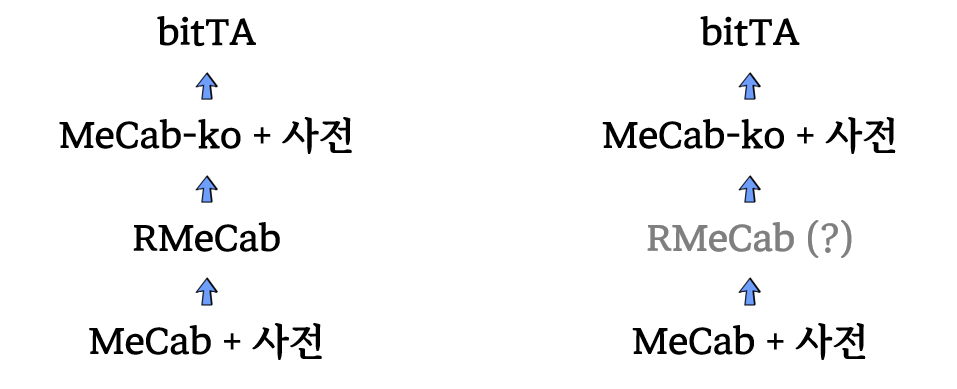
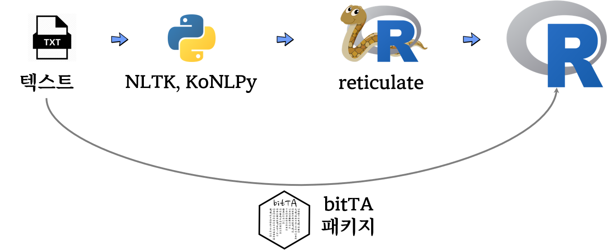

```{r setup-chapter-01, include = FALSE}
source("_common.R")

knitr::knit_hooks$set(output = function(x, options){
  paste0(
    '<pre class="r-output"><code>',
    fansi::sgr_to_html(x = htmltools::htmlEscape(x), warn = FALSE),
    '</code></pre>'
  )
})
```

# (PART\*) 환경설정 {#tm-setup .unnumbered}


# 설치 및 환경설정 {#install-setup}

즐거운 텍스트 마이닝(Text Mining) 작업환경을 구축하기 위해서는 몇가지 
환경이 구비되어야만 한다. 먼저 작업할 데이터가 텍스트이기 때문에 텍스트에서 
특정 단어 색상을 달리하는 것은 추후 딥러닝 질의응답 인공지능 시스템을 구축할 때
딥러닝 시스템이 질의에 대한 답변을 전체 텍스트의 일부를 색상을 달리하여 
시각적으로 표현하게 되면 사용자 편의성이 크게 개선시킬 수 있다.

텍스트 색상을 달리할 경우 크게 두가지 부분이 이슈가 된다. 첫번째는 텍스트 마이닝
콘솔 작업할 때 코드와 R 코드로 작업한 결과물을 출력할 때 색상을 차별화하는 것이고,
다른 하나는 텍스트 마이닝 결과를 데이터 과학 제품으로 출력할 때 색상을 달리하여
웹상으로 표현하는 것이다.

## 색상 {#tm-colors}

### 콘솔 색상 {#console-colors}

[`glue`](https://glue.tidyverse.org/) 패키지 `glue_col()` 함수를 사용하게 되면 
텍스트에 색상을 입히는 작업을 간단하게 실행에 옮길 수 있다.

```{r glue-color}
library(glue)
library(crayon)

glue_col("{blue 1 + 2 = {red 1 + 2}}")
```


### R마크다운 색상 {#rmarkdown-colors}

`.Rmd` R마크다운 파일 작업결과에 색상을 입히기 위해서는 
[`fansi`](https://cran.r-project.org/web/packages/fansi/index.html) 패키지가 필요하다.
R마크다운 코드 덩어리에 다음 사항을 추가하고 R마크다운 작업을 수행하면
자동으로 해당 색상을 `.html`, `.pdf`, `shiny` 결과물에 반영할 수 있다.


<pre>
```{r setup}
knitr::knit_hooks$set(output = function(x, options){
  paste0(
    '<pre class="r-output"><code>',
    fansi::sgr_to_html(x = htmltools::htmlEscape(x), warn = FALSE),
    '</code></pre>'
  )
})
```
</pre>

R마크다운 색상 적용에 대한 자세한 사항은 [rmarkdown and terminal colors](https://logfc.wordpress.com/2020/07/20/rmarkdown-and-terminal-colors/)를
참조한다.


### 데이터프레임 {#dataframe-color}

이를 확장하여 콘솔, R마크다운, 그리고 데이터프레임에도 색상을 적용하여
반영시킬 수 있다.


## `ggplot` 글꼴 {#ggplot-font}

단어구름(worldcloud)를 사용해서 텍스트 시각화를 많이 한다.
[`ggwordcloud`](https://lepennec.github.io/ggwordcloud/index.html) 패키지는
`ggplot`에서 텍스트 단어구름을 자연스럽게 구현했다.
`ggwordcloud`에 내장된 전세계 **사랑** 이라는 단어가 `love_words_small` 데이터프레임으로 내장되어 있다. 이를 기본 글꼴을 사용해서 단어구름 시각화를 구현해보자.

```{r wordcloud-sample}
library(ggwordcloud)
library(tidyverse)

data("love_words_small")

love_words_small %>% 
  mutate(color = ifelse(word == "사랑", "blue", "gray50")) %>% 
  ggplot(aes(label = word, size = speakers, color = color)) +
    geom_text_wordcloud() +
    scale_size_area(max_size = 40) +
    theme_minimal() +
    scale_color_manual(values = c("blue", "gray50"))
```

글꼴을 다양한 방식으로 구현하면 좀더 미려한 워드 클라우드를 뽑아낼 수 있다. 가장 최근에 네이버에서 공개한 마루부리 글꼴을 워드 클라우드에 반영해보자.


1. [마루 부리 글꼴](https://hangeul.naver.com/maru) 다운로드
2. 압축을 풀어 해당 글꼴을 운영체제에 설치
3. `sysfonts` 패키지를 사용해서 R 글꼴로 등록
4. `showtext` 패키지 `showtext_auto()` 함수로 `ggplot`에 사용할 수 있도록 설정

다음 워드 클라우드를 통해 마루부리 글꼴이 잘 반영된 것이 확인되지만 다른 언어로 
표현된 글꼴을 마루부리 글꼴이 적절히 반영하지 않는 것도 확인된다.

```{r wordcloud-sample-font}
library(systemfonts)
library(sysfonts)
library(showtext)

# 글꼴이 설치된 경로 표시
font_paths() 

# 운영체제 등록된 글꼴을 R 글꼴로 등록
sysfonts::font_add(family = "MaruBuri", regular = 'MaruBuri-Regular.ttf')

# 마루부리 글꼴이 설치되었는지 확인
font_files() %>% tibble() %>% filter(str_detect(family, "Maru"))

# ggplot에서 사용할 수 있도록 설정
showtext::showtext_auto()

love_words_small %>% 
  mutate(color = ifelse(word == "사랑", "blue", "gray50")) %>% 
  ggplot(aes(label = word, size = speakers, color = color)) +
    geom_text_wordcloud(family = "MaruBuri") +
    scale_size_area(max_size = 40) +
    theme_minimal() +
    scale_color_manual(values = c("blue", "gray50"))
```

상기 문제를 풀고자 글꼴이 필요한데 [구글 폰트](https://fonts.google.com/)에서 웹폰트를 가져와서 이를 워드 클라우드 작성에 활용해보자. `sysfonts` 패키지 `font_add_google()` 함수를 사용하면 R에서 바로 사용할 수 있는 글꼴을 바로 설치해주기 때문에 매우 편리하다.
다만, `Noto Serif KR` 글꼴은 한글과 한자, 영어는 문제가 없어 보이지만 다른 언어를 표현하는데 문제가 있음을 알 수 있다.

```{r google-fonts-all}
sysfonts::font_add_google(name = "Noto Serif KR", family = "noto_serif")

showtext::showtext_auto()

love_words_small %>% 
  mutate(color = ifelse(word == "사랑", "blue", "gray50")) %>% 
  ggplot(aes(label = word, size = speakers, color = color)) +
    geom_text_wordcloud(family = "noto_serif") +
    scale_size_area(max_size = 40) +
    theme_minimal() +
    scale_color_manual(values = c("blue", "gray50"))

```


R문서/그래프/코딩 글꼴(font)을 바꾸고 싶을 때가 있다. 
자세한 사항은 [데이터 시각화 - R 문서/그래프/코딩 글꼴(font)](https://statkclee.github.io/viz/viz-r-font.html)
문서를 참조한다.

## `bitTA`

### 은전한닢 형태소분석기

은전한닢 [형태소분석기(mecab-ko)](https://bitbucket.org/eunjeon/mecab-ko/src/master/)는 오픈소스 일본어 형태소분석기인 [MeCab(메카브)](https://taku910.github.io/mecab/)를 한글의 특성을 반영하여 포팅한 오픈소스입니다.

은전한닢은 국립국어원의 21세기 세종계획 말뭉치(Corpus)로 모델을 학습하였습니다.

### 은전한닢 장점

어찌보면 MeCab의 장점이겠습니다.[^1]

* 사전, 코퍼스 독립적 범용 디자인
* 조건부 확률 필드 (CRF)를 기반으로 한 높은 분석 정확도
* 속도가 빠름
    + 사전 추출 알고리즘/데이터 구조에는 고속 TRIE 구조인 Double-Array 채택
    + C++로 개발
* 다양한 스크립트 언어 바인딩 
    + perl/ruby/python/java/C#

[^1]: https://taku910.github.io/mecab/ 발췌

### 은전한닢 설치

#### Linix와 Mac 운영체제

은전한닢 형태소분석기인 mecab-ko와 한글사전인 mecab-ko-dic을 설치해야하는데, Linux와 Mac 운영체제에서의 은전한닢 형태소분석시의 설치는 그리 어렵지 않습니다.

[mecab-ko-dic](https://bitbucket.org/eunjeon/mecab-ko-dic/src/master/) 페이지에 설치 방법이 잘 가이드되어 있어, 기술하는 방법으로 소스를 컴파일하여 설치하면 됩니다. 

#### Windows 운영체제

Windows 운영체제에서의 mecab-ko와 mecab-ko-dic을 설치하는 것은 쉽지 않았습니다. 그러나 형태소분석기와 사전을 Windows 환경에서 컴파일한 바이너리 버전을 다음 사이트에서 다운로드 받아 "c:\mecab" 디렉토리에 설치하면 됩니다.

* [mecab-ko-msvc](https://github.com/Pusnow/mecab-ko-msvc)
* [mecab-ko-dic-msvc](https://github.com/Pusnow/mecab-ko-dic-msvc)

#### bitTA 패키지를 이용한 설치

은전한닢 형태소분석기를 설치하지 않은 상태에서 bitTA 패키지를 로드하면, 다음과 같은 메시지가 출력됩니다.

```{r bitTA-install, eval=FALSE}
> library(bitTA)
To use bitTA, you need to install mecab-ko and mecab-ko-dic.
You can install it with install_mecab_ko().
```

Linix와 Mac, Windows 운영체제와 무관하게 bitTA 패키지의 install_mecab_ko() 함수는 은전한닢 형태소분석기와 한글사전을 설치해줍니다. 그러므로 은전한닢 형태소분석기를 설치하지 않은 상태라면, install_mecab_ko() 함수를 사용하는 것을 추천합니다.

다음과 같이 설치합니다.

```{r bitTA-install-mecab, eval=FALSE}
library(bitTA)

install_mecab_ko()
```

다음은 Winows 운영체제에서의 설치 예시입니다. Winows 운영체제에서는 바이너리 프로그램을 다운로드한 후 정해진 경로에 복사하는 것으로 설치됩니다.

```{r bitTA-install-progress, eval=FALSE}
> install_mecab_ko()
Install mecab-ko-msvc...trying URL 'https://github.com/Pusnow/mecab-ko-msvc/releases/download/release-0.9.2-msvc-3/mecab-ko-msvc-x64.zip'
Content type 'application/octet-stream' length 777244 bytes (759 KB)
downloaded 759 KB

Install mecab-ko-dic-msvc...trying URL 'https://github.com/Pusnow/mecab-ko-dic-msvc/releases/download/mecab-ko-dic-2.0.3-20170922-msvc/mecab-ko-dic-msvc.zip'
Content type 'application/octet-stream' length 32531949 bytes (31.0 MB)
downloaded 31.0 MB
```

Windows 환경에서는 "c:\mecab" 디렉토리에 형태소분석기를 설치해야 정상적으로 작동합니다만, 다른 디렉터로리에 설치하려면 다음과 같이 mecabLocation 인수를 사용합니다. 그러나 이 방법은 권장하지 않습니다.

```{r bitTA-mecab-location, eval=FALSE}
install_mecab_ko(mecabLocation = "d:/morpheme/mecab")
```

### RcppMeCab 패키지 설치

bitTA에서 형태소분석 기능을 사용하기 위해서는 RcppMeCab 패키지고 설치해야 합니다. 만약에 이 패키지가 설치되어 있지 않다면, 형태소분석기를 호출할 때 다음과 같은 에러가 발생합니다.

```{r bitTA-rcppmecab-morph, eval=FALSE}
> morpho_mecab("아버지가 방에 들어가신다.")
Error in morpho_mecab("아버지가 방에 들어가신다.") : 
  To use morpho_mecab(), you need to install RcppMeCab package.
You can install it with install.packages("RcppMeCab").
```

RcppMeCab은 CRAN에 등록된 패키지므로 다음처럼 간단하게 설치합니다.

```{r install-rcppmecab, eval=FALSE}
install.packages("RcppMeCab")
```

여기까지 설치되었다면 비로소 형태소분석을 수행할 수 있습니다.

```{r install-mecab-morph, eval = FALSE}
library("bitTA")

morpho_mecab("아버지가 방에 들어가신다.", type = "morpheme")
```


## 메카브설치 {#install-stacks}

빠르면서 성능이 좋다고 알려진 메카드(MeCab) 형태소 분석기를 설치한다.

{width=100%}

### 맥 {#install-mecab-mac}

MeCab 설치과정은 가장먼저 MeCab 설치부터 시작한다. 일본에서 제작했기 때문에 
RMeCaB 패키지를 설치하면 일본어 형태소 분석 작업을 바로 시작할 수 있다.
한글을 형태소 분석하기 위해서는 은전한닢(mecab-ko)를 설치한 후에 R에서 사용할 수 있도록
개발중인 bitTA 패키지를 설치하면 된다.

#### MeCab 설치 {#install-mecab-mac-mecab}

GitHub [Installation of RMeCab 1.07 on M1 Mac #13](https://github.com/IshidaMotohiro/RMeCab/issues/13) 에 자세한 사항이 나와 있지만 간략하게 정리하면 다음과 같다.

```{bash install-mecab, eval = FALSE}
## xcode 설치되면 생략 ----- 
$ xcode-select --install

## MeCab 설치 --------------
$ cd ~/Downloads
$ curl -fsSL 'https://drive.google.com/uc?export=download&id=0B4y35FiV1wh7cENtOXlicTFaRUE'  -o mecab-0.996.tar.gz
$ tar xf mecab-0.996.tar.gz
$ cd mecab-0.996
$ ./configure --with-charset=utf8
$ make
$ sudo make install

## MeCab 사전 설치 --------------
$ cd ~/Downloads
$ curl -fsSL 'https://drive.google.com/uc?export=download&id=0B4y35FiV1wh7MWVlSDBCSXZMTXM'  -o mecab-ipadic-2.7.0-20070801.tar.gz
$ tar zvxf mecab-ipadic-2.7.0-20070801.tar.gz
$ tar xf mecab-ipadic-2.7.0-20070801.tar.gz
$ cd mecab-ipadic-2.7.0-20070801
$ ./configure --with-charset=utf-8
$ make
$ sudo make install

## MeCab 설치 테스트 --------------
$ mecab
すもももももももものうち
```

#### RMeCab 설치 (생략) {#install-mecab-mac-rmecab}

[RMeCab](https://github.com/IshidaMotohiro/RMeCab) GitHub 저장소에 설치사항을
정리하여 보면 MeCab와 사전을 설치한 후에 `install.packages()` 에 RMeCab 패키지
저장소를 달리 지정하여 설치하면 된다.

```{r rmecab, eval = FALSE}
install.packages("RMeCab", repos = "https://rmecab.jp/R", type = "source") 

library(RMeCab)
res <- RMeCabC("すもももももももものうち")
unlist (res)
## 名詞     助詞     名詞     助詞     名詞     助詞     名詞 
## "すもも"     "も"   "もも"     "も"   "もも"     "の"   "うち" 
```

#### MeCab-ko 설치 {#install-mecab-mac-mecab-ko}

일본어 `MeCab` 설치과정과 동일하게 한국어 `MeCab-ko`를 설치한다. 

- Bitbucket [eunjeon/mecab-ko](https://bitbucket.org/eunjeon/mecab-ko/downloads/) 저장소에서 `mecab-ko` 최신버전을 다운로드 한다.
- Bitbucket [eunjeon/mecab-ko-dic](https://bitbucket.org/eunjeon/mecab-ko-dic/downloads/) 저장소에서 `mecab-ko-dic` 사전 최신버전을 다운로드 한다.

```{bash install-mecab-ko, eval = FALSE}
## MeCab-ko 설치 ------------
$ cd ~/Downloads
$ curl -fsSL 'https://bitbucket.org/eunjeon/mecab-ko/downloads/mecab-0.996-ko-0.9.2.tar.gz' -o mecab-0.996-ko-0.9.2.tar.gz
$ tar xzvf mecab-0.996-ko-0.9.2.tar.gz
$ cd mecab-0.996-ko-0.9.2
$ ./configure --with-charset=utf-8
$ make
$ sudo make install

## MeCab-ko-dic 사전 설치 ------------
$ cd ~/Downloads
$ curl -fsSL 'https://bitbucket.org/eunjeon/mecab-ko-dic/downloads/mecab-ko-dic-2.1.1-20180720.tar.gz' -o mecab-ko-dic-2.1.1-20180720.tar.gz
$ cd mecab-ko-dic-2.1.1-20180720
$ ./configure --with-charset=utf-8
$ make
$ sudo make install
```


## `spacyr`

표제어 추출에 사용하는 패키지는 `spacyr`이다. [사용자설명서](https://cran.r-project.org/web/packages/spacyr/vignettes/using_spacyr.html)

### 미니콘다 설치

(아나콘다 혹은 미니콘다가 이미 컴퓨터에 설치돼 있으면 곧바로 `spacyr` 패키지 설치로 이동) 

`spacyr`은 파이썬 `spaCy`패키지를 R에서 사용할 수 있도록한 패키지이므로, `spacyr`을 이용하기 위해서는 컴퓨터에 파이썬과 필요한 패키지가 설치돼 있어야 한다. 파이썬과 자주사용하는 패키지를 한번에 설치할 수 있는 것이 아나콘다와 미니콘다이다. 

 - 아나콘다: 파이썬 + 자주 사용하는 패키지 1500여개 설치(3GB 이상 설치공간 필요)
 - 미니콘다: 파이썬 + 필수 패키지 700여개 설치(260MB 설치공간 필요)
 ([미니콘다 설치 안내](https://docs.conda.io/en/latest/miniconda.html))
 
미니콘다 설치 안내 페이지에서 본인의 운영체제에 맞는 파일을 선택해 컴퓨터에 설치한다. 관리자권한으로 설치한다 (다운로드받은 파일에 마우스커서 올려 놓고 오른쪽 버튼 클릭해 '관리자권한으로 실행' 선택)

설치후 Anaconda Prompt를 연다. 

 - 윈도화면 왼쪽 아래의 `시작`버튼을 클릭하면 윈도 시작 메뉴가 열린다. 상단 '최근에 추가한 앱'에서 Anaconda Prompt(Miniconda 3)을 클릭하면 Anaconda Prompt가 열린다. (Anaconda Powershell Prompt를 이용해도 된다) 

프롬프트가 열리면 `conda --version`을 입력한다. `conda 4.9.2`처럼 콘다의 버전 정보가 뜨면 설치에 성공. 

### `spacyr` 패키지 설치

`spacyr` 패키지를 설치하고 구동한다. (패키지 설치할 때는 R이나 RStudio를 관리자 권한으로 실행해 설치한다.)

```{r install-spacyr, eval=FALSE}
install.packages("spacyr")
library(spacyr)

```

패키지를 설치하고 구동했으면 `spacy_install()`을 실행한다. 콘솔에 Proceed여부를 묻는 화면이 나면 `2: Yes`를 선택해 진행한다. 

```{r install-spacyr-install, eval=FALSE}
spacy_install()
```

```
Proceed? 

1: No
2: Yes

Selection: 2
A new conda environment "spacy_condaenv" will be created and 
spaCy and language model(s): en_core_web_sm will be installed.  Creating spacy_condaenv conda environment for spaCy installation...
Collecting package metadata (current_repodata.json): ...working... done
Solving environment: ...working... done

...

✔ Download and installation successful
You can now load the package via spacy.load('en_core_web_sm')
Language model "en_core_web_sm" is successfully installed


Installation complete.
Condaenv: spacy_condaenv; Language model(s): en_core_web_sm

```

`spacy_install()`은 시스템 파이썬(또는 아나콘다 파이썬)과는 별개로 R환경에서 파이썬을 실행할 수 있는 콘다환경이 생성된다. 

### `reticulate` 패키지 설치

파이썬 모듈을 R환경에서 실행할 수 있도록 하는 파이썬-R 인터페이스 패키지다. 

```{r install-spacy-reticulate, eval=FALSE}
install.packages("reticulate")
```


### `spacy_initialize()`

`spacy_initialize()`로 R에서 `spaCy`를 초기화한다. 

```{r install-spacyr-initialize, eval=FALSE}
library(spacyr)
spacy_initialize(model = "en_core_web_sm")
```


### 파이썬 설정 오류

과거에 파이썬을 설치했었거나 혹은 파이썬에 의존하는 R패키지를 설치했었던 경우 오류가 발생할 수있다. 

`spacy_initialize()`를 실행하면 아래와 같은 파이썬 설정 오류가 발생할 수 있다. 

```
spacy python option is already set, spacyr will use:
	condaenv = "spacy_condaenv"
ERROR: The requested version of Python
('C:\Users\[사용자ID]\AppData\Local\r-miniconda\envs\spacy_condaenv\python.exe')
cannot be used, as another version of Python
('새로 설치한 미니콘다 경로') has
already been initialized . Please restart the R
session if you need to attach reticulate to a
different version of Python.
Error in use_python(python, required = required) : 
  failed to initialize requested version of Python
```

`spacy_initialize()`함수가 파이썬을  `C:\Users\[사용자ID]\AppData\Local\r-miniconda\envs\spacy_condaenv\python.exe`에서 찾는다는 의미다. 

이 곳으로 파이썬 환경을 설정한다. 세 가지 방법이 있다. (이 위치는 사용자별로 파이썬이 설치된 환경에 따라 다르다.) 

#### RStudio에서 설정

1. RStudio의 `Tools` 메뉴 선택. 
2. 드롭다운 메뉴가 열리면, `Global Options` 선택
3. `Options` 창이 뜨면 왼쪽 메뉴 하단의 `Python`선택
4. `Python interpreter:`의 `Select`버튼 클릭
5. `Python interpreter`를 선택할 수 있는 창이 열리면, `spacy_initialize()`함수가 찾는 파이썬 경로 선택(예: `C:\Users\[사용자ID]\AppData\Local\r-miniconda\envs\spacy_condaenv\python.exe`)


#### `Sys.setevn()` 함수 이용

```
Sys.setenv(RETICULATE_PYTHON = "`spacy_initialize()`함수가 찾는 파이썬 경로")

예:

Sys.setenv(RETICULATE_PYTHON = "C:\Users\[사용자ID]\AppData\Local\r-miniconda\envs\spacy_condaenv\python.exe")

```

#### `reticulate::use_python()` 함수 이용

```
reticulate::use_python("`spacy_initialize()`함수가 찾는 파이썬 경로")

예: 

reticulate::use_python("C:\Users\[사용자ID]\AppData\Local\r-miniconda\envs\spacy_condaenv\python.exe")

```

#### 설정 변경 확인

`reticulate::py_config()`를 실행하면 파이썬 설정 환경을 확인할 수 있다. 

```
python: C:\Users\[사용자ID]\AppData\Local\r-miniconda\envs\spacy_condaenv\python.exe
...

```

spacyr 패키지 소품문에 나와 있는 예제를 실행해본다.

```{r spacyr-helloworld}
library("spacyr")

spacy_initialize(model = "en_core_web_sm")

txt <- c(d1 = "spaCy is great at fast natural language processing.",
         d2 = "Mr. Smith spent two years in North Carolina.")

parsedtxt <- spacy_parse(txt, tag = TRUE, entity = FALSE, lemma = FALSE)
parsedtxt
```

## 파이썬 `nltk`, `konlpy`

`reticulate` 패키지를 사용해서 파이썬 텍스트 처리 패키지 `nltk`, `konlpy` 기능을 활용하여 효과적인 한국어 텍스트 처리도 가능하다. 즉 `bitTA` 같은 텍스트 패키지를 사용해서 직접 R에서 텍스트 분석을 수행해도 되지만 파이썬에서 이미 구축된 한글 패키지를 파이썬에서 처리하고 결과값을 `reticulate` 패키지 통해서 R에서 후속 작업을 수행하는 작업흐름도 권장할만하다.

{width=100%}

먼저 `konlpy`는 기본 파이썬 패키지로 설치되지 않아 `pip install` 명령어로 설치한다. `nltk` 패키지는 아나콘다를 설치한 경우 자동으로 설치되어 있다. 하지만  `nltk.download()`을 실행하여 All Packages탭 선택 후에 `Punkt`와 `Stopwords`를 추가로 다운로드 받아 설치작업을 마무리한다.

```{python nltk-setup, eval = FALSE}
! pip install konlpy

import nltk
nltk.download()
```

RStudio 혹은 파이썬 IDE에서 설치된 파이썬 한글처리 패키지가 제대로 동작되는지 꼬꼬마를 사용해서 테스트한다.

다음으로 파이썬에서 품사(Pos)를 꼬꼬마를 사용해서 처리한다.  
처리한 결과를 파이썬 객체 예를 들어 `kkma_pos_res` 변수에 저장하고 이를 R에서 불러온다.

```{python nltk-konlpy}
import nltk
from konlpy.tag import Kkma

kkma = Kkma()
kkma.sentences('한국어 텍스트 분석을 R로 가능해요? 딥러닝 시대 맞는건가요? 한편으로는 정말 빨리 잘 할 수 있을지 많이 기대됩니다.')

kkma_pos_res = kkma.pos('한편으로는 정말 빨리 잘 할 수 있을지 많이 기대됩니다.')
```

`reticulate`를 실행하게 되면 `py$...` 와 같은 방식으로 `...` 객체를 R에서 불러와서 후속작업을 수행할 수 있다. 

```{r nltk-reticulate}
library(reticulate)
library(tidyverse)

pos_tbl <- py$kkma_pos_res %>% 
  enframe() %>% 
  mutate(text = map_chr(value, 1),
         pos  = map_chr(value, 2))
  
pos_tbl
```

데이터프레임으로 가져왔기 때문에 NNG 명사만 추출하여 후속 작업을 이어간다.

```{r nltk-reticulate-nng}
pos_tbl %>% 
  filter(pos == "NNG")

```

