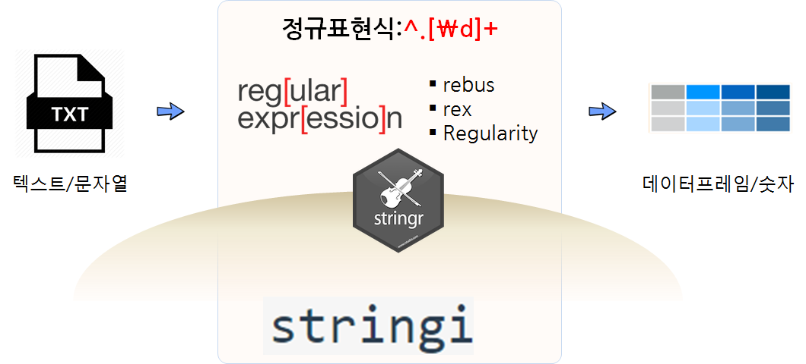

---
output: html_document
editor_options: 
  chunk_output_type: console
---

```{r setup-manip, include = FALSE}
source("_common.R")
```

# (PART\*) 자료구조 {#tm-data-structure .unnumbered}

# 텍스트 &rarr; 데이터프레임  {#text-to-tibble}

텍스트 원데이터(Raw data)를 R에서 처리하는 방식은 오래전부터 많은 함수와 도구가
개발되어 현재도 사용가능하다. 하지만 `tidyverse` 생태계를 구성하고 있는 
[`stringr`](https://stringr.tidyverse.org/)은 문자열(string)을 
다루기 위해서 개발된 전용 패키지로 티블(tibble) 데이터프레임과 결합할 경우
텍스트 전처리 작업에 생산성을 높일 수 있다. `stringr` 패키지는 [`stringi`](https://cran.r-project.org/web/packages/stringi/index.html) 패키지를 
기반으로 하여 `str_*` 방식으로 문자열 처리 함수 API 잘 문서화 되어 되어 
한번 기억하면 기억을 되새기며 코딩하기 적합하다.

{width=100%}

## 정규표현식 {#text-repex}

텍스트 데이터는 신문기사, 책, 블로그, 채팅로그 등 다양한 형태로 나타난다. 이런 텍스트를 다루는데 별도 언어가 필요한데 
이것이 **정규표현식(regular expression)**이다. 강력한 정규표현식을 사용하기 위해서 기본적으로 R에서 문자열을 불러오고 패턴을 매칭하고,
문자열 일부를 떼어내고 등등 다양한 기능을 수행하는 팩키지가 있다. 물론 R `Base`의 기본 기능함수도 있지만, `stringi`, `stringr`, `rebus` 팩키지를 조합하여 
사용하는 것이 생산성을 최대한 끌어올릴 수 있다.


{width=100%}


- [stringr](https://github.com/tidyverse/stringr): RStudio 개발환경에서 `str_` + 탭완성 기능을 조합하여 일관성을 갖고 가장 많이 사용되는 문자열 처리 기능을 함수로 제공하는 팩키지
- [stringi](https://github.com/gagolews/stringi): 속도 및 확장성, 기능에서 R 환경에서 타의 추종을 불허하는 기본 문자열 처리 R 팩키지
- [rebus: Regular Expression Builder, Um, Something](https://github.com/richierocks/rebus): 사람이 읽고 사용하기 쉬운 형태로 바꾼 정규식 구현 팩키지


텍스트/문자열 처리작업을 수행할 때 `tidyverse` 팩키지와 마찬가지로 복잡하고 난잡한 부분을 가능하면 숨기고 나서 
가장 많이 활용되는 기능만 뽑아서 가장 생산성 높게 사용하는 툴체인으로 활용가능하다.
정규표현식의 보다 자세한 사항은 데이터 과학 프로그래밍 [정규표현식](https://r2bit.com/book_programming/regex.html)을 참고한다.

## 문자열 기본 작업 {#nlp-stringr-basic-operation}

기본적으로 작업하는 기본 문자열 작업은 문자열을 찾고, 문자열을 쪼개고, 문자열을 치환하는 작업이다.
`stringr`에서 문자열 매칭에 문자열을 탐지하고, 탐지된 문자열을 뽑아내고, 매칭된 문자열 갯수를 찾아내는 기본작업을 지원한다.
이런 기본기 작업에 활용되는 다음과 같다.

- `str_detect()`
- `str_subset()`
- `str_count()`

문자열을 특정 패터에 맞춰 쪼개고 나면 `str_split()` 함수를 통해 반환되는 객체는 리스트 자료형이 된다. 왜냐하면 고정된 길이를 갖지 않을 수 있기 때문에
반환되는 리스트를 `lapply()` 함수와 연동하여 길이를 바로 구하는 것도 많이 작어되는 기본 작업 패턴이다. 
그리고 `str_replace()`, `str_replace_all()` 함수를 활용하여 문자열을 치환하는 것도 많이 사용되는 패턴이다.

``` {r basic-string-manipulation}
library(stringr)
library(magrittr)

# 1. 문자열 매칭하기 -------------------------
hangul <- c("자동차", "한국", "한국산 자동차와 손수레")

str_detect(string = hangul, pattern = "자동차")
str_detect(string = hangul, pattern = fixed("자동차"))
str_subset(string = hangul, pattern = fixed("자동차"))
str_count(string = hangul, pattern = fixed("자동차"))

# 2. 문자열 쪼개기 -------------------------
hangul <- c("한국산 자동차와 손수레 그리고 오토바이")

str_split(hangul, pattern = " 그리고 |와")
str_split(hangul, pattern = " 그리고 |와", n=2)

hanguls <- c("한국산 자동차와 손수레 그리고 오토바이",
             "독일산 자동차 그리고 아우토반")

str_split(hanguls, pattern = " 그리고 |와", simplify = TRUE)

hanguls_split <- str_split(hanguls, pattern = " 그리고 |와")

purrr::map_int(hanguls_split, length)

# 3. 매칭된 문자열 치환 --------------------

str_replace_all(hanguls,
                pattern = "와",
                replacement = " 그리고")
```

## tibble + stringr {#tibble-stringr}

짧은 텍스트는 문자열과 `stringr` 정규표현식을 조합하여 처리해도 되지만,
데이터프레임 `dplyr` 기본기를 익힌 경우 텍스트 문자열을 데이터프레임으로 
변환시킨 후에 이를 `stringr` 함수와 결합하여 텍스트를 처리하게 되면 
좀더 구조화되고 가독성 높은 코드를 작성할 수 있게 된다.

이상의 오감도 텍스트를 가져와서 텍스트 분석을 시작할 경우 파일에 읽어와도 되지만,
문자열로 읽어 `ogamdo_txt` 변수에 저장해 두고 이를 몇단계를 거쳐 데이터프레임으로 
변환시킨다.

```{r ogamdo-text}
library(dplyr)

ogamdo_txt <- "13인의 아해가 도로로 질주하오.
(길은 막다른 골목이 적당하오.)

제1의 아해가 무섭다고 그리오.
제2의 아해도 무섭다고 그리오.
제3의 아해도 무섭다고 그리오.
제4의 아해도 무섭다고 그리오.
제5의 아해도 무섭다고 그리오.
제6의 아해도 무섭다고 그리오.
제7의 아해도 무섭다고 그리오.
제8의 아해도 무섭다고 그리오.
제9의 아해도 무섭다고 그리오.
제10의 아해도 무섭다고 그리오.
제11의 아해가 무섭다고 그리오.
제12의 아해도 무섭다고 그리오.
제13의 아해도 무섭다고 그리오.
13인의 아해는 무서운 아해와 무서워하는 아해와 그렇게뿐이 모였소.(다른 사정은 없는 것이 차라리 나았소)

그중에 1인의 아해가 무서운 아해라도 좋소.
그중에 2인의 아해가 무서운 아해라도 좋소.
그중에 2인의 아해가 무서워하는 아해라도 좋소.
그중에 1인의 아해가 무서워하는 아해라도 좋소.

(길은 뚫린 골목이라도 적당하오.)
13인의 아해가 도로로 질주하지 아니하여도 좋소."

ogamdo_tbl <- ogamdo_txt %>% 
  str_split(pattern = "\n") %>%       # 문장단위로 행을 구분
  tibble::enframe(value = "text") %>% # 데이터프레임 변환
  tidyr::unnest(text) %>%             # 행기준으로 펼치기
  mutate(행 = row_number()) %>%       # 행번호 붙이기
  select(행, text)
  
ogamdo_tbl
```


이상 오감도는 총 25 줄로 구성되어 있는데 숫자가 들어간 행이 있고 그렇지 않은 행이 있는데
몇 문장에 숫자가 포함되어 있는지 `str_detect()` 함수와 숫자패턴을 탐지하는 정규표현식
`\\d` 를 조합하면 부울 참/거짓으로 변수를 생성시킬 수 있고 이를 `count()` 개수 함수를 
사용하면 빈도를 쉽게 구할 수 있다.

```{r ogamdo-tibble}
ogamdo_tbl %>% 
  mutate(숫자여부 = str_detect(text, "\\d")) %>% 
  count(숫자여부)
```

`str_squish()` 함수를 통해 연속된 공백을 제거하고 하나의 공백으로 처리할 수 
있기 때문에 텍스트가 깔끔하지 못한 경우 큰 도움이 되는 함수로 꼭 기억해두자.
만약 면자열 시작과 끝에 공백이 있는 경우 `str_trim()`을 사용하면 큰 힘 들이지 않고 
모든 문자열에 대해 공백을 제거할 수 있다.

전체적인 텍스트 정제작업이 마무리된 경우 `dplyr::pull()` 함수를 사용해서 해당
변수의 모든 텍스트를 추출하고 `str_c()` 함수로 각 행별로 구분되었던 문자열을
`collapse = " "` 인자를 넣어 하나의 텍스트로 묶어 작업을 마무리 한다.

```{r ogamdo-tibble-back-to-text, attr.output='style="max-width: 100px;"'}
ogamdo_tbl %>% 
  mutate(text = str_squish(text) %>% str_trim(.)) %>% 
  pull(text) %>% 
  str_c(., collapse = " ")
```

아직 한글화가 되어 있지 않지만, `stringr` 패키지에 담긴 `str_*`로 시작하는 다양한 함수에 대한 사항은 [String manipulation with stringr cheatsheet](https://raw.githubusercontent.com/rstudio/cheatsheets/main/strings.pdf)를 참고한다.


