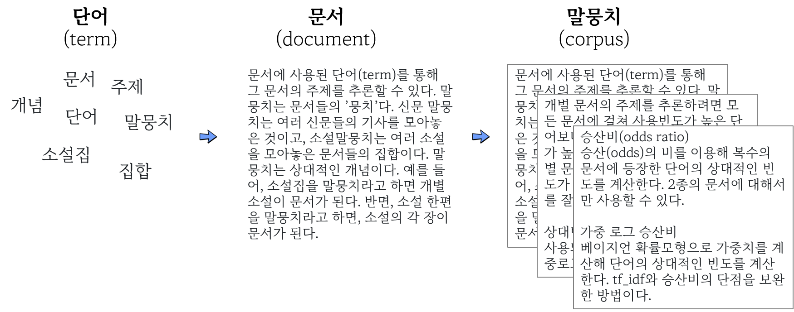

```{r setup, include = FALSE}
source("_common.R")
```

# (PART\*) 텍스트 마이닝 {#tm-text-mining .unnumbered}

# 감성분석 {#sentiment}

## 감정어 빈도 {#anal1freq}

단어가 모여 문서가 되고 문서를 모아 말뭉치를 구성한다.
문서나 말뭉치에 내재된 **감성(sentiment)**을 찾아내기 위해
크게 3가지 방식의 접근법이 많이 활용되고 있다.

{width=100%}

- 사전방식: 말뭉치에서 많이 사용된 일군의 단어집단의 빈도 계산. 감정사전을 이용하면 감정어 빈도를 구할 수 있다. 
- tf_idf: 말뭉치의 문서별로 중요하게 사용된 단어의 빈도 계산
- 주제모형(topic modeling): 말뭉치에서 주제를 나타내는 단어의 분포 계산


사전방식은 말뭉치에서 많이 사용된 일군의 단어를 사전으로 만들어 해당 단어 집단의 빈도 계산.  

- 감정사전: 각 단어를 감정에 따라 분류
- 도덕기반사전: 각 단어를 도덕감정에 따라 분류
- LIWC(Linguistic Inquiry and Word Count): 일상에서 사용하는 단어를 통해 생각, 느낌 등의 심리 측정. 상용.


## 영문 감정사전

`tidytext` 팩키지에 감성어 사전(sentiment lexicon)이 3개 포함되어 있다. `get_sentiments()` 함수에 다음 감성어 사전을 인자로 넣어 깔끔한 텍스트 데이터프레밍과 inner_join하여 텍스트에 포하된 감성을 계량화한다.

- afinn: 개발자 Finn Årup Nielsen
- bing: 개발자 Bing Liu와 기여자
- nrc: 개발자 Saif Mohammad, Peter Turney

텍스트 데이터를 토큰화 과정을 거쳐 데이터프레임으로 변환시키고 나서 영문 사전과 결합해서 감성 총합을 계산한다. 그리고 나서 `ggplot`을 통해 시각화하는 것이 일반적인 작업흐름이다.


## 국문 감정사전

[KNU한국어감성사전](https://github.com/park1200656/KnuSentiLex)은 군산대 소프트웨어융합공학과 Data Intelligence Lab에서 개발한 한국어감정사전이다. 표준국어대사전을 구성하는 각 단어의 뜻풀이를 분석하여 긍부정어를 추출했다. 
보편적인 기본 감정 표현을 나타내는 긍부정어로 구성된다. 보편적인 긍정 표현으로는 ‘감동받다’, ‘가치 있다’, ‘감사하다’와 보편적인 부정 표현으로는 ‘그저 그렇다’, ‘도저히 ~수 없다’, ‘열 받다’ 등이  있다. 이 사전을 토대로 각 영역(음식, 여행지 등)별 감정사전을 구축하는 기초 자료로 활용할 수 있다. 
[KNU한국어감성사전](https://github.com/park1200656/KnuSentiLex)은 다음 자료를 통합해 개발했다. 

1. 국립국어원 표준국어대사전의 뜻풀이(glosses) 분석을 통한 긍부정 추출(이 방법을 통해 대부분의 긍부정어 추출) 
2. 김은영(2004)의 긍부정어 목록 
3. SentiWordNet 및 SenticNet-5.0에서 주로 사용되는 긍부정어 번역 
4. 최근 온라인에서 많이 사용되는 축약어 및 긍부정 이모티콘 목록

위 자료를 통합해 총 1만4천여개의 1-gram, 2-gram, 관용구, 문형, 축약어, 이모티콘 등에 대한 긍정, 중립, 부정 판별 및 정도(degree)의 값 계산했다. 

```{r sent-pkgs }
pkg_v <- c("tidyverse", "tidytext", "epubr", "RcppMeCab")
lapply(pkg_v, require, ch = T)
```


### 사전 데이터프레임 만들기

KNU한국어감정사전을 다운로드 받아 압축을 풀어 데이터프레임 "senti_dic_df"에 할당하자. 

먼저 파일을 `data`폴더에 다운로드해  `knusenti.zip`파일로 저장한다.

```{r sent-dictionary , eval=FALSE}
url_v <- "https://github.com/park1200656/KnuSentiLex/archive/refs/heads/master.zip"
dest_v <- "data/knusenti.zip"

download.file(url = url_v, 
              destfile = dest_v,
              mode = "wb")

list.files("data/.")
```

다운로드받은 `knusenti.zip`파일을 압축해제해 필요한 사전자료의 위치를 파악한다. `data/KnuSentiLex-master` 폴더에 있는 파일의 종류를 탐색한다. 


```{r sent-dictionary-master , eval=FALSE}
unzip("data/knusenti.zip", exdir = "data")
list.files("data/KnuSentiLex-master/")
```

`SentiWord_Dict.txt`가 사전내용이 들어있는 파일이다. 9번째 있으므로, 이를 선택해 R환경으로 이입하자. `list.files()` 함수는 
지정된 디렉토리 파일과 디렉토리 정보를 알려준다. `full.names = TRUE` 인자를 함께 넣어주면 파일과 디렉토리를 결합하여 주기 때문에 경우에 따라 타이핑을 줄일 수 있다.

```{r senti-dictionary-path }
library(tidyverse)

senti_file_list <- list.files("data/KnuSentiLex-master/",
                              full.names = TRUE)

read_lines(senti_file_list[9]) %>% head(10)
```

개별 요소와 요소 사이가 공백문자로 구분돼 있다. 

```{r frq6 , eval=FALSE}
read_lines(senti_file_list[9]) %>% 
  head(10) %>% str_extract("\t|\n| ")
```

요소를 구분한 공백문자는 탭(`\t`)이다. `read_tsv`로 이입해 내용을 검토하자. 

```{r frq7 , eval=FALSE}
read_tsv(senti_file_list[9]) %>% head(10)
read_tsv(senti_file_list[9], col_names = FALSE) %>% head(10)
```

`senti_dic_df`에 할당하자. `glimpse()` 함수로 감성사전 데이터프레임을 살펴보고, 첫 5행을 출력해서 함께 살펴본다.

```{r frq8 }
senti_dic_df <- read_tsv(senti_file_list[9], col_names = FALSE)

glimpse(senti_dic_df)

senti_dic_df %>% 
  slice(1:5)
```

열의 이름을 내용에 맞게 변경하자. 감정단어의 열은 `word`로, 감정점수의 열은 `sScore`로 변경. 

```{r frq9 }
senti_dic_df <- senti_dic_df %>% 
  rename(word = X1, sScore = X2)
glimpse(senti_dic_df)
```

이제 [KNU한국어감성사전](https://github.com/park1200656/KnuSentiLex)을 R환경에서 사용할 수 있다. 

### 사전내용

KNU감성사전에 포함된 긍정단어와 부정단어를 살펴보자.

```{r frq10 }
senti_dic_df %>% filter(sScore == 2) %>% arrange(word)
senti_dic_df %>% filter(sScore == -2) %>% arrange(word)
```


각 감정점수별로 단어의 수를 계산해보자.
텍스트를 데이터프레임으로 변환하는 과정에서 
"갈등 -1" 단어가 제대로 파싱되어 데이터프레임에 반영되지 않아 이를 바로잡는 코드를 추가한다.

```{r senti-dict-conflict }
knu_dic_df <- senti_dic_df %>% 
  mutate(word   = ifelse( is.na(sScore), "갈등", word),
         sScore = ifelse( is.na(sScore), -1, sScore) )
  
knu_dic_df %>%   
  count(sScore)
```


감정점수가 -2 ~ 2까지 정수로 부여돼 있다. 이를 3단계로 줄여 각각 '긍정, 중립, 부정'으로 명칭을 바꾸자. 

```{r senti-dict-labeling }
knu_dic_df %>% 
  mutate(emotion = case_when( sScore >= 1 ~ "positive",
                              sScore <= -1 ~ "negative", 
                              TRUE         ~ "neutral")) %>% 
  count(emotion)

```

원데이터 `sScore` 열에 결측값이 한 행에 있다. 감정단어와 감정값 사이에 `\t`이 아닌 기호로 분리돼 있었기 때문이다. 결측값이 있는 행을 제거하고, `add_row()` 함수를 사용해서 해당 내용을 추가하는 방법도 있다.

```{r senti-na-fix, eval = FALSE }
knu_dic_df <- read_tsv(senti_file_list[9], col_names = FALSE) %>% 
  rename(word = X1, sScore = X2) %>% 
  filter(!is.na(sScore)) %>% 
  add_row(word = "갈등", sScore = -1) 

```


## 연습 

헌번전문을 토큰화한 다음, 긍정어와 부정어의 빈도를 계산하려고 한다. 이를 위해 토큰화한 헌법전문과 KNU한국어감성사전을 결합해 감정 단어만 추려내려 한다. 다음 중 어느 결합을 이용해야 하는가? 왜?

- semi_join
- anti_join
- inner_join
- left_join
- right_join
- full_join

위에서 선택한 _join으로 KNU한국어감성사전을 이용해 헌법전문에서 긍정어와 부정어를 추출하자. 

```{r senti-ex-01 }
library(tidytext)
library(tidyverse)

con_v <- "유구한 역사와 전통에 빛나는 우리 대한국민은 3·1운동으로 건립된 대한민국임시정부의 법통과 불의에 항거한 4·19민주이념을 계승하고, 조국의 민주개혁과 평화적 통일의 사명에 입각하여 정의·인도와 동포애로써 민족의 단결을 공고히 하고, 모든 사회적 폐습과 불의를 타파하며, 자율과 조화를 바탕으로 자유민주적 기본질서를 더욱 확고히 하여 정치·경제·사회·문화의 모든 영역에 있어서 각인의 기회를 균등히 하고, 능력을 최고도로 발휘하게 하며, 자유와 권리에 따르는 책임과 의무를 완수하게 하여, 안으로는 국민생활의 균등한 향상을 기하고 밖으로는 항구적인 세계평화와 인류공영에 이바지함으로써 우리들과 우리들의 자손의 안전과 자유와 행복을 영원히 확보할 것을 다짐하면서 1948년 7월 12일에 제정되고 8차에 걸쳐 개정된 헌법을 이제 국회의 의결을 거쳐 국민투표에 의하여 개정한다."

tibble(text = con_v) %>% 
  unnest_tokens(output = word, 
                input = text) %>% 
  inner_join(knu_dic_df)

```

형태소를 추출해 분석해보자. `RcppMeCab` 사용

```{r frq15 }
con_v %>% enc2utf8 %>% tibble(text = .) %>% 
  unnest_tokens(output = word, 
                input = text,
                token = RcppMeCab::pos) %>%
  separate(col = word, 
           into = c("word", "morph"),
           sep = "/") %>% 
  inner_join(knu_dic_df)
```

헌법 전문의 감정점수를 구해보자. 

```{r senti-constitution-ex }
con_v %>% enc2utf8 %>% tibble(text = .) %>% 
  unnest_tokens(output = word, 
                input = text,
                token = RcppMeCab::pos) %>%
  separate(col = word, 
           into = c("word", "morph"),
           sep = "/") %>% 
  inner_join(knu_dic_df) %>% 
  mutate(sScore = ifelse(is.na(sScore), 0, sScore)) %>% 
  summarise(score = sum(sScore))

```


## 소설 감정분석

소설과 같은 긴 문서를 데이터로 감성분석 작업을 수행한다.

### 수집

한글소설을 모아놓은 직지프로젝트 파일을 다운로드 받는다. 

```{r senti-novel-data , eval=FALSE}
dir.create("data")
file_url <- 'https://www.dropbox.com/s/ug3pi74dnxb66wj/jikji.epub?dl=1'
download.file(url = file_url, 
              destfile = "data/jikji.epub",
              mode="wb")
```


다운로드받은 `epub`파일을 R환경으로 이입해 데이터구조를 살핀다. 

```{r senti-novel-overview }
library(epubr)
epub("data/jikji.epub") %>% glimpse()
```

데이터는 리스트구조의 `data`열 안의 93행 4열의 데이터프레임에 저장돼 있다. `data` 열만 선택하고 `unnest()` 함수로 리스트를 풀어 일반적인 데이터프레임으로 변환한 뒤에 글자수 기준으로 역정렬한다.


```{r senti-novel-stat }
jikji_epub <- epub("data/jikji.epub")

jikji_epub %>% 
  select(data) %>% 
  unnest(data) %>% 
  arrange( desc(nchar) )
```


### 정제

`text`열에 93편의 소설 본문이 들어있다. 자료구조가 데이터프레임을 확장한 티블(tibble)이라 후속 텍스트 정제나 분석작업에 필요한 소설이 텍스트 형태로 어떻게 담겨있고 몇개나 있는지 쉽게 파악된다.

```{r senti-novel-text }
novel_raw <- jikji_epub %>% 
  select(data) %>% 
  unnest(data) %>% 
  select(text) 

novel_raw
```

소설 제목, 지은이, 출전, 본문을 추출해보자. 
`transmute()` 함수는 `mutate()` 함수와 동일한 기능을 수행하나 변환작업에 관련된 변수만 남긴다는 점에서 이번 작업에 적합하다.
제목, 지은이 등 변수를 `text` 칼럼을 원자료로 삼아 `str_extract()` 함수와 정규표현식을 결합하여 필요한 정보만 추출한다.

```{r senti-novel-extraction }

novel_tbl <- novel_raw %>% 
  transmute(제목 = str_extract(text, ".*\\b"),
            지은이 = str_extract(text, "지은이.*\\b") %>% str_remove("지은이: "),
            출전 = str_extract(text, "출전.*\\b") %>% 
              str_remove(":") %>% str_remove("\\)") %>% str_remove("출전 "),
            본문 = str_squish(text) %>% 
  str_extract("본문.*") %>%
  str_remove("본문|:"))

novel_tbl
```

데이터프레임에 저장하자. 마지막 4행은 소설본문이 아니므로 제외하고 저장. 

```{r frq24 }

sosul_df <- novel_tbl %>% 
  rename(title = 제목, 
         author = 지은이,
         source = 출전,
         main = 본문) %>%
  slice(1:89)

sosul_df %>% glimpse()
```

비슷한 길이의 소설 1편씩 추출해보자. 


```{r senti-novel-2 }
sosul2_df <- sosul_df %>% 
  slice(c(9:10))

sosul2_df
```


9번째와 10번째 소설의 길이가 둘다 21000자로 비슷하다. 
이상의 '권태'와 나혜석의 '규원'이다. 

두 편의 소설은 웹에서도 볼수 있다.

- [이상의 '권태'](https://ko.wikisource.org/wiki/권태)

일제식민지 시기 지식인의 무기력함과 좌절을 여름날 벽촌에서의 권태로운 생활에 대한 묘사를 통해 나타낸 수필. 

- [나혜석의 '규원'](https://ko.wikisource.org/wiki/규원)

1921년 여성 최초의 서양화가이자 소설가 나혜석의 단편소설. 양반집 규수였던 여인이 사랑하는 이에에 버림받은 한을 여성 특유의 섬세한 표현으로 그린 단편. 규수의 원한이라 규원. 


### 분석 및 소통

감정어휘 빈도를 계산해 두 문서에 감정을 분석해보자.

```{r senti-two-novels }
sosul2_senti_df <- sosul2_df %>% 
  unnest_tokens(word, main) %>% 
  inner_join(knu_dic_df) %>% 
  group_by(author) %>% 
  count(word, sScore, sort = TRUE) %>% 
  filter(str_length(word) > 1) %>% 
  mutate(word = reorder(word, n)) %>% 
  slice_head(n = 20) %>% 
  mutate(sScore = as.factor(sScore))

sosul2_senti_df %>% 
  ggplot(aes(n, reorder_within(word, n, author), fill = sScore)) + 
    geom_col() +
    scale_y_reordered() +
    scale_fill_brewer(type="div", palette = "RdBu") +
    facet_wrap( ~ author, scales = "free")
```

형태소를 분석해 감정을 분석해 보자. `RcppMeCab`의 `pos()`함수를 이용하자. 

```{r senti-two-novels-pos }
sosul2_senti_tk <- sosul2_df %>% 
  unnest_tokens(word, main, token = RcppMeCab::pos) %>% 
  separate(col = word, 
           into = c("word", "morph"), 
           sep = "/" ) %>% 
  inner_join(knu_dic_df) %>% 
  group_by(author) %>% 
  count(word, sScore, sort = T) %>% 
  filter(str_length(word) > 1) %>% 
  mutate(word = reorder(word, n)) %>% 
  slice_head(n = 20) %>% 
  mutate(sScore = as.factor(sScore))  

sosul2_senti_tk %>% 
  ggplot(aes(n, reorder_within(word, n, author), fill = sScore)) + 
    geom_col() +
    scale_y_reordered() +
    scale_fill_brewer(type="div", palette = "RdBu") +
    facet_wrap( ~ author, scales = "free")

```

형태소를 분석한 결과를 통해 나타난 두 문서의 감정이 조금 더 긍정적으로 변했다. 형태소분석하면서 부정어휘로 구분됐던 단어들이 한글자로 분리돼 불용어로 제거된 결과다. 


### 소설 감정점수

'권태'와 '규원'의 감정점수를 비교해 어느 글이 더 부정적인지 살펴보자. 각 토큰에 감정점수 부여한다. 감정사전에 없는 단어를 남겨두기 위해 `left_join()`이용 

```{r senti-novels-score }
sosul2_df %>% 
  unnest_tokens(word, main) %>% 
  left_join(knu_dic_df) %>% 
  mutate(sScore = ifelse(is.na(sScore), 0, sScore)) %>% 
  arrange(sScore)
```


감정단어를 극성별로 분류하자. 사전의 감정점수가 5수준으로 돼 있는 것을  3수준으로 줄인다. 

```{r senti-novels-score-three }
sosul2_df %>% 
  unnest_tokens(word, main) %>% 
  left_join(knu_dic_df) %>% 
  mutate(sScore = case_when(sScore >= 1  ~ "긍정",
                            sScore <= -1 ~ "부정", 
                            is.na(sScore) ~ NA_character_,
                            TRUE ~ "중립")) %>% 
  count(sScore)
```

'권태'와 '규원' 두소설의 감정점수 계산하면 다음과 같다.

```{r senti-novels-score-ttl }
sosul2_df %>% 
  unnest_tokens(word, main) %>% 
  left_join(knu_dic_df) %>% 
  mutate(sScore = ifelse(is.na(sScore), 0, sScore)) %>% 
  group_by(title) %>% 
  summarise(emotion = sum(sScore))

```


### 감정 극성별 단어빈도

감정사전에서 긍정감정 단어와 부정단어를 각각 긍정단어 사전과 부정단어  사전을 만들어보자.

```{r senti-polarity-dict }
knu_pos_df <- knu_dic_df %>% 
  filter(sScore > 0)

knu_pos_df %>% 
  distinct(sScore)

knu_neg_df <- knu_dic_df %>% 
  filter(sScore < 0)

knu_neg_df %>% 
  distinct(sScore)
```

긍정어 사전과 부정어 사전을 결합하여 두 소설에 포함된 단어 감성빈도를 계산해보자.

```{r senti-polarity-dict-count }
sosul2_df %>% 
  unnest_tokens(word, main) %>% 
  inner_join(knu_pos_df) %>% 
  count(author, word, sort = TRUE)

sosul2_df %>% 
  unnest_tokens(word, main) %>% 
  inner_join(knu_neg_df) %>% 
  count(author, word, sort = TRUE)
```


### 극성별 단어빈도 단어구름 

두 소설에 많이 언급된 단어 빈도수를 구해서 단어구름 시각화를 한다.

```{r senti-novel-wordcloud }
# install.packages("wordcloud")
library(wordcloud)

sosul2_df %>% 
  unnest_tokens(word, main) %>% 
  count(word) %>% 
  filter(str_length(word) > 1) %>% 
  with(wordcloud(word, n, max.words = 50))

```

긍정단어와 부정단어 분리하여 단어구름으로 시각화한다.
이를 위해서 `comparison.cloud()` 함수에 적합한 형태로 데이터프레임 변환작업을 수행하고 
`comparison.cloud()` 함수에 행렬을 넣어준다.

```{r senti-novel-wordcloud-polarity }

sosul2_df %>% 
  unnest_tokens(word, main) %>% 
  inner_join(knu_dic_df) %>% 
  mutate(emotion = case_when(sScore > 0 ~ "긍정",
                             sScore < 0 ~ "부정",
                             TRUE       ~ "중립")) %>% 
  filter(emotion != "중립") %>% 
  count(word, emotion, sort = TRUE) %>% 
  filter(str_length(word) > 1) %>% 
  ## wordcloud() 함수에 적합한 형태로 데이터프레임 변환
  pivot_wider(names_from = emotion, values_from = n, values_fill = 0)  %>% 
  column_to_rownames(var = "word") %>% 
  as.matrix() %>% 
  # reshape2::acast(word ~ emotion, value.var = "n", fill = 0) # 이전 코드
  # 비교 단어구름 시각화
  comparison.cloud(colors = c("red", "blue"), max.words = 50)
```


### 문장 전개에 따른 감정변화

문장 단위로 토큰화하고, `row_number()`를 이용해 각 문장단위로 번호를 부여한다. 

```{r frq37 }
sosul2_df %>% 
  unnest_tokens(sentence, main, token = "sentences") %>% 
  mutate(linenumber = row_number()) %>% 
  unnest_tokens(word, sentence)
```


5수준인 감정사전의 감정점수를 긍정과 부정 등 2수준으로 축소하자. 

```{r senti-time-series }
sosul2_df %>% 
  unnest_tokens(sentence, main, token = "sentences") %>% 
  mutate(linenumber = row_number()) %>% 
  unnest_tokens(word, sentence) %>% 
  inner_join(knu_dic_df) %>% 
  mutate(emotion = case_when(sScore > 0 ~ "긍정",
                             sScore < 0 ~ "부정",
                             TRUE       ~ "중립"))

```

긍정감정과 부정감정의 차이를 계산한다. 지은이를 기준으로 각 문장(행)별로 감정의 빈도를 계산하면, 글의 진행에 따른 감정의 변화를 나타낼 수 있다. 그런데, 개별 문장에는 감정어가 들어있는 빈도가 적기 때문에, 여러 문장을 하나의 단위로 묶을 필요가 있다. 이를 위해 몫만을 취하는 정수 나눗셈(`%/%`)활용. 

```{r senti-division }
c(1, 10, 20, 30, 40, 50) / 20
c(1, 10, 20, 30, 40, 50) %/% 20
```

여러 행을 묶지 않고 지은이 별로 감정어의 빈도를 계산하면 334행에는 긍정단어 2개, 부정단어가 1개 있음을 알수 있다. 

```{r frq40 }
sosul2_df %>% 
  unnest_tokens(sentence, main, token = "sentences") %>% 
  mutate(linenumber = row_number()) %>% 
  unnest_tokens(word, sentence) %>% 
  inner_join(knu_dic_df) %>% 
  mutate(emotion = case_when(sScore > 0 ~ "긍정",
                             sScore < 0 ~ "부정",
                             TRUE       ~ "중립")) %>% 
  count(author, index = linenumber, emotion)

```

각 행을 10으로 정수나눗셈을 하면 10개 행씩 모두 같은 값으로 묶을 수 있다. 334행부터 339행인 33이 된다. 긍정단어와 부정단어도 각각 5개가 된다. 

```{r frq41 }
sosul2_df %>% 
  unnest_tokens(sentence, main, token = "sentences") %>% 
  mutate(linenumber = row_number()) %>% 
  unnest_tokens(word, sentence) %>% 
  inner_join(knu_dic_df) %>% 
  mutate(emotion = case_when(sScore > 0 ~ "긍정",
                             sScore < 0 ~ "부정",
                             TRUE       ~ "중립")) %>% 
  count(author, index = linenumber %/% 10, emotion)
```


긍정감정 점수에서 부정감정 점수를 빼 감정의 상대강도를 계산하기 위해 감정의 값을 열의 제목으로 만들고, 각 감정어 빈도를 해당 열의 값으로 할당한다.  감정어가 없어 결측값이 나올수 있으므로, `values_fill = `인자로 '0'을 할당한다.  

```{r frq42 }
sosul2_emo_df <- sosul2_df %>% 
  unnest_tokens(sentence, main, token = "sentences") %>% 
  mutate(linenumber = row_number()) %>% 
  unnest_tokens(word, sentence) %>% 
  inner_join(knu_dic_df) %>% 
  mutate(emotion = case_when(sScore > 0 ~ "긍정",
                             sScore < 0 ~ "부정",
                             TRUE       ~ "중립")) %>% 
  count(author, index = linenumber %/% 10, emotion) %>% 
  pivot_wider(names_from = emotion, values_from = n, values_fill = 0) %>%   mutate(sentiment = 긍정 - 부정) 

sosul2_emo_df
```

막대도표로 소설 전개에 따른 감성변화를 시각화한다. 

```{r senti-time-viz }
sosul2_emo_df %>% 
  ggplot( aes(index, sentiment, fill = author) ) + 
    geom_col( show.legend = FALSE) +
    facet_wrap( ~ author, scales = "free_x")

```


