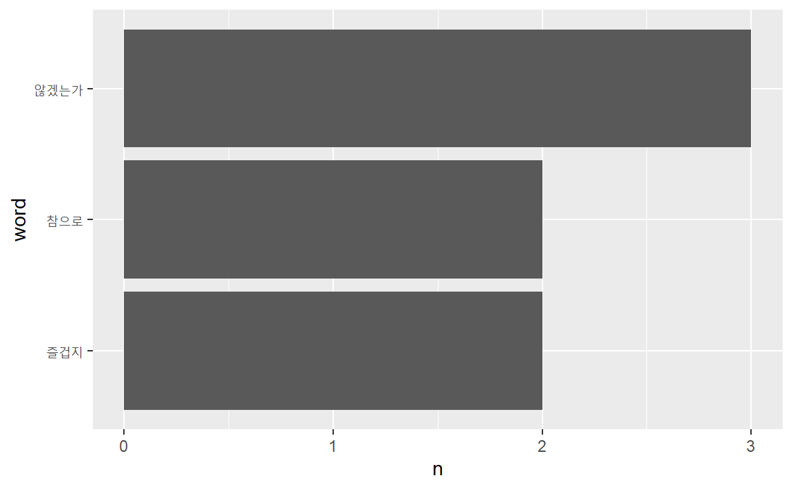

# 헬로 월드 {#browse}

인식론의 틀에서 우리가 사는 세상은 세상 그 자체가 아니라, 우리 마음에 속에 비친 그림자이다. 따라서 세상은 "인식전 세상"과 "인식된 세상"으로 구분할 수 있다. 

인식의 과정은 자료-정보-지식-지혜(DIKW: Data, Information, Knowledge, Wisdom) 위계론을 통해 4단계 모형으로 구성할 수 있다. 

- 1단계: 인식전 세계에서 원자료(raw data) 수집
- 2단계: 원자료 정제해 자료(data)로 1차부호화
- 3단계: 자료를 분석해 정보(information)로 2차부호화
- 4단계: 정보를 지식(knowledge)으로 해석하고 지혜(wisdom)로 내면화


이를 순서대로 제시하면 다음과 같다. 

{width=100%}

이를 소통의 관점에서 재구성하면 해석과 내면화의 과정을 의미공유 과정인 소통(communication)으로 대체할 수 있다. 

{width=100%}

이를 재정리하면 다음과 같다.

{width=100%}
 
텍스트마이닝에도 이 위계 과정을 적용해, 수집 &rarr; 정제 &rarr; 분석 &rarr; 소통 등의 구조로 이뤄진다. 각 단계별로 자세하게 다루기 이전에 전반적인 구조를 먼저 이해하자. 

- 수집
- 정제(전처리)
- 분석
- 소통 

## 수집

텍스트마이닝의 첫 단계다. 원자룔 수집한 다음, 정제하고 분석하기 위해 R환경에 탑재하는 단계다. 

텍스트데이터가 저장된 데이터구조는 다양하다. 벡터(vector), 데이터프레임(data frame), 리스트(list) 등의 구조에 저장해 사용한다. 가장 기본적인 텍스트데이터 구조는 문자형으로 구성된 문자벡터다. 

<논어> 학이편 1장의 텍스트데이터를 문자벡터에 담아 불러와 보자.

```
배우며 제때에 실행하면 진실로 즐겁지 않겠는가?
벗이 먼 곳에서부터 온다면 참으로 즐겁지 않겠는가?
남이 알아주지 않아도 성내지 않는다면 참으로 군자답지 않겠는가?

```


```r
text_v <- c("배우며 제때에 실행하면 진실로 즐겁지 않겠는가?
            벗이 먼 곳에서부터 온다면 참으로 즐겁지 않겠는가?
            남이 알아주지 않아도 성내지 않는다면 참으로 군자답지 않겠는가?")
text_v
```

<pre class="r-output"><code>## [1] "배우며 제때에 실행하면 진실로 즐겁지 않겠는가?\n            벗이 먼 곳에서부터 온다면 참으로 즐겁지 않겠는가?\n            남이 알아주지 않아도 성내지 않는다면 참으로 군자답지 않겠는가?"
</code></pre>

`\n`은 행바꿈을 의미하는 정규표현식이다. 


## 정제

### 정돈 텍스트

문자형, 숫자형, 논리형 등의  데이터 유형 중 텍스트데이터유형은 문자형이다. 그런데 데이터 유형이 문자형이어서는 컴퓨터로 분석할 수 없다. 양화(quantification)시켜 컴퓨터가 계산할 수 있도록 바꿔줘야 한다. 
f
다양한 방법이 있는데, 데이터프레임을 "정돈된 데이터 원리(tidy data principle)"에 따라 만든 정돈텍스트(tidy text)구조부터 시작하자. 

**정돈텍스트(tidy text)**는 데이터프레임을 텍스트마이닝에 적합하도록 만든 데이터구조다. 일반적으로 데이터프레임은 복수의 열(column)로 이뤄져 있는데, 정돈텍스트 구조에서는 열을 단 하나로 고정시켰다. 즉, **행(row) 하나에 토큰(token)이 하나만 할당돼 있다(one-token-per-row).** 토큰은 텍스트분석의 기본 단위다. 단어 하나를 토큰으로 이용하기도 하고, 복수의 단어(n-gram)를 묶어 하나의 토큰으로 이용하기도 한다. 


### 토큰화

정돈된 깔끔한 텍스트 분석을 위해서 데이터프레임 구성과 함께 
텍스트를 데이터프레임에 깔끔하게 변환시킬 수 있는 `tidytext` 패키지
`unnest_tokens()` 함수가 필요하다.

- 데이터프레임 구성 `tibble`
- 토큰화 `unnest_tokens`

정돈된 세계(tidyverse)에서 텍스트데이터를 정돈텍스트 구조에 담는 함수가 `tidytext`패키지에서 제공하는 `unnest_tokens`다. 
(철자에 주의하자. 복수 `s`가 붙어 있다.)


```r
install.packages("tidytext")
```

`tidytext`의 자세한 사용법은 아래 사용설명서를 참조한다. 

 - tidytext https://cran.r-project.org/web/packages/tidytext/

`unnest_tokens`은 데이트프레임 구조의 데이터를 받아 처리한다. 앞서 만든 문자벡터 `text_v`를 **정돈텍스트로 바꾸기 위해서는 먼저 데이터프레임으로 바꿔야 한다.** `tibble`패키지의 `tibble`함수를 이용해 `text_v`의 내용을 데이터프레임에 담아 보자. `tibble`은 `tidyverse`에 부착돼 있다. 

티블(tibble)은 현대적인 데이터프레임의 형식이다. 문자열을 요인(factor)형식으로 로 바꾸지 않는 등 텍스트분석에 사용하기 좋다. 

데이터프레임의 열 이름을 무엇으로 설정했는지에 주의하자. 여기서는 "text"로 설정했다. 


```r
library(tidyverse)
text_df <- tibble(text = text_v)
text_df
```

<pre class="r-output"><code>## <span style='color: #555555;'># A tibble: 1 × 1</span>
##   text                                                      
##   <span style='color: #555555; font-style: italic;'>&lt;chr&gt;</span>                                                     
## <span style='color: #555555;'>1</span> <span style='color: #555555;'>"</span>배우며 제때에 실행하면 진실로 즐겁지 않겠는가?\n        …
</code></pre>

이제 생성된 데이터프레임을 `tidytext`패키지의 `unnest_tokens`함수를 이용해 정돈텍스트 구조로 바꿔보자. (철자에 주의. 복수 s)

앞서 만든 데이터프레임의 열 이름("text")을 `input`에 투입한 것을 잘 기억하자. 


```r
library(tidytext)
text_df %>% unnest_tokens(output = word, input = text)
```

<pre class="r-output"><code>## <span style='color: #555555;'># A tibble: 21 × 1</span>
##   word    
##   <span style='color: #555555; font-style: italic;'>&lt;chr&gt;</span>   
## <span style='color: #555555;'>1</span> 배우며  
## <span style='color: #555555;'>2</span> 제때에  
## <span style='color: #555555;'>3</span> 실행하면
## <span style='color: #555555;'>4</span> 진실로  
## <span style='color: #555555;'>5</span> 즐겁지  
## <span style='color: #555555;'>6</span> 않겠는가
## <span style='color: #555555;'># … with 15 more rows</span>
</code></pre>

 - input : 입력한 데이터프레임의 열 이름
 - output : 출력할 정돈텍스트의 열 이름 
 
이처럼 텍스트데이터를 컴퓨터가 분석할 수 있도록 양화할 수 있는 단위로 나누는 것은 토큰화(tkoenization)이라고 한다. 

이번에는 토큰을 단어 2개로 묶은 ngram으로 정돈텍스트를 만들어 보자. 


```r
text_df %>% unnest_tokens(output = word, input = text, 
                          token = "ngrams", n = 2 )
```

<pre class="r-output"><code>## <span style='color: #555555;'># A tibble: 20 × 1</span>
##   word           
##   <span style='color: #555555; font-style: italic;'>&lt;chr&gt;</span>          
## <span style='color: #555555;'>1</span> 배우며 제때에  
## <span style='color: #555555;'>2</span> 제때에 실행하면
## <span style='color: #555555;'>3</span> 실행하면 진실로
## <span style='color: #555555;'>4</span> 진실로 즐겁지  
## <span style='color: #555555;'>5</span> 즐겁지 않겠는가
## <span style='color: #555555;'>6</span> 않겠는가 벗이  
## <span style='color: #555555;'># … with 14 more rows</span>
</code></pre>

`unnest_tokens`함수의 자세한 사용법은 `?unnest_tokens`의 도움말을 참고한다. 

## 분석

### 빈도: `count` 함수 

이제 텍스트마이닝을 해보자. 어떤 문서에서 많이 사용하는 단어가 있다면, 그 문서는 그 단어가 나타내는 의미에 의해 규정된다고 할 수 있다. "사랑"이란 단어를 많이 사용한 문서면 사랑에 대한 문서이고, "학습"이란 단어를 많이 사용했으면 학습에 대한 문서일 가능성이 높다. 

문서에 등장하는 단어를 세어 주는 함수가 `count`다. `count`함수를 앞서 정돈텍스트 구조에 저장된 텍스트에 많이 등장한 단어가 무멋인지 찾아보자. 


```r
text_tk <- text_df %>% unnest_tokens(output = word, input = text)
text_tk %>% 
  count(word, sort = TRUE)
```

<pre class="r-output"><code>## <span style='color: #555555;'># A tibble: 17 × 2</span>
##   word           n
##   <span style='color: #555555; font-style: italic;'>&lt;chr&gt;</span>      <span style='color: #555555; font-style: italic;'>&lt;int&gt;</span>
## <span style='color: #555555;'>1</span> 않겠는가       3
## <span style='color: #555555;'>2</span> 즐겁지         2
## <span style='color: #555555;'>3</span> 참으로         2
## <span style='color: #555555;'>4</span> 곳에서부터     1
## <span style='color: #555555;'>5</span> 군자답지       1
## <span style='color: #555555;'>6</span> 남이           1
## <span style='color: #555555;'># … with 11 more rows</span>
</code></pre>

"않겠는가"가 3회, "즐겁지"와 "참으로"로가 각각 2회 사용됐다. 즐거움에 관한 문서라고 가늠할 수 있다. 


## 소통

분석결과를 해석해 의미를 공유하는 과정이다. 분석결과를 요약 통계량 예를 들어 빈도수, 혹은 표형태로 깔끔하게 정리하거나, 도표로 시각화한다. 물론 글로도 분석결과의 의미를 정리한다. 여기서는 먼저 분석결과를 도표에 시각화하는 작업부터 해보자. 

### 시각화 

분석결과가 데이터프레임에 저장돼 있으므로 `ggplot2`패키지로 직접 파이핑(piping)할 수 있다. `ggplot2`는 파이프(`%>%`)가 아니라 `+`로 레이어를 더하는 방식을 이용한다는 점에 주의하자.  

`ggplot2`는 `tidyverse`에 부착돼 있다. 

다음 코드는 2회 이상 등장`filter(n > 1)`한 단어를 등장빈도 순서대로 정렬`mutate(word = reorder(word, n))`해 막대도포`geom_col()`로 시각화했다. 


```r
text_tk %>% 
  count(word, sort = TRUE) %>% 
  filter(n > 1) %>% 
  mutate(word = reorder(word, n)) %>% 
  ggplot(aes(word, n)) +
    geom_col() +
    coord_flip()
```



### 표

그래프 문법으로 시각화하는 방식이 `ggplot`이라면 동일한 방식으로 표를 작성하는 표문법을 구현한 것이 `gt` 패키지다. 이를 통해 가장 언급이 많은 빈도수를 갖는
단어를 표로 깔끔하게 정리해보자.


```r
library(gt) # install.packages("gt")
text_tk %>% 
  count(word, sort = TRUE) %>% 
  filter(n > 1) %>% 
  mutate(word = reorder(word, n)) %>% 
  gt() %>% 
    tab_header(
      title = "언급 많은 단어"
    ) %>% 
    cols_label(
      word = "단어",
      n = "언급횟수"
  )
```

```{=html}
<div id="akplliztue" style="overflow-x:auto;overflow-y:auto;width:auto;height:auto;">
<style>html {
  font-family: -apple-system, BlinkMacSystemFont, 'Segoe UI', Roboto, Oxygen, Ubuntu, Cantarell, 'Helvetica Neue', 'Fira Sans', 'Droid Sans', Arial, sans-serif;
}

#akplliztue .gt_table {
  display: table;
  border-collapse: collapse;
  margin-left: auto;
  margin-right: auto;
  color: #333333;
  font-size: 16px;
  font-weight: normal;
  font-style: normal;
  background-color: #FFFFFF;
  width: auto;
  border-top-style: solid;
  border-top-width: 2px;
  border-top-color: #A8A8A8;
  border-right-style: none;
  border-right-width: 2px;
  border-right-color: #D3D3D3;
  border-bottom-style: solid;
  border-bottom-width: 2px;
  border-bottom-color: #A8A8A8;
  border-left-style: none;
  border-left-width: 2px;
  border-left-color: #D3D3D3;
}

#akplliztue .gt_heading {
  background-color: #FFFFFF;
  text-align: center;
  border-bottom-color: #FFFFFF;
  border-left-style: none;
  border-left-width: 1px;
  border-left-color: #D3D3D3;
  border-right-style: none;
  border-right-width: 1px;
  border-right-color: #D3D3D3;
}

#akplliztue .gt_title {
  color: #333333;
  font-size: 125%;
  font-weight: initial;
  padding-top: 4px;
  padding-bottom: 4px;
  padding-left: 5px;
  padding-right: 5px;
  border-bottom-color: #FFFFFF;
  border-bottom-width: 0;
}

#akplliztue .gt_subtitle {
  color: #333333;
  font-size: 85%;
  font-weight: initial;
  padding-top: 0;
  padding-bottom: 6px;
  padding-left: 5px;
  padding-right: 5px;
  border-top-color: #FFFFFF;
  border-top-width: 0;
}

#akplliztue .gt_bottom_border {
  border-bottom-style: solid;
  border-bottom-width: 2px;
  border-bottom-color: #D3D3D3;
}

#akplliztue .gt_col_headings {
  border-top-style: solid;
  border-top-width: 2px;
  border-top-color: #D3D3D3;
  border-bottom-style: solid;
  border-bottom-width: 2px;
  border-bottom-color: #D3D3D3;
  border-left-style: none;
  border-left-width: 1px;
  border-left-color: #D3D3D3;
  border-right-style: none;
  border-right-width: 1px;
  border-right-color: #D3D3D3;
}

#akplliztue .gt_col_heading {
  color: #333333;
  background-color: #FFFFFF;
  font-size: 100%;
  font-weight: normal;
  text-transform: inherit;
  border-left-style: none;
  border-left-width: 1px;
  border-left-color: #D3D3D3;
  border-right-style: none;
  border-right-width: 1px;
  border-right-color: #D3D3D3;
  vertical-align: bottom;
  padding-top: 5px;
  padding-bottom: 6px;
  padding-left: 5px;
  padding-right: 5px;
  overflow-x: hidden;
}

#akplliztue .gt_column_spanner_outer {
  color: #333333;
  background-color: #FFFFFF;
  font-size: 100%;
  font-weight: normal;
  text-transform: inherit;
  padding-top: 0;
  padding-bottom: 0;
  padding-left: 4px;
  padding-right: 4px;
}

#akplliztue .gt_column_spanner_outer:first-child {
  padding-left: 0;
}

#akplliztue .gt_column_spanner_outer:last-child {
  padding-right: 0;
}

#akplliztue .gt_column_spanner {
  border-bottom-style: solid;
  border-bottom-width: 2px;
  border-bottom-color: #D3D3D3;
  vertical-align: bottom;
  padding-top: 5px;
  padding-bottom: 5px;
  overflow-x: hidden;
  display: inline-block;
  width: 100%;
}

#akplliztue .gt_group_heading {
  padding-top: 8px;
  padding-bottom: 8px;
  padding-left: 5px;
  padding-right: 5px;
  color: #333333;
  background-color: #FFFFFF;
  font-size: 100%;
  font-weight: initial;
  text-transform: inherit;
  border-top-style: solid;
  border-top-width: 2px;
  border-top-color: #D3D3D3;
  border-bottom-style: solid;
  border-bottom-width: 2px;
  border-bottom-color: #D3D3D3;
  border-left-style: none;
  border-left-width: 1px;
  border-left-color: #D3D3D3;
  border-right-style: none;
  border-right-width: 1px;
  border-right-color: #D3D3D3;
  vertical-align: middle;
}

#akplliztue .gt_empty_group_heading {
  padding: 0.5px;
  color: #333333;
  background-color: #FFFFFF;
  font-size: 100%;
  font-weight: initial;
  border-top-style: solid;
  border-top-width: 2px;
  border-top-color: #D3D3D3;
  border-bottom-style: solid;
  border-bottom-width: 2px;
  border-bottom-color: #D3D3D3;
  vertical-align: middle;
}

#akplliztue .gt_from_md > :first-child {
  margin-top: 0;
}

#akplliztue .gt_from_md > :last-child {
  margin-bottom: 0;
}

#akplliztue .gt_row {
  padding-top: 8px;
  padding-bottom: 8px;
  padding-left: 5px;
  padding-right: 5px;
  margin: 10px;
  border-top-style: solid;
  border-top-width: 1px;
  border-top-color: #D3D3D3;
  border-left-style: none;
  border-left-width: 1px;
  border-left-color: #D3D3D3;
  border-right-style: none;
  border-right-width: 1px;
  border-right-color: #D3D3D3;
  vertical-align: middle;
  overflow-x: hidden;
}

#akplliztue .gt_stub {
  color: #333333;
  background-color: #FFFFFF;
  font-size: 100%;
  font-weight: initial;
  text-transform: inherit;
  border-right-style: solid;
  border-right-width: 2px;
  border-right-color: #D3D3D3;
  padding-left: 5px;
  padding-right: 5px;
}

#akplliztue .gt_stub_row_group {
  color: #333333;
  background-color: #FFFFFF;
  font-size: 100%;
  font-weight: initial;
  text-transform: inherit;
  border-right-style: solid;
  border-right-width: 2px;
  border-right-color: #D3D3D3;
  padding-left: 5px;
  padding-right: 5px;
  vertical-align: top;
}

#akplliztue .gt_row_group_first td {
  border-top-width: 2px;
}

#akplliztue .gt_summary_row {
  color: #333333;
  background-color: #FFFFFF;
  text-transform: inherit;
  padding-top: 8px;
  padding-bottom: 8px;
  padding-left: 5px;
  padding-right: 5px;
}

#akplliztue .gt_first_summary_row {
  border-top-style: solid;
  border-top-color: #D3D3D3;
}

#akplliztue .gt_first_summary_row.thick {
  border-top-width: 2px;
}

#akplliztue .gt_last_summary_row {
  padding-top: 8px;
  padding-bottom: 8px;
  padding-left: 5px;
  padding-right: 5px;
  border-bottom-style: solid;
  border-bottom-width: 2px;
  border-bottom-color: #D3D3D3;
}

#akplliztue .gt_grand_summary_row {
  color: #333333;
  background-color: #FFFFFF;
  text-transform: inherit;
  padding-top: 8px;
  padding-bottom: 8px;
  padding-left: 5px;
  padding-right: 5px;
}

#akplliztue .gt_first_grand_summary_row {
  padding-top: 8px;
  padding-bottom: 8px;
  padding-left: 5px;
  padding-right: 5px;
  border-top-style: double;
  border-top-width: 6px;
  border-top-color: #D3D3D3;
}

#akplliztue .gt_striped {
  background-color: rgba(128, 128, 128, 0.05);
}

#akplliztue .gt_table_body {
  border-top-style: solid;
  border-top-width: 2px;
  border-top-color: #D3D3D3;
  border-bottom-style: solid;
  border-bottom-width: 2px;
  border-bottom-color: #D3D3D3;
}

#akplliztue .gt_footnotes {
  color: #333333;
  background-color: #FFFFFF;
  border-bottom-style: none;
  border-bottom-width: 2px;
  border-bottom-color: #D3D3D3;
  border-left-style: none;
  border-left-width: 2px;
  border-left-color: #D3D3D3;
  border-right-style: none;
  border-right-width: 2px;
  border-right-color: #D3D3D3;
}

#akplliztue .gt_footnote {
  margin: 0px;
  font-size: 90%;
  padding-left: 4px;
  padding-right: 4px;
  padding-left: 5px;
  padding-right: 5px;
}

#akplliztue .gt_sourcenotes {
  color: #333333;
  background-color: #FFFFFF;
  border-bottom-style: none;
  border-bottom-width: 2px;
  border-bottom-color: #D3D3D3;
  border-left-style: none;
  border-left-width: 2px;
  border-left-color: #D3D3D3;
  border-right-style: none;
  border-right-width: 2px;
  border-right-color: #D3D3D3;
}

#akplliztue .gt_sourcenote {
  font-size: 90%;
  padding-top: 4px;
  padding-bottom: 4px;
  padding-left: 5px;
  padding-right: 5px;
}

#akplliztue .gt_left {
  text-align: left;
}

#akplliztue .gt_center {
  text-align: center;
}

#akplliztue .gt_right {
  text-align: right;
  font-variant-numeric: tabular-nums;
}

#akplliztue .gt_font_normal {
  font-weight: normal;
}

#akplliztue .gt_font_bold {
  font-weight: bold;
}

#akplliztue .gt_font_italic {
  font-style: italic;
}

#akplliztue .gt_super {
  font-size: 65%;
}

#akplliztue .gt_two_val_uncert {
  display: inline-block;
  line-height: 1em;
  text-align: right;
  font-size: 60%;
  vertical-align: -0.25em;
  margin-left: 0.1em;
}

#akplliztue .gt_footnote_marks {
  font-style: italic;
  font-weight: normal;
  font-size: 75%;
  vertical-align: 0.4em;
}

#akplliztue .gt_asterisk {
  font-size: 100%;
  vertical-align: 0;
}

#akplliztue .gt_slash_mark {
  font-size: 0.7em;
  line-height: 0.7em;
  vertical-align: 0.15em;
}

#akplliztue .gt_fraction_numerator {
  font-size: 0.6em;
  line-height: 0.6em;
  vertical-align: 0.45em;
}

#akplliztue .gt_fraction_denominator {
  font-size: 0.6em;
  line-height: 0.6em;
  vertical-align: -0.05em;
}
</style>
<table class="gt_table">
  <thead class="gt_header">
    <tr>
      <th colspan="2" class="gt_heading gt_title gt_font_normal gt_bottom_border" style>언급 많은 단어</th>
    </tr>
    
  </thead>
  <thead class="gt_col_headings">
    <tr>
      <th class="gt_col_heading gt_columns_bottom_border gt_center" rowspan="1" colspan="1">단어</th>
      <th class="gt_col_heading gt_columns_bottom_border gt_right" rowspan="1" colspan="1">언급횟수</th>
    </tr>
  </thead>
  <tbody class="gt_table_body">
    <tr><td class="gt_row gt_center">않겠는가</td>
<td class="gt_row gt_right">3</td></tr>
    <tr><td class="gt_row gt_center">즐겁지</td>
<td class="gt_row gt_right">2</td></tr>
    <tr><td class="gt_row gt_center">참으로</td>
<td class="gt_row gt_right">2</td></tr>
  </tbody>
  
  
</table>
</div>
```


## 연습

다음은 소설가가 이상의 오감도다. 오감도에서 자주 사용된 단어의 빈도를 계산하시오. 

```
 13인의 아해가 도로로 질주하오.
(길은 막다른 골목이 적당하오.)

제1의 아해가 무섭다고 그리오.
제2의 아해도 무섭다고 그리오.
제3의 아해도 무섭다고 그리오.
제4의 아해도 무섭다고 그리오.
제5의 아해도 무섭다고 그리오.
제6의 아해도 무섭다고 그리오.
제7의 아해도 무섭다고 그리오.
제8의 아해도 무섭다고 그리오.
제9의 아해도 무섭다고 그리오.
제10의 아해도 무섭다고 그리오.
제11의 아해가 무섭다고 그리오.
제12의 아해도 무섭다고 그리오.
제13의 아해도 무섭다고 그리오.
13인의 아해는 무서운 아해와 무서워하는 아해와 그렇게뿐이 모였소.
(다른 사정은 없는 것이 차라리 나았소)

그중에 1인의 아해가 무서운 아해라도 좋소.
그중에 2인의 아해가 무서운 아해라도 좋소.
그중에 2인의 아해가 무서워하는 아해라도 좋소.
그중에 1인의 아해가 무서워하는 아해라도 좋소.

(길은 뚫린 골목이라도 적당하오.)
13인의 아해가 도로로 질주하지 아니하여도 좋소.
```

작업순서는 다음과 같다. 

- 자료준비
    1. 문자벡터에 저장 `c`
    2. 데이터프레임으로 변환 `tibble`
- 정제
    1. 토큰화 `unnest_tokens`
- 분석 `count`
- 소통(시각화) `ggplot`


텍스트 양이 많은 편이니 텍스트 객체를 별도로 마련하자.  


```r
ogamdo_txt <- "13인의 아해가 도로로 질주하오.
(길은 막다른 골목이 적당하오.)

제1의 아해가 무섭다고 그리오.
제2의 아해도 무섭다고 그리오.
제3의 아해도 무섭다고 그리오.
제4의 아해도 무섭다고 그리오.
제5의 아해도 무섭다고 그리오.
제6의 아해도 무섭다고 그리오.
제7의 아해도 무섭다고 그리오.
제8의 아해도 무섭다고 그리오.
제9의 아해도 무섭다고 그리오.
제10의 아해도 무섭다고 그리오.
제11의 아해가 무섭다고 그리오.
제12의 아해도 무섭다고 그리오.
제13의 아해도 무섭다고 그리오.
13인의 아해는 무서운 아해와 무서워하는 아해와 그렇게뿐이 모였소.(다른 사정은 없는 것이 차라리 나았소)

그중에 1인의 아해가 무서운 아해라도 좋소.
그중에 2인의 아해가 무서운 아해라도 좋소.
그중에 2인의 아해가 무서워하는 아해라도 좋소.
그중에 1인의 아해가 무서워하는 아해라도 좋소.

(길은 뚫린 골목이라도 적당하오.)
13인의 아해가 도로로 질주하지 아니하여도 좋소."
```
           


```r
# 자료준비
txt_df <- tibble(text = ogamdo_txt)

# 정제(토큰화) 및 분석
txt_tk <- txt_df %>% 
  unnest_tokens(output = word,
                input = text) %>% 
  count(word, sort = T)
txt_tk
```

<pre class="r-output"><code>## <span style='color: #555555;'># A tibble: 45 × 2</span>
##   word         n
##   <span style='color: #555555; font-style: italic;'>&lt;chr&gt;</span>    <span style='color: #555555; font-style: italic;'>&lt;int&gt;</span>
## <span style='color: #555555;'>1</span> 그리오      13
## <span style='color: #555555;'>2</span> 무섭다고    13
## <span style='color: #555555;'>3</span> 의          13
## <span style='color: #555555;'>4</span> 제          13
## <span style='color: #555555;'>5</span> 아해도      11
## <span style='color: #555555;'>6</span> 아해가       8
## <span style='color: #555555;'># … with 39 more rows</span>
</code></pre>

이제 분석결과를 `ggplot2`의 막대도표로 시각화하자. 4회 이상 등장한 단어만 포함시키자.


```r
txt_tk %>%
  filter(n >= 4) %>% 
  mutate(word = reorder(word, n)) %>% 
  ggplot(aes(word, n)) +
  geom_col() +
  coord_flip()
```


## 과제

소설이나 신문기사 등 마음에 드는 텍스트를 한 건 골라, 단어빈도를 계산하시오. 분석결과를 표와 막대도표로 제시하시오. 


