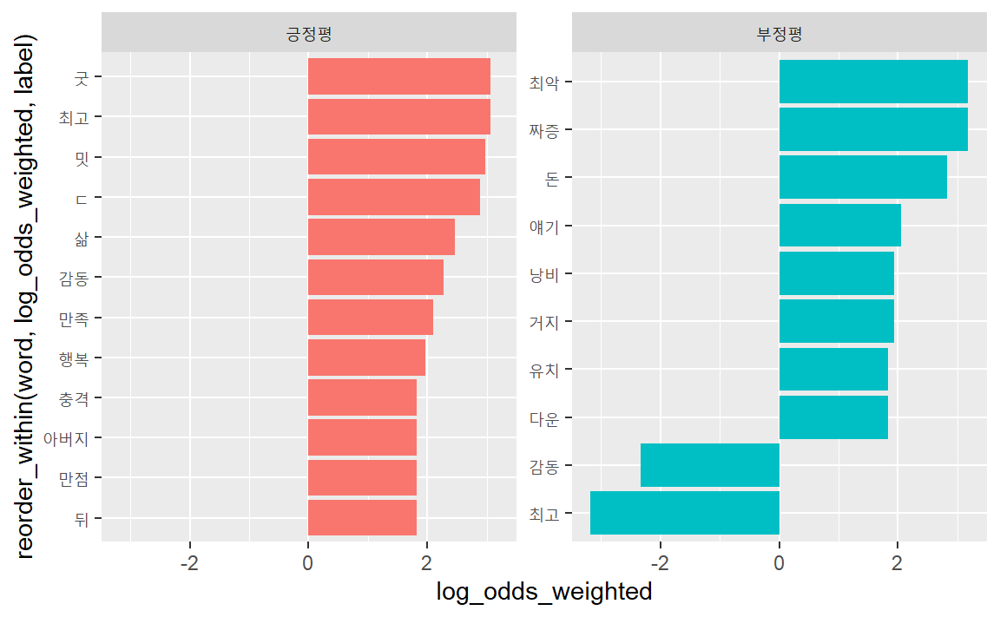
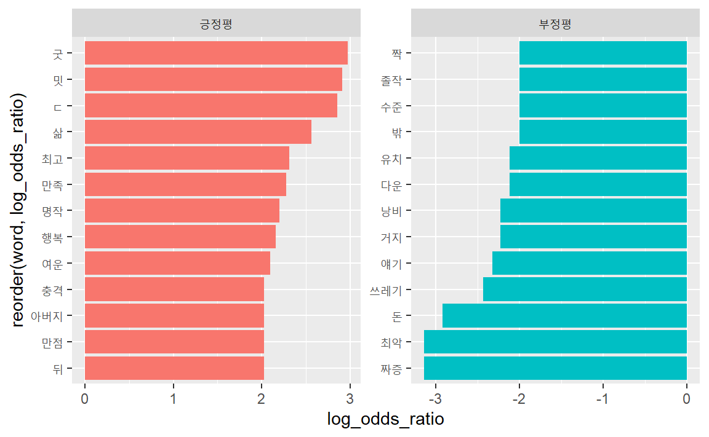

# (PART\*) 기술통계 {#text-desc-stat .unnumbered}

# 단어 빈도수 {#tf-idf}

문서에 사용된 단어(term)를 통해 그 문서의 주제를 추론할 수 있다. 말뭉치는 문서들의 '뭉치'다. 신문 말뭉치는 여러 신문들의 기사를 모아놓은 것이고, 소설말뭉치는 여러 소설을 모아놓은 문서들의 집합이다. 말뭉치는 상대적인 개념이다. 예를 들어, 소설집을 말뭉치라고 하면 개별 소설이 문서가 된다. 반면, 소설 한편을 말뭉치라고 하면, 소설의 각 장이 문서가 된다. 

{width=100%}


개별 문서의 주제를 추론하려면 모든 문서에 걸쳐 사용빈도가 높은 단어보다는 개별 문서에서만 사용빈도가 높은 단어를 찾아야 한다. 즉, 개별 문서에 등장하는 단어의 상대빈도가 높은 단어가 개별 문서의 의미를 잘 나타낸다. 

상대빈도를 계산하는 방법으로 널리 사용되는 지표가 tf_idf, 승산비, 가중로그승산비 등이다. 

- tf_idf

널리 사용되는 상대빈도 지표. 문서 전반에 걸쳐 등장하는 단어의 점수를 낮게 계산하고, 특정 문서에서 등장하는 빈도에 점수를 높게 부여해 상대 빈도를 계산한다. 예를 들어, '운수좋은 날'과 '사랑손님과 어머니' 등 2편으로 이뤄진 소설집 말뭉치가 있다고 하자. "은/는/이/가"와 같은 단어는 이 말뭉치에가 사용빈도가 꽤 높지만, 각 소설의 주제를 파악하는데 크게 기여하지 못한다. 반면 '어머니'와 같은 단어는 '운수좋은 날'에는 등장하지 않고, '사랑손님과 어머니'에는 많이 등장해, 해당 문서의 주제를 파악하는데 크게 기여한다. 

- 승산비(odds ratio)

승산(odds)의 비를 이용해 복수의 문서에 등장한 단어의 상대적인 빈도를 계산한다. 2종의 문서에 대해서만 사용할 수 있다. 

- 가중 로그 승산비(weighted log odds)

베이지언 확률모형으로 가중치를  계산해 단어의 상대적인 빈도를 계산한다. tf_idf와 승산비의 단점을 보완한 방법이다. 

## tf_idf

단어빈도-역문서빈도(term frequency-inverse document frequency: tf_idf).

말 그대로 개별 문서의 단어빈도(tf)와 문서전반에 걸쳐 사용된 정도의 역수(idf)를 곱해 구한다. 


### 공식

tf_idf의 요소인 tf와 idf에 대해 각각 알아보자. 

#### tf (term frequency)

개별 문서(d)에 등장하는 단어(t)의 수를 각 문서에 등장한 모든 단어의 수로 나눈 값. 

$$
tf(t, d) = \frac{tf_{document}}{tf_{total}}
$$

- $tf_{document}$: 각 문서에 등장한 해당 단어의 빈도
- $tf_{total}$: 각 문서에 등장한 모든 단어의 수


#### df (document frequency)

특정 단어(t)가 나타난 문서(D)의 수. df가 높다면 '은/는/이/가'처럼 대부분의 문서에서 사용되는 단어임을 나타낸다. 

$$
df(t, D)
$$


#### idf (inverse document frequency)

전체 문서의 수(N)를 해당 단어의 df로 나눈 뒤 로그를 취한 값. 값이 클수록 특정 문서에서만 등장하는 특이한 단어라는 의미가 된다. 

$$
idf(t, D) = log(\frac{N}{df})
$$


#### tf_idf

tf와 idf를 곱하면 tf_idf를 구할 수 있다. 


$$
  \text{tf_idf}(t, d, D) = tf(t, d) \times idf(t, D)
$$

- `t`: 단어
- `d`: 개별 문서
- `D`: 개별 문서의 집합(말뭉치)

### 적용 

짧은 문장을 이용해 tf_idf의 원리를 파악해 보자. 먼저 토큰화한다. 여기서 각 행은 개별 문서에 해당하고, 4개 행의 합의 말뭉치에 해당한다. 각 행을 식별하기 위해 문장별로 토큰화해 ID를 부여하자. 


```r
library(magrittr) # 파이프 연산자 %>%
library(stringr)  # 문자열 처리 
library(tidytext) # 깔끔한 텍스트 티블에서 처리

sky_v <-  c( "The sky is blue.", 
           "The sun is bright today.",
           "The sun in the sky is bright.", 
           "We can see the shining sun, the bright sun.")

sky_doc <- tibble(text = sky_v) %>% 
  unnest_tokens(sentence, text, token = "sentences") %>% 
  mutate(line_id = row_number()) %>% 
  mutate(line_id = as.factor(line_id))

sky_doc
```

<pre class="r-output"><code>## <span style='color: #555555;'># A tibble: 4 × 2</span>
##   sentence                                    line_id
##   <span style='color: #555555; font-style: italic;'>&lt;chr&gt;</span>                                       <span style='color: #555555; font-style: italic;'>&lt;fct&gt;</span>  
## <span style='color: #555555;'>1</span> the sky is blue.                            1      
## <span style='color: #555555;'>2</span> the sun is bright today.                    2      
## <span style='color: #555555;'>3</span> the sun in the sky is bright.               3      
## <span style='color: #555555;'>4</span> we can see the shining sun, the bright sun. 4
</code></pre>

#### tf

개별 문서(d)에 등장하는 단어(t)의 수를 각 문서에 등장한 모든 단어의 수로 나눈 값. 

$$
tf(t, d) = \frac{tf_{document}}{tf_{total}}
$$

- $tf_{document}$: 각 문서에 등장한 해당 단어의 빈도
- $tf_{total}$: 각 문서에 등장한 모든 단어의 수

tf의 분자인 $tf_{document}$(각 문서에 등장한 해당 단어의 빈도)를 구한다. 여기서 각 문서는 각 행이다. 따라서 각 행에서 등장한 단어의 빈도를 계산하면 된다.   


```r
sky_tfd <- sky_doc %>% 
  unnest_tokens(word, sentence) %>% 
  anti_join(stop_words) %>% 
  count(line_id, word, name = "tf_doc")
  
sky_tfd
```

<pre class="r-output"><code>## <span style='color: #555555;'># A tibble: 10 × 3</span>
##   line_id word   tf_doc
##   <span style='color: #555555; font-style: italic;'>&lt;fct&gt;</span>   <span style='color: #555555; font-style: italic;'>&lt;chr&gt;</span>   <span style='color: #555555; font-style: italic;'>&lt;int&gt;</span>
## <span style='color: #555555;'>1</span> 1       blue        1
## <span style='color: #555555;'>2</span> 1       sky         1
## <span style='color: #555555;'>3</span> 2       bright      1
## <span style='color: #555555;'>4</span> 2       sun         1
## <span style='color: #555555;'>5</span> 3       bright      1
## <span style='color: #555555;'>6</span> 3       sky         1
## <span style='color: #555555;'># … with 4 more rows</span>
</code></pre>

tf의 분모 $tf_{total}$(각 문서에 등장한 모든 단어의 수)를 구한다. 각 행을 이루는 모든 단어의 수를 계산하면 된다. 


```r
sky_tft <- sky_tfd %>% 
  mutate(N = length(unique(line_id))) %>%  # total number of documnets
  count(line_id, name = "tf_total")

sky_tft
```

<pre class="r-output"><code>## <span style='color: #555555;'># A tibble: 4 × 2</span>
##   line_id tf_total
##   <span style='color: #555555; font-style: italic;'>&lt;fct&gt;</span>      <span style='color: #555555; font-style: italic;'>&lt;int&gt;</span>
## <span style='color: #555555;'>1</span> 1              2
## <span style='color: #555555;'>2</span> 2              2
## <span style='color: #555555;'>3</span> 3              3
## <span style='color: #555555;'>4</span> 4              3
</code></pre>

$tf_{document}$(각 문서에 등장한 해당 단어의 빈도)를 $tf_{total}$(각 문서에 등장한 모든 단어의 수)로 나눈다. 


```r
sky_tf <- left_join(sky_tfd, sky_tft) %>% 
  mutate(tf = tf_doc/tf_total)

sky_tf
```

<pre class="r-output"><code>## <span style='color: #555555;'># A tibble: 10 × 5</span>
##   line_id word   tf_doc tf_total    tf
##   <span style='color: #555555; font-style: italic;'>&lt;fct&gt;</span>   <span style='color: #555555; font-style: italic;'>&lt;chr&gt;</span>   <span style='color: #555555; font-style: italic;'>&lt;int&gt;</span>    <span style='color: #555555; font-style: italic;'>&lt;int&gt;</span> <span style='color: #555555; font-style: italic;'>&lt;dbl&gt;</span>
## <span style='color: #555555;'>1</span> 1       blue        1        2 0.5  
## <span style='color: #555555;'>2</span> 1       sky         1        2 0.5  
## <span style='color: #555555;'>3</span> 2       bright      1        2 0.5  
## <span style='color: #555555;'>4</span> 2       sun         1        2 0.5  
## <span style='color: #555555;'>5</span> 3       bright      1        3 0.333
## <span style='color: #555555;'>6</span> 3       sky         1        3 0.333
## <span style='color: #555555;'># … with 4 more rows</span>
</code></pre>


#### df (document frequency)

특정 단어(t)가 나타난 문서(D)의 수. df가 높다면 '은/는/이/가'처럼 대부분의 문서에서 사용되는 단어임을 나타낸다. 

$$
df(t, D)
$$
특정 단어가 등장한 문서의 수를 계산해 구할 수 있다. 
  

```r
# sky_tf %>% 
#   count(word)

sky_df <- table(sky_tf$word) %>% 
  as.data.frame() %>% 
  rename(word = Var1, df = Freq)
sky_df
```

<pre class="r-output"><code>##      word df
## 1    blue  1
## 2  bright  3
## 3 shining  1
## 4     sky  2
## 5     sun  3
</code></pre>

'blue': 1번행에만 등장했으므로 1

'sun': 2,3, 4번 행에 등장했으므로 3
  
  
#### idf (inverse document frequency)

전체 문서의 수(N)를 해당 단어의 df로 나눈 뒤 로그를 취한 값. 값이 클수록 특정 문서에서만 등장하는 특이한 단어라는 의미가 된다. 

$$
idf(t, D) = log(\frac{N}{df})
$$

공식을 그대로 적용해 계산한다. `sky_tf`에 N의 값을 계산해 두 데이터프레임을 열방향 결합한다. 


```r
sky_tf <- sky_tf %>% 
  mutate(N = length(unique(line_id))) #total number of documnets

sky_idf <- 
  left_join(sky_tf, sky_df) %>% 
  mutate(idf = log(N / df))

sky_idf
```

<pre class="r-output"><code>## <span style='color: #555555;'># A tibble: 10 × 8</span>
##   line_id word   tf_doc tf_total    tf     N    df   idf
##   <span style='color: #555555; font-style: italic;'>&lt;fct&gt;</span>   <span style='color: #555555; font-style: italic;'>&lt;chr&gt;</span>   <span style='color: #555555; font-style: italic;'>&lt;int&gt;</span>    <span style='color: #555555; font-style: italic;'>&lt;int&gt;</span> <span style='color: #555555; font-style: italic;'>&lt;dbl&gt;</span> <span style='color: #555555; font-style: italic;'>&lt;int&gt;</span> <span style='color: #555555; font-style: italic;'>&lt;int&gt;</span> <span style='color: #555555; font-style: italic;'>&lt;dbl&gt;</span>
## <span style='color: #555555;'>1</span> 1       blue        1        2 0.5       4     1 1.39 
## <span style='color: #555555;'>2</span> 1       sky         1        2 0.5       4     2 0.693
## <span style='color: #555555;'>3</span> 2       bright      1        2 0.5       4     3 0.288
## <span style='color: #555555;'>4</span> 2       sun         1        2 0.5       4     3 0.288
## <span style='color: #555555;'>5</span> 3       bright      1        3 0.333     4     3 0.288
## <span style='color: #555555;'>6</span> 3       sky         1        3 0.333     4     2 0.693
## <span style='color: #555555;'># … with 4 more rows</span>
</code></pre>

3개 행에 걸쳐 등장하는 'bright'의 idf가 1개 행에만 등장한 'blue'보다 idf가 작다. 


#### tf_idf

tf와 idf를 곱하면 tf_idf를 구할 수 있다. 


$$
  tfidf(t, d, D) = tf(t, d) \times idf(t, D)
$$

- `t`: 단어
- `d`: 개별 문서
- `D`: 개별 문서의 집합(말뭉치)


```r
sky_idf %>% 
  mutate(tf_idf = tf * idf) %>% 
  arrange(-tf_idf)
```

<pre class="r-output"><code>## <span style='color: #555555;'># A tibble: 10 × 9</span>
##   line_id word    tf_doc tf_total    tf     N    df   idf
##   <span style='color: #555555; font-style: italic;'>&lt;fct&gt;</span>   <span style='color: #555555; font-style: italic;'>&lt;chr&gt;</span>    <span style='color: #555555; font-style: italic;'>&lt;int&gt;</span>    <span style='color: #555555; font-style: italic;'>&lt;int&gt;</span> <span style='color: #555555; font-style: italic;'>&lt;dbl&gt;</span> <span style='color: #555555; font-style: italic;'>&lt;int&gt;</span> <span style='color: #555555; font-style: italic;'>&lt;int&gt;</span> <span style='color: #555555; font-style: italic;'>&lt;dbl&gt;</span>
## <span style='color: #555555;'>1</span> 1       blue         1        2 0.5       4     1 1.39 
## <span style='color: #555555;'>2</span> 4       shining      1        3 0.333     4     1 1.39 
## <span style='color: #555555;'>3</span> 1       sky          1        2 0.5       4     2 0.693
## <span style='color: #555555;'>4</span> 3       sky          1        3 0.333     4     2 0.693
## <span style='color: #555555;'>5</span> 4       sun          2        3 0.667     4     3 0.288
## <span style='color: #555555;'>6</span> 2       bright       1        2 0.5       4     3 0.288
## <span style='color: #555555;'># … with 4 more rows, and 1 more variable: tf_idf &lt;dbl&gt;</span>
</code></pre>


### `bind_tf_idf()` 함수


`tidytext`패키지에서 제공하는 `bind_tf_idf(tbl, term, document, n)`함수를 이용하면 tf_idf를 계산할 수 있다. 

- tbl: 정돈데이터(한행에 값 하나).
- term: 문자열이나 기호 등의 단어가 저장된 열.
- document: 문자열이나 기호 등의 문서식별부호가 저장된 열.
- n: 문자열이나 기호 등의 문서-용어의 빈도가 저장된 열.	


```r
sky_tfd %>% 
  bind_tf_idf(tbl = ., term = word, document = line_id, n = tf_doc)
```

<pre class="r-output"><code>## <span style='color: #555555;'># A tibble: 10 × 6</span>
##   line_id word   tf_doc    tf   idf tf_idf
##   <span style='color: #555555; font-style: italic;'>&lt;fct&gt;</span>   <span style='color: #555555; font-style: italic;'>&lt;chr&gt;</span>   <span style='color: #555555; font-style: italic;'>&lt;int&gt;</span> <span style='color: #555555; font-style: italic;'>&lt;dbl&gt;</span> <span style='color: #555555; font-style: italic;'>&lt;dbl&gt;</span>  <span style='color: #555555; font-style: italic;'>&lt;dbl&gt;</span>
## <span style='color: #555555;'>1</span> 1       blue        1 0.5   1.39  0.693 
## <span style='color: #555555;'>2</span> 1       sky         1 0.5   0.693 0.347 
## <span style='color: #555555;'>3</span> 2       bright      1 0.5   0.288 0.144 
## <span style='color: #555555;'>4</span> 2       sun         1 0.5   0.288 0.144 
## <span style='color: #555555;'>5</span> 3       bright      1 0.333 0.288 0.095<span style='text-decoration: underline;'>9</span>
## <span style='color: #555555;'>6</span> 3       sky         1 0.333 0.693 0.231 
## <span style='color: #555555;'># … with 4 more rows</span>
</code></pre>

## 승산비 (odds ratio)

문서의 상대빈도를 구하는 또 다른 방법이 승산비다. 승산(odds)의 비를 이용해 복수의 문서에 등장한 단어의 상대적인 빈도 계산할 수 있다. 따라서 승산비는 2종의 문서에 대해서만 구할 수 있다. 

- 승산비(odds ratio)

한 사건의 승산(odds)에 대한 다른 한 사건 승산의 비(ratio)다. 다음은 승산B에 대한 승산A의 비. 

$$
승산비 = \frac{승산A}{승산B}
$$

- 비(ratio)

두 부분 중 한 부분에 대한 다른 한 부분의 비. 예를 들어, 축구경기를 할때 한국이 3골을 넣고, 일본이 1골을 넣었다면, 비는 3대 1로서, 일본팀 1점에 대한 한국팀 3점의 비(ratio)다. 

$$
A:B = \frac{A}{B}
$$

- 승산(odds)

어느 한 사건이 일어날 가능성이 승산(odds)이다. 영어를 그대로 읽어 '오즈'라고도 한다. 한 사건의 발생빈도(n)를 전체의 값(total)으로 나눈다. 

$$
승산(odds) = \frac{발생빈도(n) + 1}{총빈도(total) + 1}
$$

분자와 분모에 각각 1을 더하는 이유는 발생빈도가 0인 경우도 있기 때문이다. 분모가 0이면 무한대가 된다. 


### 자료준비

네이버영화 댓글의 승산비를 구해보자. 댓글을 긍정과 부정으로 구분해 라벨링한 자료를 이용한다.

- [Naver sentiment movie corpus](https://github.com/e9t/nsmc)


```r
url_v <- 'https://github.com/e9t/nsmc/raw/master/ratings.txt'
dest_v <- 'data/ratings.txt'

download.file(url_v, dest_v, mode = "wb")
list.files('data/.')
```

다운로드한 자료 이입 및 검토


```r
read_lines("data/ratings.txt") %>% glimpse()
```

<pre class="r-output"><code>##  chr [1:200001] "id\tdocument\tlabel" ...
</code></pre>

공백문자 `\t`으로 구분된 문자데이터이므로, `read_tsv()`로 이입한다. 


```r
read_tsv("data/ratings.txt") %>% glimpse()
```

<pre class="r-output"><code>## Rows: 200,000
## Columns: 3
## $ id       <span style='color: #555555; font-style: italic;'>&lt;dbl&gt;</span> 8112052, 8132799, 4655635, 9251303, 10067…
## $ document <span style='color: #555555; font-style: italic;'>&lt;chr&gt;</span> "어릴때보고 지금다시봐도 재밌어요ㅋㅋ", "…
## $ label    <span style='color: #555555; font-style: italic;'>&lt;dbl&gt;</span> 1, 1, 1, 1, 1, 1, 1, 1, 1, 1, 1, 1, 1, 1,…
</code></pre>


```r
ratings_df <- read_tsv("data/ratings.txt") 
head(ratings_df)
```

<pre class="r-output"><code>## <span style='color: #555555;'># A tibble: 6 × 3</span>
##         id document                                    label
##      <span style='color: #555555; font-style: italic;'>&lt;dbl&gt;</span> <span style='color: #555555; font-style: italic;'>&lt;chr&gt;</span>                                       <span style='color: #555555; font-style: italic;'>&lt;dbl&gt;</span>
## <span style='color: #555555;'>1</span>  8<span style='text-decoration: underline;'>112</span>052 어릴때보고 지금다시봐도 재밌어요ㅋㅋ            1
## <span style='color: #555555;'>2</span>  8<span style='text-decoration: underline;'>132</span>799 디자인을 배우는 학생으로, 외국디자이너와 …      1
## <span style='color: #555555;'>3</span>  4<span style='text-decoration: underline;'>655</span>635 폴리스스토리 시리즈는 1부터 뉴까지 버릴께 …     1
## <span style='color: #555555;'>4</span>  9<span style='text-decoration: underline;'>251</span>303 와.. 연기가 진짜 개쩔구나.. 지루할거라고 …      1
## <span style='color: #555555;'>5</span> 10<span style='text-decoration: underline;'>067</span>386 안개 자욱한 밤하늘에 떠 있는 초승달 같은 …      1
## <span style='color: #555555;'>6</span>  2<span style='text-decoration: underline;'>190</span>435 사랑을 해본사람이라면 처음부터 끝까지 웃을…     1
</code></pre>

데이터셋이 커 처리에 시간이 걸리므로 각 라벨별로 1000개 행씩 추출한다. 


```r
set.seed(37)

by1000_df <- ratings_df %>% 
  group_by(label) %>% 
  sample_n(size = 1000)

by1000_df %>% glimpse()
```

<pre class="r-output"><code>## Rows: 2,000
## Columns: 3
## Groups: label [2]
## $ id       <span style='color: #555555; font-style: italic;'>&lt;dbl&gt;</span> 10101634, 5925555, 9809791, 4541051, 8063…
## $ document <span style='color: #555555; font-style: italic;'>&lt;chr&gt;</span> "액션이 부족한 가운데 이야기 자체가 허접…
## $ label    <span style='color: #555555; font-style: italic;'>&lt;dbl&gt;</span> 0, 0, 0, 0, 0, 0, 0, 0, 0, 0, 0, 0, 0, 0,…
</code></pre>

`RcppMeCab`패키지에서 `pos()`함수로 형태소를 추출한 뒤, 일반명사('nng')만 추출해 빈도를 계산한다. 


```r
by1000_df %>% 
  unnest_tokens(word, document, token = RcppMeCab::pos) %>% 
  separate(word, c("word", "pos"), sep = "/") %>% 
  filter(pos == "nng") %>% 
  filter(word != "영화") %>% 
  count(word, sort = TRUE)
```

<pre class="r-output"><code>## <span style='color: #555555;'># A tibble: 2,831 × 3</span>
## <span style='color: #555555;'># Groups:   label [2]</span>
##   label word       n
##   <span style='color: #555555; font-style: italic;'>&lt;dbl&gt;</span> <span style='color: #555555; font-style: italic;'>&lt;chr&gt;</span>  <span style='color: #555555; font-style: italic;'>&lt;int&gt;</span>
## <span style='color: #555555;'>1</span>     1 최고      83
## <span style='color: #555555;'>2</span>     1 감동      58
## <span style='color: #555555;'>3</span>     1 연기      58
## <span style='color: #555555;'>4</span>     0 감독      46
## <span style='color: #555555;'>5</span>     0 스토리    46
## <span style='color: #555555;'>6</span>     0 시간      46
## <span style='color: #555555;'># … with 2,825 more rows</span>
</code></pre>

영화평은 긍정적인 평에는 '1', 부정적인 평에는 '0'으로 분류돼 있다. 긍정적인 평과 부정적인 평에 사용된 명사의 승산비를 구해보자. 이를 위해 long form을 wide form으로 변형해 `label`열의 값을 열의 헤더로 변환하고, 각 열의 값으로는 토큰을 투입한다. 결측값이 있으면 연산이 안되므로 `NA`값은 '0'으로 채운다. 


```r
by1000_df %>% 
  unnest_tokens(word, document, token = RcppMeCab::pos) %>% 
  separate(word, c("word", "pos"), sep = "/") %>% 
  filter(pos == "nng") %>% 
  filter(word != "영화") %>% 
  count(word) %>% 
  pivot_wider(names_from = label,
              values_from = n, 
              values_fill = list(n = 0))
```

<pre class="r-output"><code>## <span style='color: #555555;'># A tibble: 2,303 × 3</span>
##   word    `0`   `1`
##   <span style='color: #555555; font-style: italic;'>&lt;chr&gt;</span> <span style='color: #555555; font-style: italic;'>&lt;int&gt;</span> <span style='color: #555555; font-style: italic;'>&lt;int&gt;</span>
## <span style='color: #555555;'>1</span> 가가      1     0
## <span style='color: #555555;'>2</span> 가관      1     0
## <span style='color: #555555;'>3</span> 가능      1     4
## <span style='color: #555555;'>4</span> 가든      1     0
## <span style='color: #555555;'>5</span> 가리      1     0
## <span style='color: #555555;'>6</span> 가문      1     0
## <span style='color: #555555;'># … with 2,297 more rows</span>
</code></pre>


### 승산비 계산

긍정평과 부정평의 승산을 구한다음, 승산비를 계산한다.


```r
by1000_df %>% 
  unnest_tokens(word, document, token = RcppMeCab::pos) %>% 
  separate(word, c("word", "pos"), sep = "/") %>% 
  filter(pos == "nng") %>% 
  filter(word != "영화") %>% 
  count(word) %>% 
  pivot_wider(names_from = label,
              values_from = n, 
              values_fill = list(n = 0)) %>% 
  rename(posi = `1`, nega = `0`) %>% 
  mutate(odds_posi = ((posi+1)/sum(posi+1)),
         odds_nega = ((nega+1)/sum(nega+1))) %>% 
  mutate(posi_odds_ratio = (odds_posi / odds_nega)) 
```

<pre class="r-output"><code>## <span style='color: #555555;'># A tibble: 2,303 × 6</span>
##   word   nega  posi odds_posi odds_nega posi_odds_ratio
##   <span style='color: #555555; font-style: italic;'>&lt;chr&gt;</span> <span style='color: #555555; font-style: italic;'>&lt;int&gt;</span> <span style='color: #555555; font-style: italic;'>&lt;int&gt;</span>     <span style='color: #555555; font-style: italic;'>&lt;dbl&gt;</span>     <span style='color: #555555; font-style: italic;'>&lt;dbl&gt;</span>           <span style='color: #555555; font-style: italic;'>&lt;dbl&gt;</span>
## <span style='color: #555555;'>1</span> 가가      1     0  0.000<span style='text-decoration: underline;'>181</span>  0.000<span style='text-decoration: underline;'>334</span>           0.542
## <span style='color: #555555;'>2</span> 가관      1     0  0.000<span style='text-decoration: underline;'>181</span>  0.000<span style='text-decoration: underline;'>334</span>           0.542
## <span style='color: #555555;'>3</span> 가능      1     4  0.000<span style='text-decoration: underline;'>904</span>  0.000<span style='text-decoration: underline;'>334</span>           2.71 
## <span style='color: #555555;'>4</span> 가든      1     0  0.000<span style='text-decoration: underline;'>181</span>  0.000<span style='text-decoration: underline;'>334</span>           0.542
## <span style='color: #555555;'>5</span> 가리      1     0  0.000<span style='text-decoration: underline;'>181</span>  0.000<span style='text-decoration: underline;'>334</span>           0.542
## <span style='color: #555555;'>6</span> 가문      1     0  0.000<span style='text-decoration: underline;'>181</span>  0.000<span style='text-decoration: underline;'>334</span>           0.542
## <span style='color: #555555;'># … with 2,297 more rows</span>
</code></pre>


승산비를 이용해 영화의 긍정평과 부정평에서 상대적으로 많이 사용된 명사를 추출했다. 순서대로 정렬하자. 


```r
rate_odds_df <- by1000_df %>% 
  unnest_tokens(word, document, token = RcppMeCab::pos) %>% 
  separate(word, c("word", "pos"), sep = "/") %>% 
  filter(pos == "nng") %>% 
  filter(word != "영화") %>% 
  count(word) %>% 
  pivot_wider(names_from = label,
              values_from = n, 
              values_fill = list(n = 0)) %>% 
  rename(posi = `1`, nega = `0`) %>% 
  mutate(odds_posi = ((posi+1)/sum(posi+1)),
         odds_nega = ((nega+1)/sum(nega+1))) %>% 
  mutate(posi_odds_ratio = (odds_posi / odds_nega)) %>% 
  # 긍정평과 부정평 각각 상위 20개씩 필터 
  filter(rank(posi_odds_ratio) <= 20 | rank(-posi_odds_ratio) <= 20) %>%  
  arrange(-posi_odds_ratio)

rate_odds_df %>% head()
```

<pre class="r-output"><code>## <span style='color: #555555;'># A tibble: 6 × 6</span>
##   word   nega  posi odds_posi odds_nega posi_odds_ratio
##   <span style='color: #555555; font-style: italic;'>&lt;chr&gt;</span> <span style='color: #555555; font-style: italic;'>&lt;int&gt;</span> <span style='color: #555555; font-style: italic;'>&lt;int&gt;</span>     <span style='color: #555555; font-style: italic;'>&lt;dbl&gt;</span>     <span style='color: #555555; font-style: italic;'>&lt;dbl&gt;</span>           <span style='color: #555555; font-style: italic;'>&lt;dbl&gt;</span>
## <span style='color: #555555;'>1</span> 굿        0    18   0.003<span style='text-decoration: underline;'>44</span>  0.000<span style='text-decoration: underline;'>167</span>            20.6
## <span style='color: #555555;'>2</span> 밋        0    16   0.003<span style='text-decoration: underline;'>07</span>  0.000<span style='text-decoration: underline;'>167</span>            18.4
## <span style='color: #555555;'>3</span> ㄷ        0    15   0.002<span style='text-decoration: underline;'>89</span>  0.000<span style='text-decoration: underline;'>167</span>            17.3
## <span style='color: #555555;'>4</span> 삶        0    10   0.001<span style='text-decoration: underline;'>99</span>  0.000<span style='text-decoration: underline;'>167</span>            11.9
## <span style='color: #555555;'>5</span> 마음      0     9   0.001<span style='text-decoration: underline;'>81</span>  0.000<span style='text-decoration: underline;'>167</span>            10.8
## <span style='color: #555555;'>6</span> 최고      8    83   0.015<span style='text-decoration: underline;'>2</span>   0.001<span style='text-decoration: underline;'>50</span>             10.1
</code></pre>

```r
rate_odds_df %>% tail()
```

<pre class="r-output"><code>## <span style='color: #555555;'># A tibble: 6 × 6</span>
##   word    nega  posi odds_posi odds_nega posi_odds_ratio
##   <span style='color: #555555; font-style: italic;'>&lt;chr&gt;</span>  <span style='color: #555555; font-style: italic;'>&lt;int&gt;</span> <span style='color: #555555; font-style: italic;'>&lt;int&gt;</span>     <span style='color: #555555; font-style: italic;'>&lt;dbl&gt;</span>     <span style='color: #555555; font-style: italic;'>&lt;dbl&gt;</span>           <span style='color: #555555; font-style: italic;'>&lt;dbl&gt;</span>
## <span style='color: #555555;'>1</span> 낭비       9     0  0.000<span style='text-decoration: underline;'>181</span>   0.001<span style='text-decoration: underline;'>67</span>          0.108 
## <span style='color: #555555;'>2</span> 얘기      10     0  0.000<span style='text-decoration: underline;'>181</span>   0.001<span style='text-decoration: underline;'>84</span>          0.098<span style='text-decoration: underline;'>5</span>
## <span style='color: #555555;'>3</span> 쓰레기    36     2  0.000<span style='text-decoration: underline;'>543</span>   0.006<span style='text-decoration: underline;'>17</span>          0.087<span style='text-decoration: underline;'>9</span>
## <span style='color: #555555;'>4</span> 돈        19     0  0.000<span style='text-decoration: underline;'>181</span>   0.003<span style='text-decoration: underline;'>34</span>          0.054<span style='text-decoration: underline;'>2</span>
## <span style='color: #555555;'>5</span> 짜증      24     0  0.000<span style='text-decoration: underline;'>181</span>   0.004<span style='text-decoration: underline;'>17</span>          0.043<span style='text-decoration: underline;'>3</span>
## <span style='color: #555555;'>6</span> 최악      24     0  0.000<span style='text-decoration: underline;'>181</span>   0.004<span style='text-decoration: underline;'>17</span>          0.043<span style='text-decoration: underline;'>3</span>
</code></pre>


'밋'과 'ㄷ'이 사용된 문장을 살펴보자. `drop = `인자에 `FALSE`를 투입하면 토큰화한 문장을 제거하지 않고 남겨둔다. 


```r
by1000_df %>% 
  unnest_tokens(word, document, token = RcppMeCab::pos, drop = FALSE) %>% 
  separate(word, c("word", "pos"), sep = "/") %>% 
  filter(pos == "nng") %>% 
  filter(word == "밋" | word == "ㄷ") 
```

<pre class="r-output"><code>## <span style='color: #555555;'># A tibble: 31 × 4</span>
## <span style='color: #555555;'># Groups:   label [1]</span>
##   label document                                word  pos  
##   <span style='color: #555555; font-style: italic;'>&lt;dbl&gt;</span> <span style='color: #555555; font-style: italic;'>&lt;chr&gt;</span>                                   <span style='color: #555555; font-style: italic;'>&lt;chr&gt;</span> <span style='color: #555555; font-style: italic;'>&lt;chr&gt;</span>
## <span style='color: #555555;'>1</span>     1 <span style='color: #555555;'>"</span>이보다 더 유쾌할 수 없고 이보다 더 무… 밋    nng  
## <span style='color: #555555;'>2</span>     1 <span style='color: #555555;'>"</span>이보다 더 유쾌할 수 없고 이보다 더 무… ㄷ    nng  
## <span style='color: #555555;'>3</span>     1 <span style='color: #555555;'>"</span>이보다 더 유쾌할 수 없고 이보다 더 무… ㄷ    nng  
## <span style='color: #555555;'>4</span>     1 <span style='color: #555555;'>"</span>이보다 더 유쾌할 수 없고 이보다 더 무… ㄷ    nng  
## <span style='color: #555555;'>5</span>     1 <span style='color: #555555;'>"</span>이보다 더 유쾌할 수 없고 이보다 더 무… ㄷ    nng  
## <span style='color: #555555;'>6</span>     1 <span style='color: #555555;'>"</span>이보다 더 유쾌할 수 없고 이보다 더 무… ㄷ    nng  
## <span style='color: #555555;'># … with 25 more rows</span>
</code></pre>


::: {#rccpmecab-pos .rmdtip}

'재밋었음'에서 `MeCab`형태소 분석기가 '밋'을 명사로 추출한 결과이다. 


```r
enc2utf8("재밋었음10자는뭐여") %>% RcppMeCab::pos()
```

<pre class="r-output"><code>## $재밋었음10자는뭐여
## [1] "재/XPN"    "밋/NNG"    "었/EP"     "음/ETN"   
## [5] "10/SN"     "자/NNG"    "는/JX"     "뭐/NP"    
## [9] "여/VCP+EC"
</code></pre>
:::

막대도표로 시각화하자. 긍정평과 부정평 도표를 분리해 표시하기 위해 승산비 1을 기준으로 크면 '긍정평' 작으면 '부정평'을 부여한다. 


```r
rate_odds_df %>% 
  mutate(label = ifelse(posi_odds_ratio > 1, "긍정평", "부정평")) %>% 
  mutate(word = reorder(word, posi_odds_ratio)) %>% 
  
  ggplot(aes(x = posi_odds_ratio, 
             y = word, 
             fill = label)) + 
  geom_col(show.legend = F) +
  facet_wrap(~label, scales = "free")
```


중요도가 비슷한 단어를 추출해보자. 승산비가 1이면 분자와 분모가 같으므로 긍정평과 부정평의 승산이 같다는 의미다. 


```r
by1000_df %>% 
  unnest_tokens(word, document, token = RcppMeCab::pos) %>% 
  separate(word, c("word", "pos"), sep = "/") %>% 
  filter(pos == "nng") %>% 
  filter(word != "영화") %>% 
  count(word) %>% 
  pivot_wider(names_from = label,
              values_from = n, 
              values_fill = list(n = 0)) %>% 
  rename(posi = `1`, nega = `0`) %>% 
  mutate(odds_posi = ((posi+1)/sum(posi+1)),
         odds_nega = ((nega+1)/sum(nega+1))) %>% 
  mutate(posi_odds_ratio = (odds_posi / odds_nega)) %>% 
  # 승산비 1을 중심으로 정렬
  arrange(abs(1 - posi_odds_ratio)) %>% 
  head(20)
```

<pre class="r-output"><code>## <span style='color: #555555;'># A tibble: 20 × 6</span>
##   word    nega  posi odds_posi odds_nega posi_odds_ratio
##   <span style='color: #555555; font-style: italic;'>&lt;chr&gt;</span>  <span style='color: #555555; font-style: italic;'>&lt;int&gt;</span> <span style='color: #555555; font-style: italic;'>&lt;int&gt;</span>     <span style='color: #555555; font-style: italic;'>&lt;dbl&gt;</span>     <span style='color: #555555; font-style: italic;'>&lt;dbl&gt;</span>           <span style='color: #555555; font-style: italic;'>&lt;dbl&gt;</span>
## <span style='color: #555555;'>1</span> 이야기    14    13   0.002<span style='text-decoration: underline;'>53</span>   0.002<span style='text-decoration: underline;'>50</span>           1.01 
## <span style='color: #555555;'>2</span> 정도      18    16   0.003<span style='text-decoration: underline;'>07</span>   0.003<span style='text-decoration: underline;'>17</span>           0.970
## <span style='color: #555555;'>3</span> 결말       7     6   0.001<span style='text-decoration: underline;'>27</span>   0.001<span style='text-decoration: underline;'>34</span>           0.948
## <span style='color: #555555;'>4</span> 느낌       7     6   0.001<span style='text-decoration: underline;'>27</span>   0.001<span style='text-decoration: underline;'>34</span>           0.948
## <span style='color: #555555;'>5</span> 이상      15    13   0.002<span style='text-decoration: underline;'>53</span>   0.002<span style='text-decoration: underline;'>67</span>           0.948
## <span style='color: #555555;'>6</span> 팬         7     6   0.001<span style='text-decoration: underline;'>27</span>   0.001<span style='text-decoration: underline;'>34</span>           0.948
## <span style='color: #555555;'># … with 14 more rows</span>
</code></pre>

중요도가 비슷하면서 빈도가 높은 단어를 찾아 보자. 


```r
by1000_df %>% 
  unnest_tokens(word, document, token = RcppMeCab::pos) %>% 
  separate(word, c("word", "pos"), sep = "/") %>% 
  filter(pos == "nng") %>% 
  filter(word != "영화") %>% 
  count(word) %>% 
  pivot_wider(names_from = label,
              values_from = n, 
              values_fill = list(n = 0)) %>% 
  rename(posi = `1`, nega = `0`) %>% 
  # 긍정평과 부정평에서 각각 10회 초과한 단어 filter
  filter(nega > 10 & posi > 10) %>%  
  mutate(odds_posi = ((posi+1)/sum(posi+1)),
         odds_nega = ((nega+1)/sum(nega+1))) %>% 
  mutate(posi_odds_ratio = (odds_posi / odds_nega)) %>% 
  arrange(abs(1 - posi_odds_ratio)) %>% 
  head(20)
```

<pre class="r-output"><code>## <span style='color: #555555;'># A tibble: 20 × 6</span>
##   word    nega  posi odds_posi odds_nega posi_odds_ratio
##   <span style='color: #555555; font-style: italic;'>&lt;chr&gt;</span>  <span style='color: #555555; font-style: italic;'>&lt;int&gt;</span> <span style='color: #555555; font-style: italic;'>&lt;int&gt;</span>     <span style='color: #555555; font-style: italic;'>&lt;dbl&gt;</span>     <span style='color: #555555; font-style: italic;'>&lt;dbl&gt;</span>           <span style='color: #555555; font-style: italic;'>&lt;dbl&gt;</span>
## <span style='color: #555555;'>1</span> 이야기    14    13    0.020<span style='text-decoration: underline;'>1</span>    0.020<span style='text-decoration: underline;'>1</span>           1.00 
## <span style='color: #555555;'>2</span> 정도      18    16    0.024<span style='text-decoration: underline;'>5</span>    0.025<span style='text-decoration: underline;'>4</span>           0.963
## <span style='color: #555555;'>3</span> 이상      15    13    0.020<span style='text-decoration: underline;'>1</span>    0.021<span style='text-decoration: underline;'>4</span>           0.942
## <span style='color: #555555;'>4</span> 드라마    35    35    0.051<span style='text-decoration: underline;'>8</span>    0.048<span style='text-decoration: underline;'>1</span>           1.08 
## <span style='color: #555555;'>5</span> 배우      27    22    0.033<span style='text-decoration: underline;'>1</span>    0.037<span style='text-decoration: underline;'>4</span>           0.884
## <span style='color: #555555;'>6</span> 연출      14    11    0.017<span style='text-decoration: underline;'>3</span>    0.020<span style='text-decoration: underline;'>1</span>           0.861
## <span style='color: #555555;'># … with 14 more rows</span>
</code></pre>


### 로그승산비

- 로그승산비(log odds ratio)

승산비에 로그를 위한 값. 로그를 취하면 1보다 작은수는 음수가 되고, 1보다 큰수는 양수가 된다. 

$$
로그 승산비 = log(\frac{승산A}{승산B})
$$


```r
by1000_df %>% 
  unnest_tokens(word, document, token = RcppMeCab::pos) %>% 
  separate(word, c("word", "pos"), sep = "/") %>% 
  filter(pos == "nng") %>% 
  filter(word != "영화") %>% 
  count(word) %>% 
  pivot_wider(names_from = label,
              values_from = n, 
              values_fill = list(n = 0)) %>% 
  rename(posi = `1`, nega = `0`) %>% 
  mutate(odds_posi = ((posi+1)/sum(posi+1)),
         odds_nega = ((nega+1)/sum(nega+1))) %>% 
  # 승산비에 로그를 취한다.
  mutate(log_odds_ratio = log(odds_posi / odds_nega)) 
```

<pre class="r-output"><code>## <span style='color: #555555;'># A tibble: 2,303 × 6</span>
##   word   nega  posi odds_posi odds_nega log_odds_ratio
##   <span style='color: #555555; font-style: italic;'>&lt;chr&gt;</span> <span style='color: #555555; font-style: italic;'>&lt;int&gt;</span> <span style='color: #555555; font-style: italic;'>&lt;int&gt;</span>     <span style='color: #555555; font-style: italic;'>&lt;dbl&gt;</span>     <span style='color: #555555; font-style: italic;'>&lt;dbl&gt;</span>          <span style='color: #555555; font-style: italic;'>&lt;dbl&gt;</span>
## <span style='color: #555555;'>1</span> 가가      1     0  0.000<span style='text-decoration: underline;'>181</span>  0.000<span style='text-decoration: underline;'>334</span>         -<span style='color: #BB0000;'>0.613</span>
## <span style='color: #555555;'>2</span> 가관      1     0  0.000<span style='text-decoration: underline;'>181</span>  0.000<span style='text-decoration: underline;'>334</span>         -<span style='color: #BB0000;'>0.613</span>
## <span style='color: #555555;'>3</span> 가능      1     4  0.000<span style='text-decoration: underline;'>904</span>  0.000<span style='text-decoration: underline;'>334</span>          0.997
## <span style='color: #555555;'>4</span> 가든      1     0  0.000<span style='text-decoration: underline;'>181</span>  0.000<span style='text-decoration: underline;'>334</span>         -<span style='color: #BB0000;'>0.613</span>
## <span style='color: #555555;'>5</span> 가리      1     0  0.000<span style='text-decoration: underline;'>181</span>  0.000<span style='text-decoration: underline;'>334</span>         -<span style='color: #BB0000;'>0.613</span>
## <span style='color: #555555;'>6</span> 가문      1     0  0.000<span style='text-decoration: underline;'>181</span>  0.000<span style='text-decoration: underline;'>334</span>         -<span style='color: #BB0000;'>0.613</span>
## <span style='color: #555555;'># … with 2,297 more rows</span>
</code></pre>

로그 승산비를 이용하면 하나의 도표에 상대빈도를 표시할 수 있다. 먼저 로그승산비를 구한뒤, 0을 기준으로 긍정평과 부정평을 group으로 구분한다. 긍정평과 부정평 집단별로 구분돼 있으므로, 로그승산비의 절대값 상위 10개를 지정하면, 긍정평과 부정평 별로 각각 상위 10개 단어를 추출할 수 있다. 


```r
rate_log_df <- by1000_df %>% 
  unnest_tokens(word, document, token = RcppMeCab::pos) %>% 
  separate(word, c("word", "pos"), sep = "/") %>% 
  filter(pos == "nng") %>% 
  filter(word != "영화") %>% 
  count(word) %>% 
  pivot_wider(names_from = label,
              values_from = n, 
              values_fill = list(n = 0)) %>% 
  rename(posi = `1`, nega = `0`) %>% 
  mutate(odds_posi = ((posi+1)/sum(posi+1)),
         odds_nega = ((nega+1)/sum(nega+1))) %>% 
  # 승산비에 로그를 취한다.
  mutate(log_odds_ratio = log(odds_posi / odds_nega)) 

rate_log_df  %>% 
  group_by(label  = ifelse(log_odds_ratio > 0, "긍정평", "부정평")) %>% 
  # 긍정평과 부정평별 각각 상위 10개 
  slice_max(abs(log_odds_ratio), n = 10) 
```

<pre class="r-output"><code>## <span style='color: #555555;'># A tibble: 22 × 7</span>
## <span style='color: #555555;'># Groups:   label [2]</span>
##   word   nega  posi odds_posi odds_nega log_odds_ratio label
##   <span style='color: #555555; font-style: italic;'>&lt;chr&gt;</span> <span style='color: #555555; font-style: italic;'>&lt;int&gt;</span> <span style='color: #555555; font-style: italic;'>&lt;int&gt;</span>     <span style='color: #555555; font-style: italic;'>&lt;dbl&gt;</span>     <span style='color: #555555; font-style: italic;'>&lt;dbl&gt;</span>          <span style='color: #555555; font-style: italic;'>&lt;dbl&gt;</span> <span style='color: #555555; font-style: italic;'>&lt;chr&gt;</span>
## <span style='color: #555555;'>1</span> 굿        0    18   0.003<span style='text-decoration: underline;'>44</span>  0.000<span style='text-decoration: underline;'>167</span>           3.02 긍정…
## <span style='color: #555555;'>2</span> 밋        0    16   0.003<span style='text-decoration: underline;'>07</span>  0.000<span style='text-decoration: underline;'>167</span>           2.91 긍정…
## <span style='color: #555555;'>3</span> ㄷ        0    15   0.002<span style='text-decoration: underline;'>89</span>  0.000<span style='text-decoration: underline;'>167</span>           2.85 긍정…
## <span style='color: #555555;'>4</span> 삶        0    10   0.001<span style='text-decoration: underline;'>99</span>  0.000<span style='text-decoration: underline;'>167</span>           2.48 긍정…
## <span style='color: #555555;'>5</span> 마음      0     9   0.001<span style='text-decoration: underline;'>81</span>  0.000<span style='text-decoration: underline;'>167</span>           2.38 긍정…
## <span style='color: #555555;'>6</span> 최고      8    83   0.015<span style='text-decoration: underline;'>2</span>   0.001<span style='text-decoration: underline;'>50</span>            2.31 긍정…
## <span style='color: #555555;'># … with 16 more rows</span>
</code></pre>

막대도표로 시각화하면 다음과 같은 긍부정에 기여하는 중요단어를 한눈에 일별할 수 있다. 


```r
rate_log_df %>% 
  group_by(label  = ifelse(log_odds_ratio > 0, "긍정평", "부정평")) %>% 
  slice_max(abs(log_odds_ratio), n = 10) %>% 
  
  ggplot(aes(x = log_odds_ratio,
             y = reorder(word, log_odds_ratio),
             fill = label)) +
  geom_col() 
```


### 가중로그승산비

로그승산비는 문서 2종에 대한 승산으로 비를 구하므로, 3종 이상의 문서로 구성된 말뭉치에 적용할 수 없는 한계가 있다. `tf_idf`는 3종 이상의 문서로 구성된 말뭉치에 적용할 수 있지만, tf_idf계산 방식에서 오는 한계가 있다. 모든 문서에 걸쳐 등장하는 단어라 해서 반드시 불용어처럼 문서의 의미파악에 기여하지 못하는 것이 아니기 때문이다. 

`tf_idf`의 한계를 Tyler Schnoebelen이 [Monroe, Colaresi, and Quinn(2008)](Monroe, Colaresi, and Quinn(2008)의 연구를 토대 블로그문서
["I dare say you will never use tf-idf again"](https://medium.com/@TSchnoebelen/i-dare-say-you-will-never-use-tf-idf-again-4918408b2310)을 통해 지적하며, 대안으로 로그승산비에 베이지언 확률모형을 적용한 [가중로그승산비(weighted log odds ratio)](https://bookdown.org/Maxine/tidy-text-mining/weighted-log-odds-ratio.html)를 제안했다. 

이에 `tidytext` 개발자인 Julia Silge가 [`tydylo`](https://github.com/juliasilge/tidylo)패키지를 개발해 가중로그승산비를 간단하게 계산할 수 있도록 했다. ([Silge의 패키지 소개 글](https://juliasilge.com/blog/introducing-tidylo/))


```r
install.packages("tidylo")
```


### `bind_log_odds()` 함수 


`bind_log_odds(tbl, set, feature, n, uninformative = FALSE, unweighted = FALSE)` 함수 주요 인자를 살펴보면 다음과 같다.

- tbl: 정돈데이터(feature와 set이 하나의 행에 저장).
- set: feature를 비교하기 위한 set(group)에 대한 정보(예: 긍정 vs. 부정)이 저장된 열.
- feature: feature(단어나 바이그램 등의 텍스트자료)가 저장된 열.
- n: feature-set의 빈도를 저장한 열.
- uninformative: uninformative 디리슐레 분포 사용 여부. 기본값은 `FALSE`.	
- unweighted: 비가중 로그승산 사용여부. 기본값은 `FALSE`. `TRUE`로 지정하면 비가중 로그승산비(`log_odds`) 열을 추가한다. 


가중로그승산비를 이용해 네이버영화 댓글 중 긍정평과 부정평에 사용된 단어의 상대빈도를 구해보자. 


```r
library(tidylo)

weighted_log_odds_df <- by1000_df %>% 
  unnest_tokens(word, document, token = RcppMeCab::pos) %>% 
  separate(word, c("word", "pos"), sep = "/") %>% 
  filter(pos == "nng") %>% 
  filter(word != "영화") %>% 
  count(word) %>% 
  bind_log_odds(set = label,
                feature = word,
                n = n) %>% 
  arrange(-log_odds_weighted)

weighted_log_odds_df
```

<pre class="r-output"><code>## <span style='color: #555555;'># A tibble: 2,831 × 4</span>
## <span style='color: #555555;'># Groups:   label [2]</span>
##   label word      n log_odds_weighted
##   <span style='color: #555555; font-style: italic;'>&lt;dbl&gt;</span> <span style='color: #555555; font-style: italic;'>&lt;chr&gt;</span> <span style='color: #555555; font-style: italic;'>&lt;int&gt;</span>             <span style='color: #555555; font-style: italic;'>&lt;dbl&gt;</span>
## <span style='color: #555555;'>1</span>     0 짜증     24              3.18
## <span style='color: #555555;'>2</span>     0 최악     24              3.18
## <span style='color: #555555;'>3</span>     1 굿       18              3.16
## <span style='color: #555555;'>4</span>     1 최고     83              3.06
## <span style='color: #555555;'>5</span>     1 밋       16              2.98
## <span style='color: #555555;'>6</span>     1 ㄷ       15              2.88
## <span style='color: #555555;'># … with 2,825 more rows</span>
</code></pre>

긍정평과 부정평별 가중로그승산비 상위 10개 추출한다.


```r
weighted_log_odds_df %>%   
  group_by(label = ifelse(label > 0, "긍정평", "부정평")) %>% 
  slice_max(abs(log_odds_weighted), n = 10) # 긍정평과 부정평별 각각 상위 10개
```

<pre class="r-output"><code>## <span style='color: #555555;'># A tibble: 20 × 4</span>
## <span style='color: #555555;'># Groups:   label [2]</span>
##   label  word      n log_odds_weighted
##   <span style='color: #555555; font-style: italic;'>&lt;chr&gt;</span>  <span style='color: #555555; font-style: italic;'>&lt;chr&gt;</span> <span style='color: #555555; font-style: italic;'>&lt;int&gt;</span>             <span style='color: #555555; font-style: italic;'>&lt;dbl&gt;</span>
## <span style='color: #555555;'>1</span> 긍정평 굿       18              3.16
## <span style='color: #555555;'>2</span> 긍정평 최고     83              3.06
## <span style='color: #555555;'>3</span> 긍정평 밋       16              2.98
## <span style='color: #555555;'>4</span> 긍정평 ㄷ       15              2.88
## <span style='color: #555555;'>5</span> 긍정평 삶       10              2.35
## <span style='color: #555555;'>6</span> 긍정평 감동     58              2.28
## <span style='color: #555555;'># … with 14 more rows</span>
</code></pre>

막대도표로 시각화한다. 특히 `reorder_within()` 함수를 사용하게 되면 작은창(facet)
에 따라 내림차순하여 시각적으로 깔끔하게 구현할 수 있다.


```r
weighted_log_odds_df %>%   
  group_by(label = ifelse(label > 0, "긍정평", "부정평")) %>% 
  slice_max(abs(log_odds_weighted), n = 10) %>%  # 긍정평과 부정평별 각각 상위 10개 
  
  ggplot(aes(x = log_odds_weighted,
             y = reorder_within(word, log_odds_weighted, label),
             fill = label)) +
  scale_y_reordered() +
  geom_col(show.legend = FALSE) +
  facet_wrap(~label, scale = "free_y")
```




부정평으로 분류된 내용 중 '최고'와 '감동'이 부정평에 들어 있다. 어떤 문장인지 확인해보자. 


```r
by1000_df %>% 
  unnest_tokens(word, document, token = RcppMeCab::pos, drop = FALSE) %>% 
  separate(word, c("word", "pos"), sep = "/") %>% 
  filter(pos == "nng") %>% 
  filter(word != "영화") %>% 
  filter(label == 0) %>% 
  filter(word == "최고" | word == "감동")
```

<pre class="r-output"><code>## <span style='color: #555555;'># A tibble: 19 × 4</span>
## <span style='color: #555555;'># Groups:   label [1]</span>
##   label document                                word  pos  
##   <span style='color: #555555; font-style: italic;'>&lt;dbl&gt;</span> <span style='color: #555555; font-style: italic;'>&lt;chr&gt;</span>                                   <span style='color: #555555; font-style: italic;'>&lt;chr&gt;</span> <span style='color: #555555; font-style: italic;'>&lt;chr&gt;</span>
## <span style='color: #555555;'>1</span>     0 <span style='color: #555555;'>"</span>액션이 부족한 가운데 이야기 자체가 허… 감동  nng  
## <span style='color: #555555;'>2</span>     0 <span style='color: #555555;'>"</span>액션이 부족한 가운데 이야기 자체가 허… 감동  nng  
## <span style='color: #555555;'>3</span>     0 <span style='color: #555555;'>"</span>액션이 부족한 가운데 이야기 자체가 허… 최고  nng  
## <span style='color: #555555;'>4</span>     0 <span style='color: #555555;'>"</span>액션이 부족한 가운데 이야기 자체가 허… 최고  nng  
## <span style='color: #555555;'>5</span>     0 <span style='color: #555555;'>"</span>액션이 부족한 가운데 이야기 자체가 허… 최고  nng  
## <span style='color: #555555;'>6</span>     0 <span style='color: #555555;'>"</span>액션이 부족한 가운데 이야기 자체가 허… 최고  nng  
## <span style='color: #555555;'># … with 13 more rows</span>
</code></pre>

'억지로 끼워 맞추려는 감동 설정' '감동 없음' 등 단어 하나만을 토큰으로 사용했을 때의 한계를 잘 보여주는 사례. 

'감동적 그자체 영화'를 부정평으로 분류한 것은 라벨링 오류. 

## 지표 비교

### 로그승산비

먼저 가중치를 사용하지않은 로그승산비를 구한다.  


```r
rate_log_df  %>% # 승산비에 로그를 취한다.
  group_by(label  = ifelse(log_odds_ratio > 0, "긍정평", "부정평")) %>% 
  slice_max(abs(log_odds_ratio), n = 10) %>%  # 긍정평과 부정평별 각각 상위 10개 
  
  ggplot(aes(x = log_odds_ratio,
             y = reorder(word, log_odds_ratio),
             fill = label)) +
  geom_col(show.legend = F) +
  facet_wrap(~label, scale = "free")
```




### tf_idf

tf_idf 계산를 계산한다.


```r
tf_idf_df <- by1000_df %>% 
  unnest_tokens(word, document, token = RcppMeCab::pos) %>% 
  separate(word, c("word", "pos"), sep = "/") %>% 
  filter(pos == "nng") %>% 
  filter(word != "영화") %>% 
  count(word) %>% 
  bind_tf_idf(term = word,
              document = label,
              n = n)
tf_idf_df
```

<pre class="r-output"><code>## <span style='color: #555555;'># A tibble: 2,831 × 6</span>
## <span style='color: #555555;'># Groups:   label [2]</span>
##   label word      n       tf   idf   tf_idf
##   <span style='color: #555555; font-style: italic;'>&lt;dbl&gt;</span> <span style='color: #555555; font-style: italic;'>&lt;chr&gt;</span> <span style='color: #555555; font-style: italic;'>&lt;int&gt;</span>    <span style='color: #555555; font-style: italic;'>&lt;dbl&gt;</span> <span style='color: #555555; font-style: italic;'>&lt;dbl&gt;</span>    <span style='color: #555555; font-style: italic;'>&lt;dbl&gt;</span>
## <span style='color: #555555;'>1</span>     0 가가      1 0.000<span style='text-decoration: underline;'>271</span> 0.693 0.000<span style='text-decoration: underline;'>188</span>
## <span style='color: #555555;'>2</span>     0 가관      1 0.000<span style='text-decoration: underline;'>271</span> 0.693 0.000<span style='text-decoration: underline;'>188</span>
## <span style='color: #555555;'>3</span>     0 가능      1 0.000<span style='text-decoration: underline;'>271</span> 0     0       
## <span style='color: #555555;'>4</span>     0 가든      1 0.000<span style='text-decoration: underline;'>271</span> 0.693 0.000<span style='text-decoration: underline;'>188</span>
## <span style='color: #555555;'>5</span>     0 가리      1 0.000<span style='text-decoration: underline;'>271</span> 0.693 0.000<span style='text-decoration: underline;'>188</span>
## <span style='color: #555555;'>6</span>     0 가문      1 0.000<span style='text-decoration: underline;'>271</span> 0.693 0.000<span style='text-decoration: underline;'>188</span>
## <span style='color: #555555;'># … with 2,825 more rows</span>
</code></pre>

긍정평과 부정평별 상위 10개 추출한다.


```r
tf_idf_df %>% 
  group_by(label = ifelse(label > 0, "긍정평", "부정평")) %>% 
  slice_max(tf_idf, n = 10) # 긍정평과 부정평별 각각 상위 10개 
```

<pre class="r-output"><code>## <span style='color: #555555;'># A tibble: 22 × 6</span>
## <span style='color: #555555;'># Groups:   label [2]</span>
##   label  word      n      tf   idf  tf_idf
##   <span style='color: #555555; font-style: italic;'>&lt;chr&gt;</span>  <span style='color: #555555; font-style: italic;'>&lt;chr&gt;</span> <span style='color: #555555; font-style: italic;'>&lt;int&gt;</span>   <span style='color: #555555; font-style: italic;'>&lt;dbl&gt;</span> <span style='color: #555555; font-style: italic;'>&lt;dbl&gt;</span>   <span style='color: #555555; font-style: italic;'>&lt;dbl&gt;</span>
## <span style='color: #555555;'>1</span> 긍정평 굿       18 0.005<span style='text-decoration: underline;'>58</span> 0.693 0.003<span style='text-decoration: underline;'>87</span>
## <span style='color: #555555;'>2</span> 긍정평 밋       16 0.004<span style='text-decoration: underline;'>96</span> 0.693 0.003<span style='text-decoration: underline;'>44</span>
## <span style='color: #555555;'>3</span> 긍정평 ㄷ       15 0.004<span style='text-decoration: underline;'>65</span> 0.693 0.003<span style='text-decoration: underline;'>22</span>
## <span style='color: #555555;'>4</span> 긍정평 삶       10 0.003<span style='text-decoration: underline;'>10</span> 0.693 0.002<span style='text-decoration: underline;'>15</span>
## <span style='color: #555555;'>5</span> 긍정평 마음      9 0.002<span style='text-decoration: underline;'>79</span> 0.693 0.001<span style='text-decoration: underline;'>93</span>
## <span style='color: #555555;'>6</span> 긍정평 만족      8 0.002<span style='text-decoration: underline;'>48</span> 0.693 0.001<span style='text-decoration: underline;'>72</span>
## <span style='color: #555555;'># … with 16 more rows</span>
</code></pre>

막대도표로 시각화한다.


```r
tf_idf_df %>% 
  group_by(label = ifelse(label > 0, "긍정평", "부정평")) %>% 
  slice_max(tf_idf, n = 10) %>% # 긍정평과 부정평별 각각 상위 10개 
  
  ggplot(aes(x = tf_idf,
             y = reorder(word, tf_idf),
             fill = label)) +
  geom_col(show.legend = F) +
  facet_wrap(~label, scale = "free")
```


### 비교 

가중로그승산비, 로그승산비, tf_idf의 값을 비교해보자. 먼저 3개 데이터프레임을 행방향으로 결합해 하나의 데이터프레임으로 저장한다. 


```r
wlo_df <- 
weighted_log_odds_df %>%   
  group_by(label = ifelse(label > 0, "긍정평", "부정평")) %>% 
  slice_max(abs(log_odds_weighted), n = 10) %>% 
  select(label, word, score = log_odds_weighted)

rlo_df <- 
rate_log_df  %>% 
  group_by(label  = ifelse(log_odds_ratio > 0, "긍정평", "부정평")) %>% 
  slice_max(abs(log_odds_ratio), n = 10) %>% 
  select(label, word, score = log_odds_ratio) 

ti_df <- 
tf_idf_df %>% 
  group_by(label = ifelse(label > 0, "긍정평", "부정평")) %>% 
  slice_max(tf_idf, n = 10) %>% 
  select(label, word, score = tf_idf) %>% 
  mutate(score = score * 600)

bind_rows(wlo_df, rlo_df, ti_df, .id = "ID") %>% tail(20)
```

<pre class="r-output"><code>## <span style='color: #555555;'># A tibble: 20 × 4</span>
## <span style='color: #555555;'># Groups:   label [2]</span>
##   ID    label  word  score
##   <span style='color: #555555; font-style: italic;'>&lt;chr&gt;</span> <span style='color: #555555; font-style: italic;'>&lt;chr&gt;</span>  <span style='color: #555555; font-style: italic;'>&lt;chr&gt;</span> <span style='color: #555555; font-style: italic;'>&lt;dbl&gt;</span>
## <span style='color: #555555;'>1</span> 3     긍정평 ㄷ    1.93 
## <span style='color: #555555;'>2</span> 3     긍정평 삶    1.29 
## <span style='color: #555555;'>3</span> 3     긍정평 마음  1.16 
## <span style='color: #555555;'>4</span> 3     긍정평 만족  1.03 
## <span style='color: #555555;'>5</span> 3     긍정평 감정  0.902
## <span style='color: #555555;'>6</span> 3     긍정평 행복  0.902
## <span style='color: #555555;'># … with 14 more rows</span>
</code></pre>


```r
bind_rows(wlo_df, rlo_df, ti_df, .id = "ID") %>% 
  mutate(ID = case_when(ID == "1" ~ "1.가중로그승산비",
                        ID == "2" ~ "2.로그승산비",
                        TRUE ~ "3.tf_idf")) %>% 
  
  ggplot(aes(x = score,
             y = reorder_within(word, score, list(ID, label) ),
             fill = label)
         ) +
  geom_col(show.legend = F) +
  scale_y_reordered() +
  facet_wrap( ~ label+ID, scales = "free_y", ncol = 3)
```


## 연습

'백신'관련 보도의 내용을 빅카인즈의 자료를 이용해 탐색해보자. 


### 빅카인즈

[빅카인즈](https://www.bigkinds.or.kr/)는 언론진흥재단이 운영하는 뉴스빅데이터 분석서비스다. 종합일간지, 경제지, 지역일간지, 방송사 등의 기사를 분석할수 인터페이스를 제공한다. 빅카인즈인터페이스를 통해 
빅카인즈에서 제공하는 인터페이스으로 뉴스텍스트를 분석할 수 있다. 관계도, 키워드트렌드, 연관어분석 등이 가능하다. 사용자가 직접 분석할 수 있도록 데이터다운로드 서비스도 제공한다. 무료데이터는 일자, 언론사, 기고자, 제목, 분류, 인물, 위치, 본문(200자), 기사ULR 등이 포함돼 있다. 

- 데이터다운로도 방법: 

1. 빅카인즈 접솝
2. 상단 메뉴의 '뉴스분석' 클릭
3. '뉴스분석' 메뉴가 아래로 펼쳐지면 '뉴스·검색 분석' 클릭. 
4. 'STEP01·뉴스검색' 창에서 다운로드할 기사의 범위 설정.
5. 'STEP03·분석결과 및 시각화'를 클릭하면 '데이터다운로드' 메뉴가 나온다. 
6. 오른쪽 하단의 '엑셀다운로드' 클릭. 


#### 백신관련 보도 수집

모든 기사를 분석하기 위해서는 시간이 많이 걸리므로, 데이터셋의 크기를 줄이기 위해, 분석 대상을 2021년 2월 한달간 '경향신문' '한겨레' '문화일보' '조선일보' 등 4개 일간지에서 보도된 내용에 국한하자. 

`4. 'STEP01·뉴스검색'` 창에서 다운로드할 기사의 범위 설정

 - 검색어: '백신'
 - 기간: 2021년 2월 1일 ~ 2월 28일
 - 통합분류: '사회', 'IT_과학'
 - 언론사: '경향신문' '한겨레' '문화일보' '조선일보' 선택

작업디렉토리 아래 `data`폴더에 다운로드 받는다. 

파일명을 확인한다. `NewsResult_20210201-20210228.xlsx`다. 


```r
list.files("data/.")
```

`readxl`패키지의 `read_excel()`함수로 해당 파일을 R환경으로 이입한다. 


```r
readxl::read_excel("data/NewsResult_20210201-20210228.xlsx") %>% glimpse()
```

분석에 활용할 열만 추출해 `vac_df`에 할당한다.


```r
vac_df <- 
  readxl::read_excel("data/NewsResult_20210201-20210228.xlsx") %>% 
  select(제목, 언론사, 본문, URL)

vac_df %>% glimpse()
```

<pre class="r-output"><code>## Rows: 602
## Columns: 4
## $ 제목   <span style='color: #555555; font-style: italic;'>&lt;chr&gt;</span> "백신 접종 3일째 ‘큰 탈’ 없어 곳곳서 방역…
## $ 언론사 <span style='color: #555555; font-style: italic;'>&lt;chr&gt;</span> "경향신문", "경향신문", "경향신문", "경향신…
## $ 본문   <span style='color: #555555; font-style: italic;'>&lt;chr&gt;</span> "이틀간 2만322명에 접종 마쳐 중증 이상반응 …
## $ URL    <span style='color: #555555; font-style: italic;'>&lt;chr&gt;</span> "http://news.khan.co.kr/kh_news/khan_art_vi…
</code></pre>


### 정제 

먼저 `drop_na()`함수로 결측값을 제거하고, 토큰화한 다음, `pos`함수로 일반명사만 추출해, `vac_tk`로 저장한다. 


```r
vac_tk <- vac_df %>% 
  drop_na() %>% 
  unnest_tokens(word, 제목, token = RcppMeCab::pos) %>% 
  separate(word, c("word", "pos"), sep = "/") %>% 
  filter(pos == 'nng')

vac_tk
```

<pre class="r-output"><code>## <span style='color: #555555;'># A tibble: 3,570 × 5</span>
##   언론사   본문                           URL    word  pos  
##   <span style='color: #555555; font-style: italic;'>&lt;chr&gt;</span>    <span style='color: #555555; font-style: italic;'>&lt;chr&gt;</span>                          <span style='color: #555555; font-style: italic;'>&lt;chr&gt;</span>  <span style='color: #555555; font-style: italic;'>&lt;chr&gt;</span> <span style='color: #555555; font-style: italic;'>&lt;chr&gt;</span>
## <span style='color: #555555;'>1</span> 경향신문 <span style='color: #555555;'>"</span>이틀간 2만322명에 접종 마쳐 … http:… 백신  nng  
## <span style='color: #555555;'>2</span> 경향신문 <span style='color: #555555;'>"</span>이틀간 2만322명에 접종 마쳐 … http:… 접종  nng  
## <span style='color: #555555;'>3</span> 경향신문 <span style='color: #555555;'>"</span>이틀간 2만322명에 접종 마쳐 … http:… 탈    nng  
## <span style='color: #555555;'>4</span> 경향신문 <span style='color: #555555;'>"</span>이틀간 2만322명에 접종 마쳐 … http:… 곳곳  nng  
## <span style='color: #555555;'>5</span> 경향신문 <span style='color: #555555;'>"</span>이틀간 2만322명에 접종 마쳐 … http:… 방역  nng  
## <span style='color: #555555;'>6</span> 경향신문 <span style='color: #555555;'>"</span>이틀간 2만322명에 접종 마쳐 … http:… 해이  nng  
## <span style='color: #555555;'># … with 3,564 more rows</span>
</code></pre>


### 분석 및 소통 

총빈도, 감정어빈도, tf_idf, 로그승산비, 가중로그승산비 등 다양한 분석 방법을 배웠다. 총빈도와 가중로그승산비를 구해 언론사별 어떤 차이가 있는지 살펴보자. (분석 결과를 해석할 때는 2021년 2월 한달 기간에 국한한 자료를 이용한 점에 주의해야 한다.) 


### 언론사별 총빈도


```r
vac_tk %>% 
  count(언론사, word, sort = TRUE) %>% 
  filter(word != "경향") %>% 
  filter(word != "포토") %>% 
  filter(word != "문화") %>% 
  filter(word != "조선") %>% 
  filter(word != "한겨레") %>% 
  filter(word != "백신") %>%
  filter(word != "접종") %>% 
  group_by(언론사) %>% 
  slice_max(n, n = 7) %>% 
  
  ggplot(aes(x = n,
             y = reorder_within(word, n, 언론사),
             fill = 언론사)
         ) +
  geom_col(show.legend = F) +
  scale_y_reordered() +
  facet_wrap( ~ 언론사, scales = "free_y")
```


주요 단어가 사용된 내용(제목)을 살펴보자.


```r
vac_df %>% 
  drop_na() %>% 
  unnest_tokens(word, 제목, token = RcppMeCab::pos, drop = F) %>% 
  separate(word, c("word", "pos"), sep = "/") %>% 
  filter(pos == 'nng') %>% 
  filter(word == "카") %>% 
  pull(제목)
```

<pre class="r-output"><code>##  [1] "“독일, 65세 이상 아스트라제네카 백신 접종 곧 허가할 듯”"                            
##  [2] "대통령은 아스트라제네카, 총리는 화이자 백신 접종 참관"                                
##  [3] "접종 D-1  정세균 총리 “아스트라제네카 백신 의구심 근거 없어”"                       
##  [4] "인천시, 26일부터 아스트라제네카 백신 접종 시작"                                       
##  [5] "아스트라제네카 26일 화이자 27일 접종 시작"                                            
##  [6] "‘스푸트니크-아스트라제네카 결합, 접종 기간 단축’"                                   
##  [7] "아스트라제네카 백신 접종 '동의한다' 93.8%"                                            
##  [8] "아스트라제네카 백신 국가출하승인 화이자는 3월초 허가 전망"                            
##  [9] "호주, 아스트라제네카 백신 승인 “65세 이상도 사용 가능”"                             
## [10] "WHO, 아스트라제네카 백신 승인"                                                        
## [11] "[2 3월 백신접종]정부 \"아스트라제네카 백신 만 65세 이상 접종 보류\""                  
## [12] "아스트라제네카, 65살 이상 고령자 접종 연기 3월말 이후 결정"                           
## [13] "아스트라제네카, 유럽 주요국도 65세 이상에겐 접종 제한"                                
## [14] "아스트라제네카 백신 고령 접종여부 오늘 발표"                                          
## [15] "아스트라제네카(AZ) 백신 고령층 접종 금지한 스웨덴도 \"AZ 밖에 없으면 당연히 맞혀야\"" 
## [16] "WHO 자문단 “아스트라제네카 백신, 65세 이상에게도 권고”"                             
## [17] "아스트라제네카 백신 ‘만 65세 이상도 맞나’...16일 발표"                              
## [18] "아스트라제네카 ‘모든 연령층 접종’ 허가 ‘65살 이상’은 의사가 판단"                 
## [19] "아스트라제네카 백신, 만 65세 고령층에도 접종 허가  식약처 \"현장에서 의사가 판단\""   
## [20] "아스트라제네카 백신 허가... 만 65세 이상 접종여부는 ‘불투명'"                        
## [21] "식약처, 아스트라제네카 백신 사용 허가 65살 이상도 포함"                               
## [22] "질병청 ”아스트라제네카 백신 26일부터 접종 시작”"                                    
## [23] "26일 아스트라제네카 백신 접종 시작 요양병원 시설 먼저"                                
## [24] "“아스트라제네카 백신 75만명분, 24일부터 받아 곧바로 접종”"                          
## [25] "남아공, 아스트라제네카 백신 접종 보류 변이 바이러스에 효과 낮아"                      
## [26] "스위스 이어 남아공도 아스트라제네카 백신 접종 보류"                                   
## [27] "“아스트라제네카 백신, 노인 접종에 신중해야”"                                        
## [28] "식약처 “아스트라제네카 만 65세 접종 신중” 질병청에 공 넘겨"                         
## [29] "노인에 대한 아스트라제네카 백신 투여, 최종 결정은 질병청에 넘겨"                      
## [30] "식약처 “아스트라제네카, 65살 이상 접종 신중하게”"                                   
## [31] "불투명해진 아스트라제네카 백신 고령층 접종  중앙약심위 \"만 65세 이상 접종 신중해야\""
## [32] "아스트라제네카 고령층 접종 제한하는 유럽 스위스는 “승인 보류”"                      
## [33] "아스트라제네카 고령층 백신 효과 두고 유럽 시끌, 스위스는 승인 보류"                   
## [34] "아스트라제네카 백신 논란 지속 스위스, 승인 보류"                                      
## [35] "스위스, 아스트라제네카 백신 승인 거부"                                                
## [36] "유럽 7개국, 아스트라제네카 고령자 접종 제한 우리나라는?"                              
## [37] "프랑스, 스웨덴도 아스트라제네카 백신 65세 미만에만 접종 권고"                         
## [38] "[만물상] 말 많고 탈 많은 아스트라제네카"                                              
## [39] "아스트라제네카 접종, 65세 이상 고령층 포함 가능성 커졌다"                             
## [40] "아스트라제네카 백신 ‘무용론’ 딛고 65세 이상도 접종할 듯"                            
## [41] "[속보] 아스트라제네카 백신 예방효과 62% “고령층 접종 배제할 필요 없다”"             
## [42] "“아스트라제네카, 고령층 투여 배제할 수 없어” 1차 자문 결과"                         
## [43] "아스트라제네카, 조건부로 허용되나?"
</code></pre>

::: {#rccpmecab-pos-covid .rmdtip}

'카'의 빈도가 높았던 이유는 '아스트라제네카'를 형태소분석기가 하나의 일반명사로 추출하지 않았기 때문이다. 


```r
enc2utf8("아스트라제네카 ‘모든 연령층 접종’ 허가 ‘65살 이상’은 의사가 판단") %>% RcppMeCab::pos()
```

<pre class="r-output"><code>## $`아스트라제네카 ‘모든 연령층 접종’ 허가 ‘65살 이상’은 의사가 판단`
##  [1] "아스트라/NNP" "제/NP"        "네/XSN"      
##  [4] "카/NNG"       "‘/SY"        "모든/MM"     
##  [7] "연령층/NNG"   "접종/NNG"     "’/SY"       
## [10] "허가/NNG"     "‘/SY"        "65/SN"       
## [13] "살/NNBC"      "이상/NNG"     "’/SY"       
## [16] "은/JX"        "의사/NNG"     "가/JKS"      
## [19] "판단/NNG"
</code></pre>

:::


```r
vac_df %>% 
  drop_na() %>% 
  unnest_tokens(word, 제목, token = RcppMeCab::pos, drop = F) %>% 
  separate(word, c("word", "pos"), sep = "/") %>% 
  filter(pos == 'nng') %>% 
  filter(word == "이상") %>% 
  pull(제목)
```

<pre class="r-output"><code>##  [1] "독일, \"65세 이상 AZ백신 접종 검토\""                                                 
##  [2] "27일 백신 이상반응 97건 두통 발열 등 모두 경증"                                       
##  [3] "“독일, 65세 이상 아스트라제네카 백신 접종 곧 허가할 듯”"                            
##  [4] "[속보] 코로나 백신접종 첫날 이상반응 15건 두통 발열 구토 등 경증"                     
##  [5] "백신 맞은 인천 간호사 2명도 이상증세... 숨차고 혈압 올라 병원행"                      
##  [6] "포항서 아스트라 첫 이상증세 고혈압 어지럼증에 응급실 이송"                            
##  [7] "백신 맞았다면 최소 15분이상 대기 ‘이상반응’ 관찰해야"                               
##  [8] "백신 맞았다면 최소 15분이상 대기 ‘이상반응’ 관찰해야"                               
##  [9] "중앙약심 “화이자 백신, 16세 이상 대상으로 접종 허가 타당”"                          
## [10] "2차 자문에서도 화이자 백신 \"예방효과 안전성 충분... 16세 이상 허가 권고\""           
## [11] "서울 65세 이상 성인은 4월이후 코로나 백신 맞는다"                                     
## [12] "시민 10명 중 7명 \"금고형 이상 범죄, 의사면허 취소 찬성\""                            
## [13] "“아스트라, 65세 이상도 입원 위험 80% 감소”"                                         
## [14] "정 총리 “65세 이상 고령층에 화이자 백신 먼저 접종 가능성”"                          
## [15] "식약처 “화이자 백신 16살 이상 사용 타당”"                                           
## [16] "식약처 전문가 검증 자문단 “화이자 백신, 16살 이상 사용 허가 타당”"                  
## [17] "식약처 자문단 “화이자 백신, 예방 효과 충분 16세 이상 접종도 타당”"                  
## [18] "“화이자 백신 예방효과 충분  16세 이상 허가 타당”"                                   
## [19] "졸업사진 찍을땐 5명 이상도 가능"                                                      
## [20] "호주, 아스트라제네카 백신 승인 “65세 이상도 사용 가능”"                             
## [21] "65세 이상, 아스트라 백신 접종 연기"                                                   
## [22] "아스트라 백신 접종, 65살 이상 일단 보류 3월말께 재결정"                               
## [23] "[2 3월 백신접종]정부 \"아스트라제네카 백신 만 65세 이상 접종 보류\""                  
## [24] "정은경 “65세 이상 접종 미루게 돼 안타까워”"                                         
## [25] "아스트라제네카, 65살 이상 고령자 접종 연기 3월말 이후 결정"                           
## [26] "아스트라제네카, 유럽 주요국도 65세 이상에겐 접종 제한"                                
## [27] "AZ백신 ‘65세이상 접종’ 일단 후순위로"                                               
## [28] "백신접종 계획 내일 발표 65세 이상도 아스트라 맞나"                                    
## [29] "수도권 영업 오후10시까지, 5인 이상 모임 금지는 유지"                                  
## [30] "WHO 자문단 “아스트라제네카 백신, 65세 이상에게도 권고”"                             
## [31] "아스트라제네카 백신 ‘만 65세 이상도 맞나’...16일 발표"                              
## [32] "아스트라제네카 ‘모든 연령층 접종’ 허가 ‘65살 이상’은 의사가 판단"                 
## [33] "아스트라제네카 백신 허가... 만 65세 이상 접종여부는 ‘불투명'"                        
## [34] "식약처, 아스트라제네카 백신 사용 허가 65살 이상도 포함"                               
## [35] "65세 이상 고령층 대신 경찰 군인부터 백신 접종순위 바뀔 가능성"                        
## [36] "식약처 “아스트라제네카, 65살 이상 접종 신중하게”"                                   
## [37] "불투명해진 아스트라제네카 백신 고령층 접종  중앙약심위 \"만 65세 이상 접종 신중해야\""
## [38] "아스트라 백신 65세이상 접종 결정보류 일정 차질 불가피"                                
## [39] "식약처 자문단 “화이자 백신, 만 16세 이상도 접종 타당”"                              
## [40] "아스트라제네카 접종, 65세 이상 고령층 포함 가능성 커졌다"                             
## [41] "의협회장 “만65세이상은 아스트라 백신 안돼, 화이자 모더나 접종을”"                   
## [42] "아스트라제네카 백신 ‘무용론’ 딛고 65세 이상도 접종할 듯"                            
## [43] "식약처 자문단, 아스트라 65세 이상 접종 결론 못내...다수 의견은 “가능”"              
## [44] "단속 힘들고 불편만 ‘5인 이상 가족모임 금지’ 유지 논란"                              
## [45] "[사이언스카페] 코로나 백신 2회중 1회만 맞아도 감염 전염력 60% 이상 떨어뜨려"          
## [46] "설 차례, 직계가족이라도 주소 다르면 5인이상 금지"
</code></pre>


### 언론사별 가중로그승산비

언론사별 가중로그승산비를 구하고 이를 시각화하여 비교해보자.


```r
vac_tk %>% 
  count(언론사, word) %>% 
  filter(word != "경향") %>% 
  filter(word != "포토") %>% 
  filter(word != "문화") %>% 
  filter(word != "조선") %>% 
  filter(word != "한겨레") %>%
  filter(word != "백신") %>%
  filter(word != "접종") %>% 
  bind_log_odds(set = 언론사,
                feature = word,
                n = n) %>% 
  group_by(언론사) %>% 
  slice_max(abs(log_odds_weighted), n = 7) %>% 
  
  ggplot(aes(x = log_odds_weighted,
             y = reorder(word, log_odds_weighted),
             fill = 언론사)
         ) +
  geom_col(show.legend = F) +
  facet_wrap( ~ 언론사, scales = "free")
```


주요 단어가 사용된 내용(제목)을 살펴보자.


```r
vac_df %>% 
  drop_na() %>% 
  unnest_tokens(word, 제목, token = RcppMeCab::pos, drop = F) %>% 
  separate(word, c("word", "pos"), sep = "/") %>% 
  filter(pos == 'nng') %>% 
  filter(언론사 == "경향신문") %>% 
  filter(word == "현장") %>% 
  pull(제목)
```

<pre class="r-output"><code>## [1] "문 대통령, 접종 현장 방문 후 “일상 회복 머지않았다”"                             
## [2] "'긴장 탓 울렁' 했지만 \"백신 접종 기쁠 뿐\"  첫 날 백신접종 현장은"                
## [3] "국내 첫 백신 접종 시작 문 대통령 접종 현장 참관"                                   
## [4] "아스트라제네카 백신, 만 65세 고령층에도 접종 허가  식약처 \"현장에서 의사가 판단\""
## [5] "[오늘은 이런 경향] 2월 9일 정 총리 답신 한달 지냈지만...현장 간호사들은..."
</code></pre>

품사로 명사(`nng`), 언론사로 "문화일보", 단어 "확정"이 들어간 신문기사 제목을 추출해보자.


```r
vac_df %>% 
  drop_na() %>% 
  unnest_tokens(word, 제목, token = RcppMeCab::pos, drop = F) %>% 
  separate(word, c("word", "pos"), sep = "/") %>% 
  filter(pos == 'nng') %>% 
  filter(언론사 == "문화일보") %>% 
  filter(word == "확정") %>% 
  pull(제목)
```

<pre class="r-output"><code>## [1] "백신 접종 D-7 명단 확정 65세미만 27만명으로 줄어"       
## [2] "국내 1호 AZ백신 첫 접종 대상은 누구? 19일까지 명단 확정"
</code></pre>

품사로 명사(`nng`), 언론사로 "조선일보", 단어 "국민"이 들어간 신문기사 제목을 추출해보자.


```r
vac_df %>% 
  drop_na() %>% 
  unnest_tokens(word, 제목, token = RcppMeCab::pos, drop = F) %>% 
  separate(word, c("word", "pos"), sep = "/") %>% 
  filter(pos == 'nng') %>% 
  filter(언론사 == "조선일보") %>% 
  filter(word == "국민") %>%
  pull(제목)
```

<pre class="r-output"><code>## [1] "文 “백신 관리 접종 과정, 국민 신뢰 주기에 충분”"                    
## [2] "국민 열에 일곱은 “코로나 백신 접종할 것”"                           
## [3] "백신 불안감 여전 국민 30% “안 맞거나 미룰래요”"                     
## [4] "국민 41%가 백신 맞았다, 이스라엘 제치고 세계 1위된 이 나라"           
## [5] "“과학자 입 막으면 국민 건강권 침해” 기자협회 과학기자협회 공동 발표"
</code></pre>

품사로 명사(`nng`), 언론사로 "한겨레", 단어 "뒤"가 들어간 신문기사 제목을 추출해보자.


```r
vac_df %>% 
  drop_na() %>% 
  unnest_tokens(word, 제목, token = RcppMeCab::pos, drop = F) %>% 
  separate(word, c("word", "pos"), sep = "/") %>% 
  filter(pos == 'nng') %>% 
  filter(언론사 == "한겨레") %>% 
  filter(word == "뒤") %>%
  pull(제목)
```

<pre class="r-output"><code>## [1] "백신 ‘1호 접종’은 야간근무 뒤 일찍 온 요양보호사"            
## [2] "통합관제센터서 “온도 벗어났다” 제주행 백신 전량 회수 뒤 교체"
## [3] "백신접종 뒤 입원 위험, 아스트라가 화이자보다 낮았다"           
## [4] "예진 통과하면 간호사 4명 배치된 주사실로 접종 뒤 15~30분 관찰"
</code></pre>


### 총빈도와 상대빈도 비교

언론사별로 각 기사에서 사용된 단어의 총빈도와 상대빈도를 비교하자. 

먼저 총빈도를 구한다. 


```r
total_fq <- vac_tk %>% 
  count(언론사, word, sort = TRUE) %>% 
  filter(word != "경향") %>% 
  filter(word != "포토") %>% 
  filter(word != "문화") %>% 
  filter(word != "조선") %>% 
  filter(word != "한겨레") %>% 
  filter(word != "백신") %>%
  filter(word != "접종") %>% 
  group_by(언론사) %>% 
  slice_max(n, n = 7) 

total_fq
```

<pre class="r-output"><code>## <span style='color: #555555;'># A tibble: 32 × 3</span>
## <span style='color: #555555;'># Groups:   언론사 [4]</span>
##   언론사   word      n
##   <span style='color: #555555; font-style: italic;'>&lt;chr&gt;</span>    <span style='color: #555555; font-style: italic;'>&lt;chr&gt;</span> <span style='color: #555555; font-style: italic;'>&lt;int&gt;</span>
## <span style='color: #555555;'>1</span> 경향신문 오늘     19
## <span style='color: #555555;'>2</span> 경향신문 카       14
## <span style='color: #555555;'>3</span> 경향신문 시작     13
## <span style='color: #555555;'>4</span> 경향신문 집단     13
## <span style='color: #555555;'>5</span> 경향신문 고령     10
## <span style='color: #555555;'>6</span> 경향신문 이상     10
## <span style='color: #555555;'># … with 26 more rows</span>
</code></pre>

이번에는 상대빈도를 구한다.


```r
wlo_fq <- vac_tk %>% 
  count(언론사, word) %>% 
  filter(word != "경향") %>% 
  filter(word != "포토") %>% 
  filter(word != "문화") %>% 
  filter(word != "조선") %>% 
  filter(word != "한겨레") %>%
  filter(word != "백신") %>%
  filter(word != "접종") %>% 
  bind_log_odds(set = 언론사,
                feature = word,
                n = n) %>% 
  group_by(언론사) %>% 
  slice_max(abs(log_odds_weighted), n = 7)

wlo_fq 
```

<pre class="r-output"><code>## <span style='color: #555555;'># A tibble: 38 × 4</span>
## <span style='color: #555555;'># Groups:   언론사 [4]</span>
##   언론사   word      n log_odds_weighted
##   <span style='color: #555555; font-style: italic;'>&lt;chr&gt;</span>    <span style='color: #555555; font-style: italic;'>&lt;chr&gt;</span> <span style='color: #555555; font-style: italic;'>&lt;int&gt;</span>             <span style='color: #555555; font-style: italic;'>&lt;dbl&gt;</span>
## <span style='color: #555555;'>1</span> 경향신문 현장      5              2.74
## <span style='color: #555555;'>2</span> 경향신문 오늘     19              2.46
## <span style='color: #555555;'>3</span> 경향신문 국산      4              2.45
## <span style='color: #555555;'>4</span> 경향신문 발        3              2.12
## <span style='color: #555555;'>5</span> 경향신문 사회      3              2.12
## <span style='color: #555555;'>6</span> 경향신문 삶        3              2.12
## <span style='color: #555555;'># … with 32 more rows</span>
</code></pre>

총빈도와 상대빈도 데이터프레임을 행방향으로 결합한다. 


```r
bind_rows(
  select(total_fq, 언론사, word, score = n),
  select(wlo_fq, 언론사, word, score = log_odds_weighted),
  .id = "ID") %>% 
  mutate(ID = ifelse(ID == 1, "total", "wlo")) %>% 
  ungroup() %>% 
  
  ggplot(aes(x = reorder_within(word, score, list(ID, 언론사)),
             y = score,
             fill = 언론사)
         ) +
  geom_col(show.legend = FALSE) +
  scale_x_reordered() +
  facet_wrap(~ID+언론사, scales = "free_y", ncol = 4) +
  coord_flip()
```


전반적으로 4개 언론사는 백신과 관련하여 2021년 2월 한달간 '이상'(특정 연령 이상)과 아스트라제네카 백신에 대한 내용을 주로 다뤘다. 

언론사별로는 경향신문은 '오늘'과 '현장', 문화일보는 '미국'과 '누적', 조선일보는 '국민'과 '속도', 한겨레는 '뒤'와 '팔' 등에 관련된 기사를 다른 언론사에 비해 상대적으로 더 다뤘다. 

## 과제

빅카인즈에서 언론사별로 관심 분야의 기사를 추출해 보도 내용을 분석할 수 있도록 시각화하시오. 

- 보도에 사용된 단어의 총빈도에 대해 선택한 언론사별 비교 시각화
- 보도에 사용된 단어의 상대빈도에 대해 선택한 언론사별 비교 시각화
- 총빈도와 상대빈도에 대해 언론사별로 비교 시각화 

