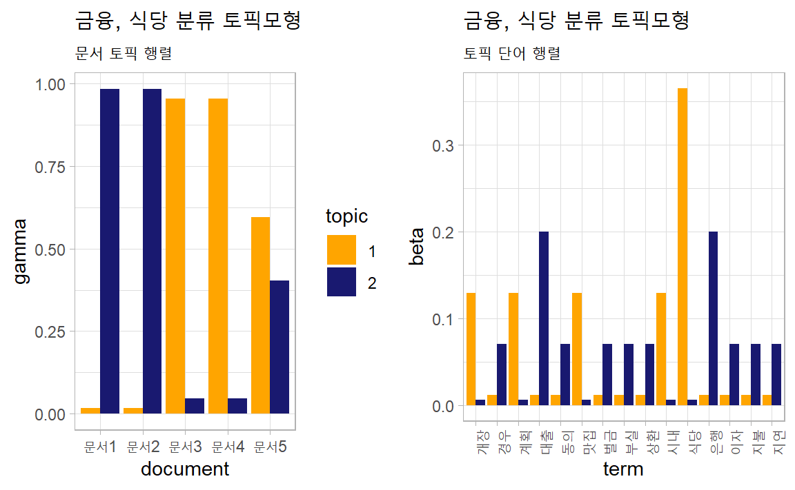
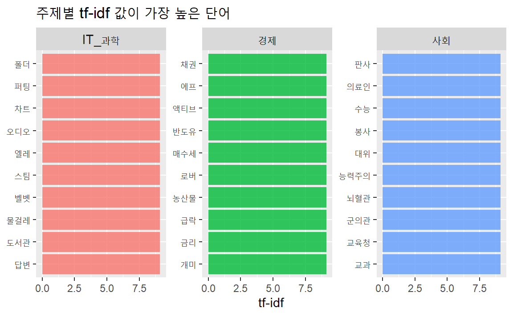
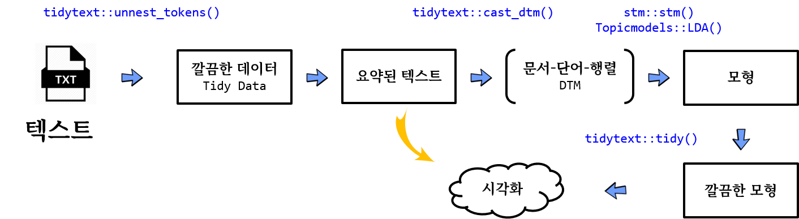
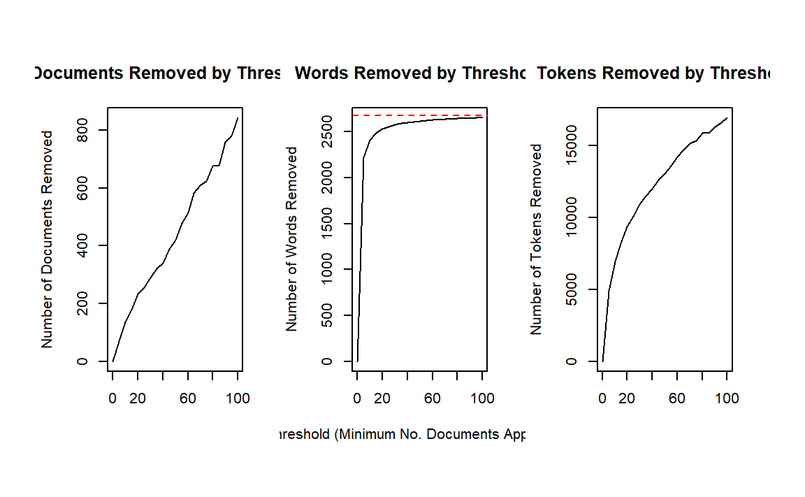
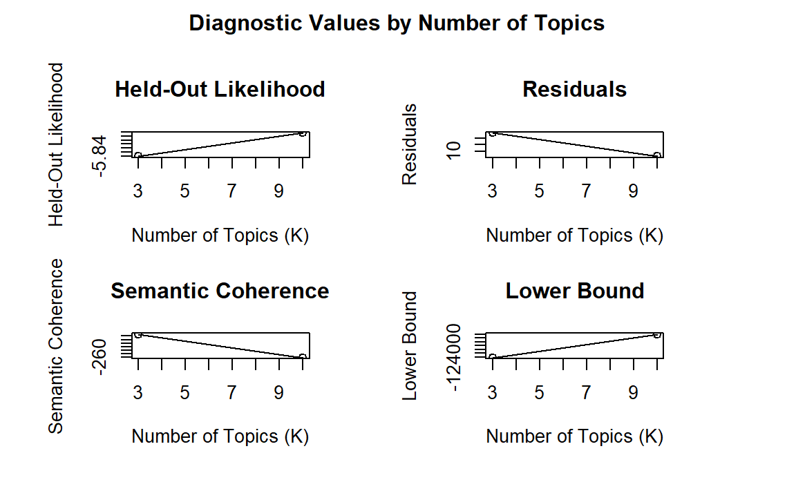
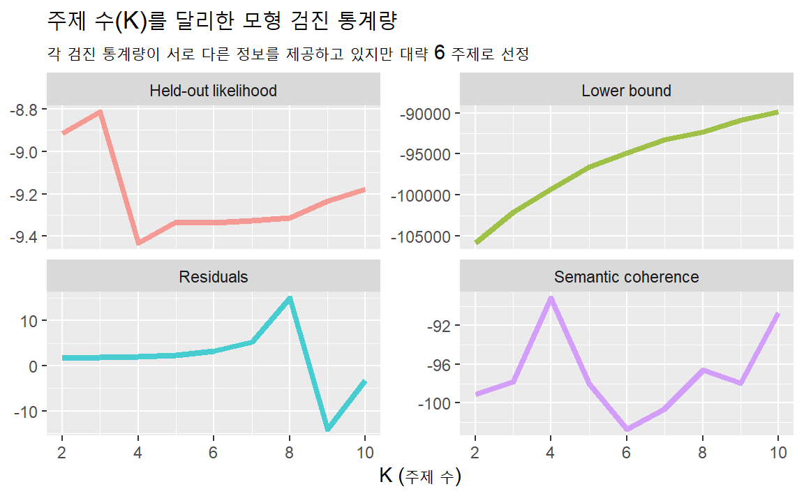
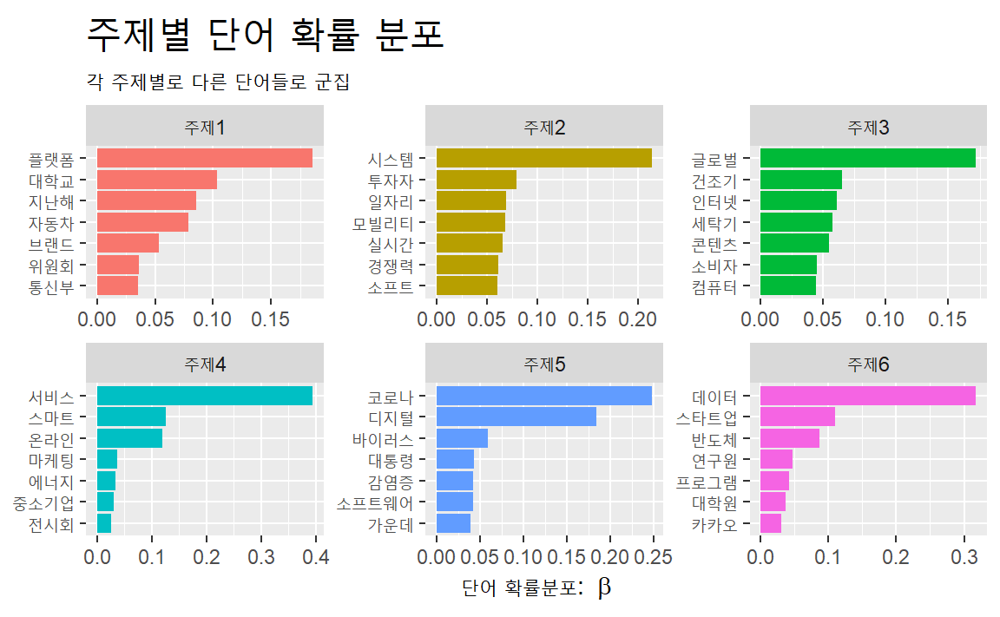
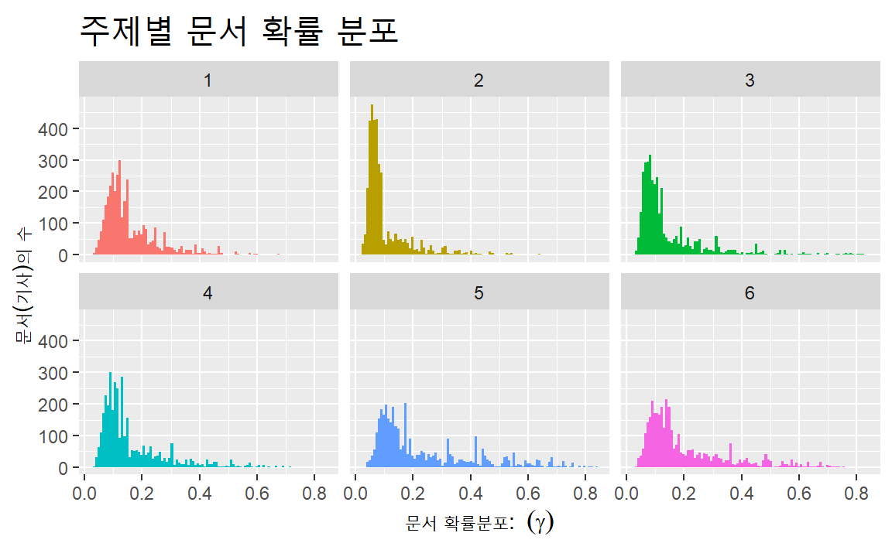
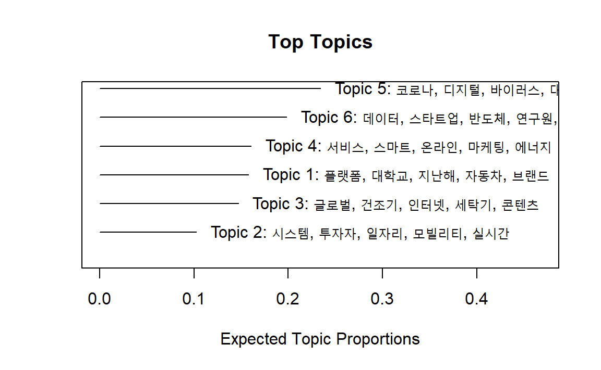
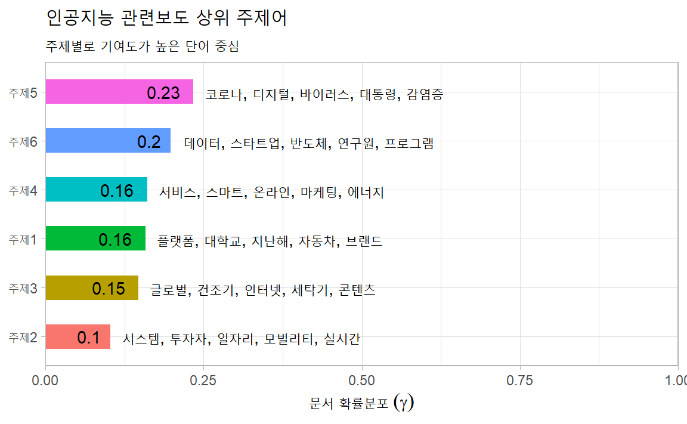

# 주제모형 {#topic-modeling}

## 개관

문서에 빈번하는 등장하는 단어를 통해 그 문서의 주제를 추론할 수 있다. 한 문서에는 다양한 주제가 들어있다. 

예를 들어, 아래 문장은 AP가 보도한 1988년 허스트재단의 링컨센터 기부 기사다.


```r
ap_v <- c("The William Randolph Hearst Foundation will give $1.25 million to Lincoln Center, Metropolitan Opera Co., New York Philharmonic and Juilliard School. “Our board felt that we had a
real opportunity to make a mark on the future of the performing arts with these grants an act
every bit as important as our traditional areas of support in health, medical research, education
and the social services,” Hearst Foundation President Randolph A. Hearst said Monday in
announcing the grants. Lincoln Center’s share will be $200,000 for its new building, which
will house young artists and provide new public facilities. The Metropolitan Opera Co. and
New York Philharmonic will receive $400,000 each. The Juilliard School, where music and
the performing arts are taught, will get $250,000. The Hearst Foundation, a leading supporter
of the Lincoln Center Consolidated Corporate Fund, will make its usual annual $100,000
donation, too.")
```


단어의 총빈도와 상대빈도를 계산하면, 이 문서의 주요 내용이 무엇인지 파악할 수 있다. 
먼저 총빈도 상위단어를 찾아보자.


```r
pkg_v <- c("tidyverse", "tidytext", "tidylo")
purrr::walk(pkg_v, require, ch = T)
```


```r
ap_count <- ap_v %>% tibble(text = .) %>% 
  unnest_tokens(word, text, drop = FALSE) %>% 
  anti_join(stop_words) %>% 
  count(word, sort = TRUE) %>% head(10)
```

상대빈도를 구해보자.

먼저 문장 단위로 토큰화해 문장별 ID를 구한다음 단어 단위로 토큰화한다. 대문자 앞의 마침표와 공백(`"\\.\\s(?=[:upper:])"`)을 기준으로 구분하면 된다.  


```r
ap_tfidf <- ap_v %>% tibble(text = .) %>% 
  mutate(text = str_squish(text)) %>% 
  unnest_tokens(sentence, text, token = "regex", pattern = "\\.\\s(?=[:upper:])") %>% 
  mutate(ID = row_number()) %>% 
  unnest_tokens(word, sentence, drop = F) %>% 
  anti_join(stop_words) %>% 
  count(ID, word, sort = T) %>% 
  bind_tf_idf(term = word, document = ID, n = n) %>% 
  arrange(-tf_idf) %>% head(10)

ap_wlo <- ap_v %>% tibble(text = .) %>% 
  mutate(text = str_squish(text)) %>% 
  unnest_tokens(sentence, text, token = "regex", pattern = "\\.\\s(?=[:upper:])") %>% 
  mutate(ID = row_number()) %>% 
  unnest_tokens(word, sentence, drop = F) %>% 
  anti_join(stop_words) %>% 
  count(ID, word, sort = T) %>% 
  bind_log_odds(feature = word, set = ID, n = n) %>% 
  arrange(-log_odds_weighted) %>% head(10)
```

추출한 상위 10대 빈도 단어를 비교해 보자. 


```r
bind_cols(
  select(ap_count,  총빈도  = word),
  select(ap_tfidf, tf_idf = word),
  select(ap_wlo,  가중승산비  = word)
)
```

<pre class="r-output"><code>## <span style='color: #555555;'># A tibble: 10 × 3</span>
##   총빈도     tf_idf     가중승산비  
##   <span style='color: #555555; font-style: italic;'>&lt;chr&gt;</span>      <span style='color: #555555; font-style: italic;'>&lt;chr&gt;</span>      <span style='color: #555555; font-style: italic;'>&lt;chr&gt;</span>       
## <span style='color: #555555;'>1</span> hearst     announcing hearst      
## <span style='color: #555555;'>2</span> foundation monday     grants      
## <span style='color: #555555;'>3</span> lincoln    400,000    announcing  
## <span style='color: #555555;'>4</span> arts       receive    monday      
## <span style='color: #555555;'>5</span> center     grants     metropolitan
## <span style='color: #555555;'>6</span> grants     250,000    opera       
## <span style='color: #555555;'># … with 4 more rows</span>
</code></pre>

총빈도와 상대빈도를 보면, 허스트재단이 링컨아트센터에 기부금 발표한 내용이란 것을 추론할 수 있지만, 기사에는 보다 다양한 주제를 담고 있다. 기사의 내용을 읽어보면 다양한 주제가 있음을 알수 있다 (Figure \@ref(fig:ap)).

<div class="figure" style="text-align: center">

<p class="caption">(\#fig:ap)AP 기사</p>
</div>

기사에 포함된 단어 중 같은 색으로 구부된 단어들을 모아보면 예술, 재정, 아동, 교육 등의 주제를 나타내는 일관된 단어로 구성됐음을 알수 있다 (Figure \@ref(fig:ap2)). 

<div class="figure" style="text-align: center">

<p class="caption">(\#fig:ap2)AP 기사 주제</p>
</div>

Blei 등 일군의 전산학자들은 문서 내 단어의 확률분포를 계산해 찾아낸 일련의 단어 군집을 통해 문서의 주제를 추론하는 방법으로서 LDA(Latent Dirichlet Allocation)을 제시했다. 

- Blei, D. M., Ng, A. Y., & Jordan, M. I. (2003). Latent dirichlet allocation. Journal of Machine Learning Research, 3, 993-1022.

19세기 독일 수학자 러죈 디리클레(Lejeune Dirichlet, 1805 ~ 1859)가 제시한 디리클래 분포(Dirichlet distribution)를 이용해 문서에 잠재된 주제를 추론하기에 잠재 디리클레 할당(LDA: Latent Dirichlet Allocation)이라고 했다. 문서의 주제를 추론하는 방법이므로 **주제모형(topic models)**이라고 한다. 

Beli(2012)가 설명한 LDA에 대한 직관적인 이해는 다음과 같다. Figure\@ref(fig:topic)에 제시된 논문 "Seeking life's bare (genetics) necessities"은 진화의 틀에서 유기체가 생존하기 위해 필요한 유전자의 수를 결정하기 위한 데이터분석에 대한 내용이다. 문서(documents)에 파란색으로 표시된 'computer' 'prediction' 등은 데이터분석에 대한 단어들이다. 분홍색으로 표시된 'life' 'organism'은 진화생물학에 대한 내용이다. 노란색으로 표시된 'sequenced' 'genes'는 유전학에 대한 내용이다. 이 논문의 모든 단어를 이런 식으로 분류하면 아마도 이 논문은 유전학, 데이터분석, 진화생물학 등이 상이한 비율로 혼합돼 있음을 알게 된다. 

- Blei, D. M. (2012). Probabilistic topic models. Communications of the ACM, 55(4), 77-84.

<div class="figure" style="text-align: center">

<p class="caption">(\#fig:topic)LDA의 직관적 예시</p>
</div>

LDA에는 다음과 같은 전제가 있다. 

- 말뭉치에는 단어를 통해 분포된 다수의 주제가 있다 (위 그림의 가장 왼쪽). 

각 문서에서 주제를 생성하는 과정은 다음과 같다. 

- 주제에 대해 분포 선택(오른쪽 히스토그램)
- 각 단어에 대해 주제의 분포 선택(색이 부여된 동그라미)
- 해당 주제를 구성하는 단어 선택(가운데 화살표)

LDA에서 정의하는 주제(topic)는 특정 단어에 대한 분포다. 예를 들어, 유전학 주제라면 유전학에 대하여 높은 확률로 분포하는 단어들이고, 진화생물학 주제라면 진화생물학에 대하여 높은 확률로 분포하는 단어들이다. 

LDA에서는 문서를 주머니에 무작위로 섞여 있는 임의의 혼합물로 본다(Bag of words). 일반적으로 사용하는 문장처럼 문법이라는 짜임새있는 구조로 보는 것이 아니다. 임의의 혼합물이지만 온전하게 무작위로 섞여 있는 것은 아니다. 서로 함께 모여 있는 군집이 확률적으로 존재한다. 즉, 주제모형에서 접근하는 문서는 잠재된 주제의 혼합물로서, 각 주제를 구성하는 단어 단위가 확률적으로 혼합된 주머니(bag)인 셈이다.

- 개별 문서: 여러 주제(topic)가 섞여 있는 혼합물
- 문서마다 주제(예술, 교육, 예산 등)의 분포 비율 상이
- 주제(예: 예술)마다 단어(예: 오페라, 교향악단)의 분포 상이

주제모형의 목표는 말뭉치에서 주제의 자동추출이다. 문서 자체는 관측가능하지만, 주제의 구조(문서별 주제의 분포와 문서별-단어별 주제할당)는 감춰져 있다. 감춰진 주제의 구조를 찾아내는 작업은 뒤집어진 생성과정이라고 할 수 있다. 관측된 말뭉치를 생성하는 감춰진 구조를 찾아내는 작업이기 때문이다. 문서에 대한 사전 정보없이 문서의 주제를 분류하기 때문에 주제모형은 비지도학습(unsupervised learning) 방식의 기계학습(machine learning)이 된다. 

- 기계학습(machine learing)
    - 인공지능 작동방식. 투입한 데이터에서 규칙성 탐지해 분류 및 예측. 지도학습, 비지도학습, 강화학습 등으로 구분.  
- 지도학습(supervised learning)
    - 인간이 사전에 분류한 결과를 학습해 투입한 자료에서 규칙성 혹은 경향  발견
- 비지도학습(unsupervised learning)  
    - 사전분류한 결과 없이 기계 스스로 투입한 자료에서 규칙성 혹은 경향 발견
- 강화학습(reinforced learning)
    - 행동의 결과에 대한 피드백(보상, 처벌 등)을 통해 투입한 자료에서 규칙성 혹은 경향 발견

주제모형의 효용은 대량의 문서에서 의미구조를 닮은 주제구조를 추론해 주석을 자동으로 부여할 수 있다는데 있다. 

주제모형은 다양한 패지키가 있다. 

- [lda](https://cran.r-project.org/web/packages/lda/)
- [topicmodels](https://cran.r-project.org/web/packages/topicmodels/) 
- [stm](https://cran.r-project.org/web/packages/stm/)

여기서는 구조적 주제모형(structural topic model)이 가능한 `stm`패키지를 이용한다. `stm`은 메타데이터를 이용한 추출한 주제에 대하여 다양한 분석을 할 수 있는 장점이 있다. 

### 작업흐름 {#nlp-topic-model}

단어가 모이면 토픽이 되고, 토픽이 모이면 문서가 되는 방식을 상상하는 것이 필요하다.

**토픽(topic)**은 문서 모임을 추상화한 것으로 토픽을 듣게 되면 토픽을 구성할 단어를 어림 짐작할 수 있게 된다. 예를 들어, 전쟁이라고 하면 총, 군인, 탱크, 비행기 등이 관련된 단어로 연관된다. 여러 토픽이 모여서 문서가 되고, 문서는 여러 토픽을 담게 된다.

**토픽 모형(topci modeling)**은 문서로부터 모형을 적합시켜 토픽을 찾아내는 과정으로 정의할 수 있다. 토픽모형을 활용함으로써 문서를 분류하는데 종종 활용된다. 특히, LDA(Latent Dirichlet Allocation) 모형이 가장 많이 활용되고 있다.

텍스트에서 토픽모형을 개발하는 순서는 대략 다음과 같다.

1. 텍스트를 DTM을 변환시킨다.
    - 명사를 추출할 경우와, 동사를 추출할 경우로 나눠서 살펴볼 수도 있다.
1. LDA는 DTM을 입력값을 받아 문서별로 토픽에 대한 연관성을 나타내는 행렬과 토픽에 단어가 속할 확률 행렬을 출력값으로 반환한다.
    - 제어 매개변수(control parameter)를 적절히 설정한다.
1. 출력된 행렬은 세부적으로 정보를 확인할 때 필요하고 우선, 시각매체를 사용하여 시각화한다.
    - $\beta$ 행렬은 토픽에 단어가 포함될 확률
    - $\gamma$ 행렬은 문서에 토픽이 포함될 확률

### 개념 예제 {#nlp-topic-model-hello-world}

문장을 금융 관련 문서1, 문서2를 준비하고, 식당관련 문장을 문서3, 문서4로 준비한다.
문서5는 금융과 식당이 뒤섞이도록 준비한다.
이를 `topicmodels` 팩키지를 활용하여 `LDA` 분석작업을 수행한다.
그리고 나서 결과값을 문서-토픽 행렬로 표현하고 좀더 직관적으로 볼 수 있도록 `ggplot`으로 시각화한다.  


```r
library(tidyverse)
library(tidytext)
library(topicmodels)

## 예제 데이터
sample_text <- c("부실 대출로 인해서 은행은 벌금을 지불하는데 동의했다",
                 "은행에 대출을 늦게 갚은 경우, 은행에서 지연에 대해 이자를 물릴 것이다.", 
                 "시내에 새로운 식당이 생겼습니다.",
                 "테헤란로에 맛집 식당이 있습니다.",
                 "새로 개장하려고 하는 식당 대출을 어떻게 상환할 계획입니까?")

sample_df <- tibble(
  document = paste0("문서", 1:5),
  text = sample_text
)

## BOW 데이터 변환
sample_bow <- sample_df %>% 
  ## 문서 내 텍스트에서 명사 추출
  mutate(mecab_pos = map(text, RcppMeCab::pos) ) %>% 
  unnest(mecab_pos) %>% 
  unnest(mecab_pos) %>% 
  separate(mecab_pos, into = c("nouns", "pos"), sep = "/") %>% 
  filter(pos == "NNG") %>% 
  ## 문서별 명사 빈도수
  group_by(document) %>% 
  count(nouns, sort = TRUE)

## DTM 변환
sample_dtm <- sample_bow %>% 
  cast_dtm(document = document, term = nouns, value = n) %>% 
  as.matrix

## LDA 모형 적합
sample_lda <- LDA(sample_dtm, k = 2,  method="Gibbs", 
                  control=list(alpha=0.1, delta=0.1, seed=1357))

## 토픽 결과 - 행렬
tidy(sample_lda, matrix="gamma") %>% 
  arrange(document) %>% 
  spread(topic, gamma)
```

<pre class="r-output"><code>## <span style='color: #555555;'># A tibble: 5 × 3</span>
##   document    `1`    `2`
##   <span style='color: #555555; font-style: italic;'>&lt;chr&gt;</span>     <span style='color: #555555; font-style: italic;'>&lt;dbl&gt;</span>  <span style='color: #555555; font-style: italic;'>&lt;dbl&gt;</span>
## <span style='color: #555555;'>1</span> 문서1    0.016<span style='text-decoration: underline;'>1</span> 0.984 
## <span style='color: #555555;'>2</span> 문서2    0.016<span style='text-decoration: underline;'>1</span> 0.984 
## <span style='color: #555555;'>3</span> 문서3    0.955  0.045<span style='text-decoration: underline;'>5</span>
## <span style='color: #555555;'>4</span> 문서4    0.955  0.045<span style='text-decoration: underline;'>5</span>
## <span style='color: #555555;'>5</span> 문서5    0.596  0.404
</code></pre>

```r
## 토픽 결과 - 시각화
### 문서 - 토픽

doc_topic_g <- tidy(sample_lda, matrix="gamma") %>% 
  mutate(topic = as.factor(topic)) %>% 
  ggplot(aes(x = document, y=gamma)) + 
    geom_col(aes(fill = topic), position=position_dodge()) +
    scale_fill_manual(values = c("orange", "midnightblue")) +
    theme_light() +
    labs(title="금융, 식당 분류 토픽모형",
         subtitle = "문서 토픽 행렬")

### 토픽 - 단어
topic_word_g <- tidy(sample_lda, matrix="beta") %>% 
  ggplot(aes(x = term, y=beta)) + 
    geom_col(aes(fill=as.factor(topic)), position=position_dodge()) +
    scale_fill_manual(values = c("orange", "midnightblue")) +
    theme_light() +
    labs(title="금융, 식당 분류 토픽모형",
         subtitle = "토픽 단어 행렬") +
    theme(axis.text.x = element_text(angle=90),
          legend.position = "none")

cowplot::plot_grid(doc_topic_g, topic_word_g)
```



상기 사례를 통해서 문서가 두가지 주제 금융과 식당으로 분류되고 문서를 
구성하는 단어는 금융과 식당 중 어떤 주제에 더 많은 기여를 하는지 확인이
가능하다.

## 자료 준비

[빅카인즈](https://www.bigkinds.or.kr/)에서 다음의 조건으로 기사를 추출한다.

- 검색어: 인공지능
- 기간: 2010.1.1 ~ 2020.12.31
- 언론사: 중앙일보, 조선일보, 한겨레, 경향신문, 한국경제, 매일경제
- 분석: 분석 기사

모두 5,145건이다. 

### 자료 이입 

다운로드한 기사를 작업디렉토리 아래 `data`폴더에 복사한다. 


```r
list.files("data/.", pattern = '^News.*20200101.*\\.xlsx$')
```

<pre class="r-output"><code>## [1] "NewsResult_20200101-20201231.xlsx"
</code></pre>

파일명이 'NewsResult_20200101-20201201.xlsx'다. 


```r
readxl::read_excel("data/NewsResult_20200101-20201231.xlsx") %>% names()
```

<pre class="r-output"><code>##  [1] "뉴스 식별자"                 
##  [2] "일자"                        
##  [3] "언론사"                      
##  [4] "기고자"                      
##  [5] "제목"                        
##  [6] "통합 분류1"                  
##  [7] "통합 분류2"                  
##  [8] "통합 분류3"                  
##  [9] "사건/사고 분류1"             
## [10] "사건/사고 분류2"             
## [11] "사건/사고 분류3"             
## [12] "인물"                        
## [13] "위치"                        
## [14] "기관"                        
## [15] "키워드"                      
## [16] "특성추출(가중치순 상위 50개)"
## [17] "본문"                        
## [18] "URL"                         
## [19] "분석제외 여부"
</code></pre>

분석에 필요한 열을 선택해 데이터프레임으로 저장한다. 분석 텍스트는 제목과 본문이다. 빅카인즈는 본문을 200자까지만 무료로 제공하지만, 학습 목적을 달성하기에는 충분하다. 제목은 본문의 핵심 내용을 반영하므로, 제목과 본문을 모두 주제모형 분석에 투입한다. 시간별, 언론사별, 분류별로 분석할 계획이므로, 해당 열을 모두 선택한다. 


```r
ai_df <- readxl::read_excel("data/NewsResult_20200101-20201231.xlsx") %>% 
  select(일자, 제목, 본문, 언론사, cat = `통합 분류1`) 
ai_df %>% head()
```

<pre class="r-output"><code>## <span style='color: #555555;'># A tibble: 6 × 5</span>
##   일자     제목                           본문  언론사 cat  
##   <span style='color: #555555; font-style: italic;'>&lt;chr&gt;</span>    <span style='color: #555555; font-style: italic;'>&lt;chr&gt;</span>                          <span style='color: #555555; font-style: italic;'>&lt;chr&gt;</span> <span style='color: #555555; font-style: italic;'>&lt;chr&gt;</span>  <span style='color: #555555; font-style: italic;'>&lt;chr&gt;</span>
## <span style='color: #555555;'>1</span> 20201231 <span style='color: #555555;'>"</span>`사모펀드 책임` 놓고 새해부…  <span style='color: #555555;'>"</span>은…  매일…  경제…
## <span style='color: #555555;'>2</span> 20201231 <span style='color: #555555;'>"</span>[이광석의 디지털 이후](25)시… <span style='color: #555555;'>"</span>ㆍ…  경향…  IT_… 
## <span style='color: #555555;'>3</span> 20201231 <span style='color: #555555;'>"</span>\"소처럼 묵묵하게 경제 통합 … <span style='color: #555555;'>"</span>역…  매일…  지역…
## <span style='color: #555555;'>4</span> 20201231 <span style='color: #555555;'>"</span>GS건설, `강릉자이 파인베뉴` … <span style='color: #555555;'>"</span>GS…  매일…  경제…
## <span style='color: #555555;'>5</span> 20201231 <span style='color: #555555;'>"</span>디지털 강조한 금융협회장들 …  <span style='color: #555555;'>"</span>\"…  매일…  경제…
## <span style='color: #555555;'>6</span> 20201231 <span style='color: #555555;'>"</span>정치인 거짓말도 진실로 둔갑 … <span style='color: #555555;'>"</span>◆ …  매일…  IT_…
</code></pre>

시간열에는 연월일의 값이 있다. 월별 추이에 따른 주제를 분석할 것이므로 열의 값을 월에 대한 값으로 바꾼다. `tidyverse`패키지에 함께 설치되는 `lubridate`패키지를 이용해 문자열을 날짜형으로 변경하고 월 데이터 추출해 새로운 열 `month` 생성한다. `lubridate`는 `tidyverse`에 포함돼 있으나 함께 부착되지 않으므로 별도로 실행해야 한다. 


```r
library(lubridate)
as_date("20201231") %>% month()
```

<pre class="r-output"><code>## [1] 12
</code></pre>

```r
ymd("20201231") %>% month()
```

<pre class="r-output"><code>## [1] 12
</code></pre>

DB에 같은 기사가 중복 등록되는 경우가 있으므로, `dplyr`패키지의 `distinct()`함수를 이용해 중복된 문서를 제거한다. `.keep_all = `인자의 기본값은 `FALSE`다. 투입한 열 이외의 열은 유지하지 않는다. 다른 변수(열)도 분석에 필요하므로  `.keep_all = `인자를 `TRUE`로 지정한다. 

분석 목적에 맞게 열을 재구성한다. 


```r
library(lubridate) 

ai2_df <- ai_df %>% 
  # 중복기사 제거
  distinct(제목, .keep_all = TRUE) %>% 
  # 기사별 ID부여
  mutate(ID = factor(row_number())) %>% 
  # 월별로 구분한 열 추가
  mutate(month = month(ymd(일자))) %>% 
  # 기사 제목과 본문 결합
  unite(제목, 본문, col = "text", sep = " ") %>% 
  # 중복 공백 제거
  mutate(text = str_squish(text)) %>% 
  # 언론사 분류: 보수 진보 경제 %>% 
  mutate(press = case_when(
    언론사 == "조선일보" ~ "종합지",
    언론사 == "중앙일보" ~ "종합지",
    언론사 == "경향신문" ~ "종합지",
    언론사 == "한겨레"   ~ "종합지",
    언론사 == "한국경제" ~ "경제지",
    TRUE ~ "경제지") ) %>% 
  # 기사 분류 구분 
  separate(cat, sep = ">", into = c("cat", "cat2")) %>% 
  # IT_과학, 경제, 사회 만 선택
  filter(str_detect(cat, "IT_과학|경제|사회")) %>% 
  select(-cat2)  

ai2_df %>% head(5)
```

<pre class="r-output"><code>## <span style='color: #555555;'># A tibble: 5 × 7</span>
##   일자     text               언론사 cat   ID    month press
##   <span style='color: #555555; font-style: italic;'>&lt;chr&gt;</span>    <span style='color: #555555; font-style: italic;'>&lt;chr&gt;</span>              <span style='color: #555555; font-style: italic;'>&lt;chr&gt;</span>  <span style='color: #555555; font-style: italic;'>&lt;chr&gt;</span> <span style='color: #555555; font-style: italic;'>&lt;fct&gt;</span> <span style='color: #555555; font-style: italic;'>&lt;dbl&gt;</span> <span style='color: #555555; font-style: italic;'>&lt;chr&gt;</span>
## <span style='color: #555555;'>1</span> 20201231 <span style='color: #555555;'>"</span>`사모펀드 책임` … 매일…  경제  1        12 경제…
## <span style='color: #555555;'>2</span> 20201231 <span style='color: #555555;'>"</span>[이광석의 디지털… 경향…  IT_…  2        12 종합…
## <span style='color: #555555;'>3</span> 20201231 <span style='color: #555555;'>"</span>GS건설, `강릉자…  매일…  경제  4        12 경제…
## <span style='color: #555555;'>4</span> 20201231 <span style='color: #555555;'>"</span>디지털 강조한 금… 매일…  경제  5        12 경제…
## <span style='color: #555555;'>5</span> 20201231 <span style='color: #555555;'>"</span>정치인 거짓말도 … 매일…  IT_…  6        12 경제…
</code></pre>

```r
ai2_df %>% names()
```

<pre class="r-output"><code>## [1] "일자"   "text"   "언론사" "cat"    "ID"     "month" 
## [7] "press"
</code></pre>

기사의 분류된 종류, 월 등 새로 생성한 열의 내용을 확인해보자.


```r
ai2_df$cat %>% unique()
```

<pre class="r-output"><code>## [1] "경제"    "IT_과학" "사회"
</code></pre>

```r
ai2_df$month %>% unique()
```

<pre class="r-output"><code>##  [1] 12 11 10  9  8  7  6  5  4  3  2  1
</code></pre>

```r
ai2_df$press %>% unique()
```

<pre class="r-output"><code>## [1] "경제지" "종합지"
</code></pre>

분류별, 월별로 기사의 양을 계산해보자.


```r
ai2_df %>% count(cat, sort = TRUE, name = "기사건수")
```

<pre class="r-output"><code>## <span style='color: #555555;'># A tibble: 3 × 2</span>
##   cat     기사건수
##   <span style='color: #555555; font-style: italic;'>&lt;chr&gt;</span>      <span style='color: #555555; font-style: italic;'>&lt;int&gt;</span>
## <span style='color: #555555;'>1</span> IT_과학     <span style='text-decoration: underline;'>1</span>922
## <span style='color: #555555;'>2</span> 경제        <span style='text-decoration: underline;'>1</span>409
## <span style='color: #555555;'>3</span> 사회         460
</code></pre>

```r
ai2_df %>% count(month, sort = TRUE, name = "기사건수")
```

<pre class="r-output"><code>## <span style='color: #555555;'># A tibble: 12 × 2</span>
##   month 기사건수
##   <span style='color: #555555; font-style: italic;'>&lt;dbl&gt;</span>    <span style='color: #555555; font-style: italic;'>&lt;int&gt;</span>
## <span style='color: #555555;'>1</span>     1      382
## <span style='color: #555555;'>2</span>     9      379
## <span style='color: #555555;'>3</span>    12      366
## <span style='color: #555555;'>4</span>     7      345
## <span style='color: #555555;'>5</span>     6      335
## <span style='color: #555555;'>6</span>     5      334
## <span style='color: #555555;'># … with 6 more rows</span>
</code></pre>

```r
ai2_df %>% count(press, sort = TRUE, name = "기사건수")
```

<pre class="r-output"><code>## <span style='color: #555555;'># A tibble: 2 × 2</span>
##   press  기사건수
##   <span style='color: #555555; font-style: italic;'>&lt;chr&gt;</span>     <span style='color: #555555; font-style: italic;'>&lt;int&gt;</span>
## <span style='color: #555555;'>1</span> 경제지     <span style='text-decoration: underline;'>2</span>049
## <span style='color: #555555;'>2</span> 종합지     <span style='text-decoration: underline;'>1</span>742
</code></pre>


### 정제

#### 토큰화

`RcppMeCab`패키지의 `pos()`함수로 명사만 추출해 토큰화한다. 명사가 문서의 주제를 잘 나타내므로 주제모형에서는 주로 명사를 이용하지만, 목적에 따라서는 다른 품사(용언 등)를 분석에 투여하기도 한다. 

(* 형태소 추출전에 문자 혹은 공백 이외의 요소(예: 구둣점)를 먼저 제거한다.) 


```r
library(RmecabKo)

ai_tk <- ai2_df %>%
  # 문자 혹은 공백 이외 것 제거
  mutate(text = str_remove_all(text, "[^(\\w+|\\s)]")) %>%  
  # 메카브로 품사 중 명사만 추출
  unnest_tokens(word, text, token = RcppMeCab::pos, drop = FALSE) %>% 
  separate(col = word, 
         into = c("word", "morph"), 
         sep = "/" ) %>% 
  filter(morph == "nng")

ai_tk %>% glimpse()
```

<pre class="r-output"><code>## Rows: 145,965
## Columns: 9
## $ 일자   <span style='color: #555555; font-style: italic;'>&lt;chr&gt;</span> "20201231", "20201231", "20201231", "202012…
## $ text   <span style='color: #555555; font-style: italic;'>&lt;chr&gt;</span> "사모펀드 책임 놓고 새해부터 금융위 탓한 금…
## $ 언론사 <span style='color: #555555; font-style: italic;'>&lt;chr&gt;</span> "매일경제", "매일경제", "매일경제", "매일경…
## $ cat    <span style='color: #555555; font-style: italic;'>&lt;chr&gt;</span> "경제", "경제", "경제", "경제", "경제", "경…
## $ ID     <span style='color: #555555; font-style: italic;'>&lt;fct&gt;</span> 1, 1, 1, 1, 1, 1, 1, 1, 1, 1, 1, 1, 1, 1, 1…
## $ month  <span style='color: #555555; font-style: italic;'>&lt;dbl&gt;</span> 12, 12, 12, 12, 12, 12, 12, 12, 12, 12, 12,…
## $ press  <span style='color: #555555; font-style: italic;'>&lt;chr&gt;</span> "경제지", "경제지", "경제지", "경제지", "경…
## $ word   <span style='color: #555555; font-style: italic;'>&lt;chr&gt;</span> "사모", "펀드", "책임", "새해", "금융", "위…
## $ morph  <span style='color: #555555; font-style: italic;'>&lt;chr&gt;</span> "nng", "nng", "nng", "nng", "nng", "nng", "…
</code></pre>

#### 불용어 제거

'인공지능'으로 검색한 기사이므로, '인공지능'관련 단어는 제거한다. 
문자가 아닌 요소를 모두 제거한다. (숫자를 반드시 제거해야 하는 것은 아니다.)


```r
ai_tk <- ai_tk %>% 
  filter(!word %in% c("인공지능", "AI", "ai", "인공지능AI", "인공지능ai")) %>% 
  filter(str_detect(word, "[:alpha:]+")) 
```

단어의 총빈도와 상대빈도를 살펴보자


```r
ai_tk %>% count(word, sort = TRUE)
```

<pre class="r-output"><code>## <span style='color: #555555;'># A tibble: 9,562 × 2</span>
##   word       n
##   <span style='color: #555555; font-style: italic;'>&lt;chr&gt;</span>  <span style='color: #555555; font-style: italic;'>&lt;int&gt;</span>
## <span style='color: #555555;'>1</span> 기술    <span style='text-decoration: underline;'>1</span>933
## <span style='color: #555555;'>2</span> 기업    <span style='text-decoration: underline;'>1</span>674
## <span style='color: #555555;'>3</span> 데이터  <span style='text-decoration: underline;'>1</span>138
## <span style='color: #555555;'>4</span> 서비스  <span style='text-decoration: underline;'>1</span>114
## <span style='color: #555555;'>5</span> 개발    <span style='text-decoration: underline;'>1</span>094
## <span style='color: #555555;'>6</span> 코로나  <span style='text-decoration: underline;'>1</span>051
## <span style='color: #555555;'># … with 9,556 more rows</span>
</code></pre>

상대빈도가 높은 단어와 낮은 단어를 확인한다. 


```r
ai_tk %>% count(cat, word, sort = TRUE) %>% 
  bind_log_odds(set = cat, feature = word, n = n) %>% 
  arrange(log_odds_weighted)
```

<pre class="r-output"><code>## <span style='color: #555555;'># A tibble: 16,139 × 4</span>
##   cat     word       n log_odds_weighted
##   <span style='color: #555555; font-style: italic;'>&lt;chr&gt;</span>   <span style='color: #555555; font-style: italic;'>&lt;chr&gt;</span>  <span style='color: #555555; font-style: italic;'>&lt;int&gt;</span>             <span style='color: #555555; font-style: italic;'>&lt;dbl&gt;</span>
## <span style='color: #555555;'>1</span> IT_과학 반도체    32             -<span style='color: #BB0000;'>5.78</span>
## <span style='color: #555555;'>2</span> IT_과학 투자     230             -<span style='color: #BB0000;'>5.56</span>
## <span style='color: #555555;'>3</span> IT_과학 펀드      16             -<span style='color: #BB0000;'>5.07</span>
## <span style='color: #555555;'>4</span> 경제    전자      92             -<span style='color: #BB0000;'>5.07</span>
## <span style='color: #555555;'>5</span> IT_과학 종목       5             -<span style='color: #BB0000;'>4.92</span>
## <span style='color: #555555;'>6</span> IT_과학 금융     140             -<span style='color: #BB0000;'>4.84</span>
## <span style='color: #555555;'># … with 16,133 more rows</span>
</code></pre>

```r
ai_tk %>% count(cat, word, sort = TRUE) %>% 
  bind_tf_idf(term = word, document = word, n = n) %>% 
  arrange(idf)
```

<pre class="r-output"><code>## <span style='color: #555555;'># A tibble: 16,139 × 6</span>
##   cat     word       n    tf   idf tf_idf
##   <span style='color: #555555; font-style: italic;'>&lt;chr&gt;</span>   <span style='color: #555555; font-style: italic;'>&lt;chr&gt;</span>  <span style='color: #555555; font-style: italic;'>&lt;int&gt;</span> <span style='color: #555555; font-style: italic;'>&lt;dbl&gt;</span> <span style='color: #555555; font-style: italic;'>&lt;dbl&gt;</span>  <span style='color: #555555; font-style: italic;'>&lt;dbl&gt;</span>
## <span style='color: #555555;'>1</span> IT_과학 기술    <span style='text-decoration: underline;'>1</span>175 0.608  8.07   4.90
## <span style='color: #555555;'>2</span> 경제    기업     831 0.496  8.07   4.00
## <span style='color: #555555;'>3</span> IT_과학 기업     771 0.461  8.07   3.72
## <span style='color: #555555;'>4</span> IT_과학 서비스   735 0.660  8.07   5.32
## <span style='color: #555555;'>5</span> IT_과학 데이터   671 0.590  8.07   4.76
## <span style='color: #555555;'>6</span> IT_과학 개발     633 0.579  8.07   4.67
## <span style='color: #555555;'># … with 16,133 more rows</span>
</code></pre>

한글자 단어는 문서의 주제를 나타내는데 기여하지 못하는 경우도 있고, 
고유명사인데 형태소로 분리돼 있는 경우도 있다. 
상대빈도가 높은 단어를 살펴 특이한 단어가 있으면 형태소 추출전 단어가 무엇인지 확인한다. 특이한 경우가 없으면 한글자 단어는 모두 제거한다.
tibble 데이터프레임은 문자열의 일부만 보여준다.  
`pull()`함수로 열에 포함된 문자열을 벡터로 출력하므로, 모든 내용을 확인할 수 있다. 


```r
ai_tk %>% 
  filter(word == "하") %>% pull(text) %>% head(3)
```

<pre class="r-output"><code>## [1] "정희수 생보협회장 빅테크의 금융 진출에 규제 공백 없게 정희수 생명보험협회장은 새해 신년사로 빅테크의 금융상품 판매에 규제 공백이 발생하지 않도록 노력하겠다 밝혔다 정희수 협회장은 31일 공개한 신축년 신년사를 통해 동일기능 동일규제 원칙 하에 빅테크와 관련한 기울어진 운동장 이슈를 해결하고 빅테크 플랫폼 기업의 금융상품판매 유사행위에 대한 규제 공백이 발생하지 않도록 지속적으로 노력하겠다고 강조했"
## [2] "한국화웨이 ICT 챌린지 경진대회 16명에 6500만원 상금 수여 한국화웨이가 개최한 제1회 한국 화웨이 ICT 챌린지 경진대회 결과 총 16명의 수상자가 선정됐다 한국화웨이는 지난 28일 온라인으로 시상식을 열고 상장과 상금(총 6500만원)을 수여했다 회사 관계자는 한국화웨이 ICT 챌린지는 화웨이가 한국에서 한국을 위하여라는 비전 하에 국내 ICT 인재 발굴 및 양성을 위해 계획하고 추진한 또 다른"                       
## [3] "왜 청년들은 중소기업에서 일하려고 하지 않는걸까 (하) 중기야사20 저는 인문계 고등학교를 졸업해 전형적인 모범생으로 살아와 공업계 고등학교에 대한 편견이 있습니다 그런데 공고 전체 중 10 정도에 해당하는 마이스터고는 졸업 후 취업률이 거의 90에 가깝습니다 이 중에는 정부에서 운영하는 국립 공고뿐 아니라 포항제철고 현대공업고 처럼 대기업에서 운영하는 공고도 있습니다 이런 공고는 졸업생들이"
</code></pre>


'기업' '기술' 등의 단어는 총사용빈도가 높지만, 상대빈도는 낮다. 대부분의 분류에서 널리 사용된 단어다. 지금 제거할필요는 없지만, 제거가능성을 염두에 둔다. 


```r
ai2_tk <- ai_tk %>% 
  filter(str_length(word) > 1)

ai2_tk %>% 
  count(word, sort = TRUE) 
```

<pre class="r-output"><code>## <span style='color: #555555;'># A tibble: 8,970 × 2</span>
##   word       n
##   <span style='color: #555555; font-style: italic;'>&lt;chr&gt;</span>  <span style='color: #555555; font-style: italic;'>&lt;int&gt;</span>
## <span style='color: #555555;'>1</span> 기술    <span style='text-decoration: underline;'>1</span>933
## <span style='color: #555555;'>2</span> 기업    <span style='text-decoration: underline;'>1</span>674
## <span style='color: #555555;'>3</span> 데이터  <span style='text-decoration: underline;'>1</span>138
## <span style='color: #555555;'>4</span> 서비스  <span style='text-decoration: underline;'>1</span>114
## <span style='color: #555555;'>5</span> 개발    <span style='text-decoration: underline;'>1</span>094
## <span style='color: #555555;'>6</span> 코로나  <span style='text-decoration: underline;'>1</span>051
## <span style='color: #555555;'># … with 8,964 more rows</span>
</code></pre>

상대빈도를 다시 확인하자. 


```r
ai2_tk %>% count(cat, word, sort = T) %>% 
  bind_log_odds(set = cat, feature = word, n = n) %>% 
  arrange(-log_odds_weighted)
```

<pre class="r-output"><code>## <span style='color: #555555;'># A tibble: 14,990 × 4</span>
##   cat     word       n log_odds_weighted
##   <span style='color: #555555; font-style: italic;'>&lt;chr&gt;</span>   <span style='color: #555555; font-style: italic;'>&lt;chr&gt;</span>  <span style='color: #555555; font-style: italic;'>&lt;int&gt;</span>             <span style='color: #555555; font-style: italic;'>&lt;dbl&gt;</span>
## <span style='color: #555555;'>1</span> 사회    교육     287              9.25
## <span style='color: #555555;'>2</span> 사회    대학     185              7.62
## <span style='color: #555555;'>3</span> 경제    자산     132              7.32
## <span style='color: #555555;'>4</span> 사회    학생     127              7.23
## <span style='color: #555555;'>5</span> 사회    치료      55              7.20
## <span style='color: #555555;'>6</span> IT_과학 건조기   158              6.86
## <span style='color: #555555;'># … with 14,984 more rows</span>
</code></pre>

```r
ai2_tf_idf <- ai2_tk %>% count(cat, word, sort = T) %>% 
  bind_tf_idf(term = word, document = word, n = n) %>% 
  arrange(tf_idf)
```

각 분야별 가장 `tf-idf` 값을 기준으로 높은 단어를 10개 뽑아 시각화를 한다.
특별한 모형이나 가정이 수반되지 않는 시각화로 직관적이지만 중복되는 `tf-idf`이
많은 경우 소통에 어려움이 있을 수 있다.


```r
ai2_tf_idf %>% 
    group_by(cat) %>%
    slice_max(tf_idf, n = 10, with_ties = FALSE) %>%
    ungroup() %>% 
  
    ggplot(aes(word, tf_idf, fill = cat)) +
      geom_col(alpha = 0.8, show.legend = FALSE) +
      facet_wrap(~ cat, scales = "free", ncol = 3) +
      scale_x_reordered() +
      coord_flip() +
      theme(strip.text=element_text(size=11)) +
      labs(x = NULL, y = "tf-idf",
           title = "주제별 tf-idf 값이 가장 높은 단어")
```




### stm 말뭉치

주제모형(topic model) 개발을 위해서 함수에 들어가는 입력 데이터를 
두가지 방식으로 다음과 같이 나눠 작업도 가능하다.

#### `cast_*()` 방식

텍스트 데이터를 EDA 작업을 할 경우 대부분 시각화를 통해서 인사이트 
도출 작업을 수행할 경우 깔끔한 데이터(tidy data)가 편리하지만
모형개발을 할 때는 깔끔한 데이터 보다는 `cast_dtm()` 함수를 사용해서 
문서-단어-행렬(Document-term-matrix)로 바꿔줘야 주제모형을 개발할 수 있다.
주제모형(topic model)을 데이터에 적합시켜 도출한 후에 면멸한 모형 검정을 위해서
다시 `tidytext::tidy()` 함수를 사용해서 다시 깔끔한 데이터(tidy data) 변환시켜
후속 작업을 수행한다.

{width=100%}

한국언론진흥재단 빅카인즈에서 제공한 기사데이터는 "키워드"를 별도로 제공하고 있다.
주제모형 개발을 위해서 주제 발굴에 가장 영향이 큰 명사를 추출하여 이를 행렬로 
변환시켜 `stm::stm()` 혹은 `topicmodels::LDA()` 함수를 사용해서 적절한
주제를 찾아내고 이를 해석하고 소통하는 과정이다.

따라서, 신속한 모형개발을 위해서 앞서 수행한 원문기사에서 명사를 추출하는 과정을 
이미 사전에 기사마다 특정되어 있는 "키워드"를 사용한다.


```r
library(stm)

ai_news_raw <- readxl::read_excel("data/NewsResult_20200101-20201231.xlsx")

set.seed(02138)

ai_news_tidy <- ai_news_raw %>% 
  janitor::clean_names(ascii = FALSE) %>% 
  select(news_id = 뉴스_식별자, keyword = 키워드) %>% 
  slice_sample(prop = 0.01) %>% # 5145 중 1% 51개
  mutate(keyword = map(keyword, str_split, pattern = ",")) %>% 
  unnest(keyword) %>% 
  unnest(keyword)

ai_news_sparse <- ai_news_tidy %>% 
  count(news_id, keyword) %>%
  cast_sparse(news_id, keyword, n)

dim(ai_news_sparse)
```

<pre class="r-output"><code>## [1]   51 4869
</code></pre>

```r
ai_news_sparse[1:10, 100:110]
```

<pre class="r-output"><code>## 10 x 11 sparse Matrix of class "dgCMatrix"
##                                                 
## 01100101.20200211155933001 1 1 1 3 1 2 1 1 1 3 1
## 01100101.20200311210122001 . . . . . . . . . . .
## 01100101.20200323091817001 . . . . . . . . . 1 .
## 01100101.20200727214230001 . . . . . . . . . 1 .
## 01100801.20200114104535002 . . . . . . . . . 1 .
## 01100801.20200128103005001 . . 1 . . 1 . . 2 1 .
## 01100801.20200618091524001 . . . . . . . . . 2 .
## 01100801.20200731103017001 . . . . . 1 9 1 1 . .
## 01100801.20200905145115001 . 1 1 . . 1 1 . 1 . .
## 01100901.20200114054513001 . . . . . 1 . . 1 1 .
</code></pre>

`ai_news_tidy` 데이터프레임은 탐색적 데이터 분석에 적합한 자료형태라 이를 `cast_sparse()` 함수를 사용해서 주제모형 개발에 적합한 형태로 변환시킨다.
`cast_sparse()` 함수를 사용하는 이유는 동일한 정보를 저장하는데 `cast_dtm()`보다 저장공간을 절약하고 효율적이기 때문이다. 
주제모형 개발작업흐름에 있어 개념적으로 봤을 때 큰 차이는 없다.


#### 순차 말뭉치 방식

토큰화한 데이터프레임을 `stm`패키지 형식의 말뭉치로 변환한다. 
이를 위해 먼저 분리된 토큰을 원래 문장에 속한 하나의 열로 저장한다.

- `str_flatten()`은 `str_c()`함수와 달리, 문자열을 결합해 단일 요소로 산출한다.  
  - `str_c()`함수에  `collapse = `인자를 사용한 경우에 해당한다.  
  - `str_c()`는 R기본함수 `paste0()`와 비슷하다. 결측값 처리방법이 서로 다르다. 


```r
# install.packages("stm", dependencies = T)

library(stm)

combined_df <- ai2_tk %>%
  group_by(ID) %>%
  summarise(text2 = str_flatten(word, " ")) %>%
  ungroup() %>% 
  inner_join(ai2_df, by = "ID")

combined_df %>% glimpse()
```

<pre class="r-output"><code>## Rows: 3,791
## Columns: 8
## $ ID     <span style='color: #555555; font-style: italic;'>&lt;fct&gt;</span> 1, 2, 4, 5, 6, 7, 8, 9, 10, 12, 14, 15, 16,…
## $ text2  <span style='color: #555555; font-style: italic;'>&lt;chr&gt;</span> "사모 펀드 책임 새해 금융 은성 금융 위원장 …
## $ 일자   <span style='color: #555555; font-style: italic;'>&lt;chr&gt;</span> "20201231", "20201231", "20201231", "202012…
## $ text   <span style='color: #555555; font-style: italic;'>&lt;chr&gt;</span> "`사모펀드 책임` 놓고 새해부터 금융위 탓한 …
## $ 언론사 <span style='color: #555555; font-style: italic;'>&lt;chr&gt;</span> "매일경제", "경향신문", "매일경제", "매일경…
## $ cat    <span style='color: #555555; font-style: italic;'>&lt;chr&gt;</span> "경제", "IT_과학", "경제", "경제", "IT_과학…
## $ month  <span style='color: #555555; font-style: italic;'>&lt;dbl&gt;</span> 12, 12, 12, 12, 12, 12, 12, 12, 12, 12, 12,…
## $ press  <span style='color: #555555; font-style: italic;'>&lt;chr&gt;</span> "경제지", "종합지", "경제지", "경제지", "경…
</code></pre>

`textProcessor()`함수로 리스트 형식의 stm말뭉치로 변환한다. 'documents' 'vacab' 'meta'등의 하부요소가 생성된다. 'meta'에 텍스트데이터가 저장돼 있다. 

영문문서의 경우, `textProcessor()`함수로 정제과정을 수행하므로, 한글문서처럼 별도의 형태소 추출과정 바로 영문데이터프레임을 투입하면 된다. 

'text2'열에 토큰화한 단어가 저장돼 있다. 

만일 `tm`패키지나 `SnowballC`패키지가 설치돼 있지 않으면 


```r
library(stm)

processed <- ai2_df %>% 
  textProcessor(documents = combined_df$text2, metadata = .)
```

<pre class="r-output"><code>## Building corpus... 
## Converting to Lower Case... 
## Removing punctuation... 
## Removing stopwords... 
## Removing numbers... 
## Stemming... 
## Creating Output...
</code></pre>

`prepDocuments()`함수로 주제모형에 사용할 데이터의 인덱스(wordcounts)를 만든다.


```r
out <- 
  prepDocuments(processed$documents,
                     processed$vocab,
                     processed$meta)
```

<pre class="r-output"><code>## Removing 1354 of 2677 terms (1354 of 18122 tokens) due to frequency 
## Removing 16 Documents with No Words 
## Your corpus now has 3747 documents, 1323 terms and 16768 tokens.
</code></pre>

제거할수 있는 단어와 문서의 수를 `plotRemoved()`함수로 확인할 수 있다. 


```r
plotRemoved(processed$documents, lower.thresh = seq(0, 100, by = 5))
```



`lower.thresh = `로 최소값 설정하면 빈도가 낮아 제거할 용어의 수를 설정할 수 있다. 설정값을 너무 높게 잡으면 분석의 정확도가 떨어진다. 여기서는 계산 편의를 위해 설정값을 높게 잡았다. 


```r
out <-
  prepDocuments(processed$documents,
                processed$vocab,
                processed$meta, 
                lower.thresh = 15)
```

<pre class="r-output"><code>## Removing 2487 of 2677 terms (6204 of 18122 tokens) due to frequency 
## Removing 179 Documents with No Words 
## Your corpus now has 3584 documents, 190 terms and 11918 tokens.
</code></pre>

산출결과를 개별 객체로 저장한다. 이 객체들은 이후 모형구축에 사용된다. 


```r
docs <- out$documents
vocab <- out$vocab
meta <- out$meta
```


## 분석

### 주제의 수(K) 설정

주제를 몇개로 설정할지 탐색한다. 7개와 10개를 놓고 비교해보자. `searchK()`함수는 주제의 수에 따라 4가지 계수를 제공한다. 

- 배타성(exclusivity): 특정 주제에 등장한 단어가 다른 주제에는 나오지 않는 정도. 확산타당도에 해당. 
- 의미 일관성(semantic coherence): 특정 주제에 높은 확률로 나타나는 단어가 동시에 등장하는 정도. 수렴타당도에 해당.
- 지속성(heldout likelihood): 데이터 일부가 존재하지 않을 때의 모형 예측 지속 정도. 
- 잔차(residual): 투입한 데이터로 모형을 설명하지 못하는 오차. 

배타성, 의미 일관성, 지속성이 높을 수록, 그리고 잔차가 작을수록 모형의 적절성 증가. 

보통 10개부터 100개까지 10개 단위로 주제의 수를 구분해 연구자들이 정성적으로 최종 주제의 수 판단한다. 

학습 상황이므로 계산시간을 줄이기 위해 주제의 수를 3개와 10개의 결과만 비교한다. (iteration을 200회 이상 수행하므로 계산시간이 오래 걸린다.)

백그라운드에서 계산하도록 하면, RStudio에서 다른 작업을 병행할 수 있다. 

- [RStudio 코드 백그라운드에서 돌리기](https://www.youtube.com/watch?v=84rNE63H8gA)
 


```r
# topicN <- seq(from = 10, to = 100, by = 10)
topicN <- c(3, 10)

topicN_storage <- searchK(out$documents, out$vocab, K = topicN)

topicN_storage %>% 
  write_rds("data/topicN_storage.rds")
```

작업 시간이 오래 걸리기 때문에 작업결과를 로컬 디스크에 저장하고 나서 이를 다시
가져와서 적절한 주제 선정에 대한 작업결과를 시각적으로 확인한다.


```r
topicN_storage <- 
  read_rds("data/topicN_storage.rds")

plot(topicN_storage)
```



배타성, 지속성, 잔차 등 3개 지표에서 모두 주제의 수가 10개인 모형이 3개인 모형보다 우수하고, 3개인 모형은 의미일관성만 높다. 따라서 이미 10개로 분석한 모형을 그대로 이용한다. 

### 기계학습 방식

적절한 주제수 K를 선정하는 다른 방식을 기계학습모형 개발에 사용하는 
하이퍼 패러미터(hyper parameter) 를 격자탐색, 무작위 탐색 등 다양한 방식이 있지만
기본 개념은 패러미터를 달리하여, 즉 주제수(K)를 달리하여 데이터에 주제모형을
적합시켜 가장 좋은 주제모형 특성을 갖는 K를 선정하는 방식이다.

개념상 단순하며 직관적인데 이에 대한 단점은 시간이 오래 걸린다는 점이다.
이를 보완하기 위해서 최근 컴퓨터가 멀티코어 병렬처리가 가능하기 때문에 `furrr` 
패키지를 사용하여 병렬처리를 통해 이런 단점을 보완한다.

따라서, 주제수 `K` 를 선정하기 위해서 기계학습 방식을 도입하여 지정된 K에 대해
모두 주제모형 적합을 수행하고 학습 시간을 단축하기 위해서 병렬컴퓨팅을 통해
신속히 결과를 취합하고 이를 후속 시각화 작업을 통해 최적의 K 를 선정한다.


```r
library(stm)
# stm() 토픽모형 기본
# ai_topic_model <- stm(ai_news_sparse, K = 10, verbose = FALSE)

# 병렬처리 준비
library(furrr)
plan(multisession)

# 주제수 선정: 1 ~ 10
topic_tbl <- tibble(K = c(2:10))

# 주제수를 달리하여 모형 적합
many_models <- topic_tbl %>% 
  mutate(topic_model = future_map(K, ~stm(ai_news_sparse, K = .,
                                          verbose = FALSE)))

heldout <- make.heldout(ai_news_sparse)

k_result <- many_models %>%
  mutate(exclusivity = map(topic_model, exclusivity),
         semantic_coherence = map(topic_model, semanticCoherence, ai_news_sparse),
         eval_heldout = map(topic_model, eval.heldout, heldout$missing),
         residual = map(topic_model, checkResiduals, ai_news_sparse),
         bound =  map_dbl(topic_model, function(x) max(x$convergence$bound)),
         lfact = map_dbl(topic_model, function(x) lfactorial(x$settings$dim$K)),
         lbound = bound + lfact,
         iterations = map_dbl(topic_model, function(x) length(x$convergence$bound)))

k_result %>% 
  write_rds("data/k_result.rds")
```

`Held-out likelihood`, `Residuals`, `Semantic coherence` 값이 일치된 주제수 K에 대한 
정보를 제공하지 않지만 대략 6~9 주제가 적절한 주제로 사료된다.
이를 바탕으로 주제수를 선정하여 텍스트 데이터에 모형을 적합시키고 해석하는 과정을 거쳐
최종적으로 소통에 필요한 후속 작업을 수행한다.


```r
k_result <- 
  read_rds("data/k_result.rds")

k_result %>%
  transmute(K,
            `Lower bound` = lbound,
            Residuals = map_dbl(residual, "dispersion"),
            `Semantic coherence` = map_dbl(semantic_coherence, mean),
            `Held-out likelihood` = map_dbl(eval_heldout, "expected.heldout")) %>%
  gather(Metric, Value, -K) %>%
  ggplot(aes(K, Value, color = Metric)) +
  geom_line(size = 1.5, alpha = 0.7, show.legend = FALSE) +
  facet_wrap(~Metric, scales = "free_y") +
  labs(x = "K (주제 수)",
       y = NULL,
       title = "주제 수(K)를 달리한 모형 검진 통계량",
       subtitle = "각 검진 통계량이 서로 다른 정보를 제공하고 있지만 대략 6 주제로 선정")
```




### 주제모형 구성

docs, vocab, meta에 저장된 문서와 텍스트정보를 이용해 주제모형을 구성한다. 추출한 주제의 수는 `K = `인자로 설정한다. 처음에는 임의의 값을 투입한다. 이후 적절한 주제의 수를 다시 추정하는 단계가 있다. 
모형 초기값은 `init.type = `인자에 "Spectral"을 투입한다. 같은 결과가 나오도록 하려면  `seed = `인자를 지정한다. 투입하는 값은 개인의 선호대로 한다. 


```r
stm_fit <-
  stm(
    documents = docs,
    vocab = vocab,
    K = 10,    # 토픽의 수
    data = meta,
    init.type = "Spectral",
    seed = 37 # 반복실행해도 같은 결과가 나오게 난수 고정
  )

summary(stm_fit) %>% glimpse()
summary(stm_fit)
```

`stm`패키지는 4종의 가중치를 이용해 주제별로 주요 단어를 제시한다. 

- Highest probability: 각 주제별로 단어가 등장할 확률이 높은 정도. 베타(\beta) 값. 
- FREX: 전반적인 단어빈도의 가중 평균. 해당 주제에 배타적으로 포함된 정도.
- Lift: 다른 주제에 덜 등장하는 정도. 해당 주제에 특정된 정도.
- score: 다른 주제에 등장하는 로그 빈도. 해당 주제에 특정된 정도.

FREX와 Lift는 드문 빈도의 단어도 분류하는 경향이 있으므로, 주로 Highest probability(베타)를 이용한다. 

stm패키지의 자세한 내용은 패키지 저자 Roberts의 [stm홈페이지](https://www.structuraltopicmodel.com/)와 해설 논문을 참조한다.

- [stm: R Package for Structural Topic Models](https://cran.r-project.org/web/packages/stm/vignettes/stmVignette.pdf)

- [Roberts, M. E., Stewart, B. M., & Airoldi, E. M. (2016). A model of text for experimentation in the social sciences. Journal of the American Statistical Association, 111(515), 988-1003.](https://scholar.princeton.edu/sites/default/files/bstewart/files/stm.pdf)


## 소통

분석한 모형을 통해 말뭉치에 포함된 주제와 주제별 단어의 의미가 무엇인지 전달하기 위해서는 우선 모형에 대한 해석을 제시할 수 있는 시각화가 필요하다. 이를 위해서는 먼저 주요 계수의 의미를 이해할 필요가 있다. 주제모형에서 주제별 확률분포를 나타내는 베타와 감마다. 

- 베타 $\beta$: 단어가 각 주제에 등장할 확률. 각 단어별로 베타 값 부여. stm모형 요약에서 제시한 Highest probability의 지표다. 
- 감마 $\gamma$: 문서가 각 주제에 등장할 확률. 각 문서별로 감마 값 부여. 

즉, 베타와 감마 계수를 이용해 시각화하면 주제와 주제단어의 의미를 간명하게 나타낼 수 있다. 

먼저 `tidy()`함수를 이용해 `stm()`함수로 주제모형을 계산한 결과를 정돈텍스트 형식으로 변환한다([줄리아 실기의 시각화 참고](https://juliasilge.com/blog/evaluating-stm/))

학습편의를 위해 주제의 수롤 6개로 조정해 다시 모형을 구성하자. 


```r
stm_fit <-
  stm(
    documents = docs,
    vocab = vocab,
    K = 6,    # 토픽의 수
    data = meta,
    init.type = "Spectral",
    seed = 37, # 반복실행해도 같은 결과가 나오게 난수 고정
    verbose = F
  )

summary(stm_fit) %>% glimpse()
```

<pre class="r-output"><code>## A topic model with 6 topics, 3584 documents and a 190 word dictionary.
## List of 5
##  $ prob     : chr [1:6, 1:7] "플랫폼" "시스템" "글로벌" "서비스" ...
##  $ frex     : chr [1:6, 1:7] "대학교" "시스템" "건조기" "스마트" ...
##  $ lift     : chr [1:6, 1:7] "에어컨" "청소기" "건조기" "어르신" ...
##  $ score    : chr [1:6, 1:7] "에어컨" "청소기" "건조기" "서비스" ...
##  $ topicnums: int [1:6] 1 2 3 4 5 6
##  - attr(*, "class")= chr "labelTopics"
</code></pre>

```r
summary(stm_fit)
```

<pre class="r-output"><code>## A topic model with 6 topics, 3584 documents and a 190 word dictionary.
</code></pre><pre class="r-output"><code>## Topic 1 Top Words:
##  	 Highest Prob: 플랫폼, 대학교, 지난해, 자동차, 브랜드, 위원회, 통신부 
##  	 FREX: 대학교, 코스닥, 사이버, 플랫폼, 위원회, 브랜드, 스피커 
##  	 Lift: 에어컨, 사이버, 위원장, 코스닥, 대학교, 전시관, 플러스 
##  	 Score: 에어컨, 플랫폼, 대학교, 자동차, 지난해, 브랜드, 학년도 
## Topic 2 Top Words:
##  	 Highest Prob: 시스템, 투자자, 일자리, 모빌리티, 실시간, 경쟁력, 소프트 
##  	 FREX: 시스템, 디자인, 일자리, 투자자, 청소기, 알고리즘, 중공업 
##  	 Lift: 청소기, 디자인, 중공업, 베스트, 시스템, 알고리즘, 자동화 
##  	 Score: 청소기, 시스템, 투자자, 디자인, 일자리, 모빌리티, 소프트 
## Topic 3 Top Words:
##  	 Highest Prob: 글로벌, 건조기, 인터넷, 세탁기, 콘텐츠, 소비자, 컴퓨터 
##  	 FREX: 건조기, 세탁기, 콘텐츠, 소비자, 그랑데, 핀테크, 글로벌 
##  	 Lift: 건조기, 개개인, 고등학교, 세탁기, 그랑데, 콘텐츠, 한국어 
##  	 Score: 건조기, 세탁기, 글로벌, 그랑데, 콘텐츠, 소비자, 컴퓨터 
## Topic 4 Top Words:
##  	 Highest Prob: 서비스, 스마트, 온라인, 마케팅, 에너지, 중소기업, 전시회 
##  	 FREX: 스마트, 에너지, 목소리, 이벤트, 중소기업, 마케팅, 컴퍼니 
##  	 Lift: 어르신, 운전자, 이벤트, 목소리, 스마트, 컴퍼니, 에너지 
##  	 Score: 서비스, 운전자, 스마트, 온라인, 에너지, 마케팅, 목소리 
## Topic 5 Top Words:
##  	 Highest Prob: 코로나, 디지털, 바이러스, 대통령, 감염증, 소프트웨어, 가운데 
##  	 FREX: 바이러스, 감염증, 코로나, 디지털, 대통령, 가운데, 컨퍼런스 
##  	 Lift: 대유행, 바이러스, 어려움, 감염증, 과학자, 학술지, 포스트 
##  	 Score: 코로나, 디지털, 대유행, 바이러스, 감염증, 대통령, 소프트웨어 
## Topic 6 Top Words:
##  	 Highest Prob: 데이터, 스타트업, 반도체, 연구원, 프로그램, 대학원, 카카오 
##  	 FREX: 반도체, 스타트업, 카카오, 대학원, 데이터, 차세대, 비디아 
##  	 Lift: 반도체, 메모리, 비디아, 배터리, 부회장, 스타트업, 차세대 
##  	 Score: 반도체, 데이터, 스타트업, 대학원, 연구원, 프로그램, 부동산
</code></pre>

### 주제별 단어 분포

베타 값을 이용해 주제별로 단어의 분포를 막대도표로 시각화하자. 


```r
td_beta <- stm_fit %>% tidy(matrix = 'beta') 

td_beta %>% 
  group_by(topic) %>% 
  slice_max(beta, n = 7) %>% 
  ungroup() %>% 
  mutate(topic = str_c("주제", topic)) %>% 
  
  ggplot(aes(x = beta, 
             y = reorder_within(term, beta, topic),
             fill = topic)) +
  geom_col(show.legend = F) +
  scale_y_reordered() +
  facet_wrap(~topic, scales = "free") +
  labs(x = expression("단어 확률분포: "~beta), y = NULL,
       title = "주제별 단어 확률 분포",
       subtitle = "각 주제별로 다른 단어들로 군집") +
  theme(plot.title = element_text(size = 20))
```



### 주제별 문서 분포

감마 값을 이용해 주제별로 문서의 분포를 히스토그램으로 시각화한다. x축과 y축에 각각 변수를 투입하는 막대도표와 달리, 히스토그램은 x축에만 변수를 투입하고, y축에는 x축 값을 구간(bin)별로 요약해 표시한다. 

각 문서가 각 주제별로 등장할 확률인 감마($\gamma$)의 분포가 어떻게 히스토그램으로 표시되는지 살펴보자. 


```r
td_gamma <- stm_fit %>% tidy(matrix = "gamma") 
td_gamma %>% glimpse()
```

<pre class="r-output"><code>## Rows: 21,504
## Columns: 3
## $ document <span style='color: #555555; font-style: italic;'>&lt;int&gt;</span> 1, 2, 3, 4, 5, 6, 7, 8, 9, 10, 11, 12, 13…
## $ topic    <span style='color: #555555; font-style: italic;'>&lt;int&gt;</span> 1, 1, 1, 1, 1, 1, 1, 1, 1, 1, 1, 1, 1, 1,…
## $ gamma    <span style='color: #555555; font-style: italic;'>&lt;dbl&gt;</span> 0.4677, 0.2027, 0.2440, 0.1080, 0.1209, 0…
</code></pre>

```r
td_gamma %>% 
  mutate(max = max(gamma),
         min = min(gamma),
         median = median(gamma))
```

<pre class="r-output"><code>## <span style='color: #555555;'># A tibble: 21,504 × 6</span>
##   document topic gamma   max    min median
##      <span style='color: #555555; font-style: italic;'>&lt;int&gt;</span> <span style='color: #555555; font-style: italic;'>&lt;int&gt;</span> <span style='color: #555555; font-style: italic;'>&lt;dbl&gt;</span> <span style='color: #555555; font-style: italic;'>&lt;dbl&gt;</span>  <span style='color: #555555; font-style: italic;'>&lt;dbl&gt;</span>  <span style='color: #555555; font-style: italic;'>&lt;dbl&gt;</span>
## <span style='color: #555555;'>1</span>        1     1 0.468 0.835 0.022<span style='text-decoration: underline;'>5</span>  0.120
## <span style='color: #555555;'>2</span>        2     1 0.203 0.835 0.022<span style='text-decoration: underline;'>5</span>  0.120
## <span style='color: #555555;'>3</span>        3     1 0.244 0.835 0.022<span style='text-decoration: underline;'>5</span>  0.120
## <span style='color: #555555;'>4</span>        4     1 0.108 0.835 0.022<span style='text-decoration: underline;'>5</span>  0.120
## <span style='color: #555555;'>5</span>        5     1 0.121 0.835 0.022<span style='text-decoration: underline;'>5</span>  0.120
## <span style='color: #555555;'>6</span>        6     1 0.149 0.835 0.022<span style='text-decoration: underline;'>5</span>  0.120
## <span style='color: #555555;'># … with 21,498 more rows</span>
</code></pre>

`td_gamma`에는 문서별로 감마 값이 부여돼 있다. 1번 문서는 주제1에 포함될 확률(감마)이 0.4이고, 2번 문서는 주제1에 포함될 확률이 0.2다. 감마 값은 최저 0.04에서 최고 0.74까지 있다. 감마는 연속적인 값이므로 이 감마의 값을 일정한 구간(bin)으로 나누면, 각 감마의 구간에 문서(document)가 몇개 있는지 계산해, 감마 값에 따른 각 문서의 분포를 구할 수 있다. 연속하는 값을 구간(bin)으로 구분해 분포를 표시한 도표가 히스토그램이다. 

주제별로 문서의 분포를 감마 값에 따라 히스토그램으로 시각해하자. 
`geom_histogram()`함수에서 `bins = `인자의 기본값은 30이다. 
즉, bin을 30개로 나눠 분포를 그린다.  


```r
td_gamma %>% 
  ggplot(aes(x = gamma, fill = as.factor(topic))) +
  geom_histogram(bins = 100, show.legend = F) +
  facet_wrap(~topic) + 
  labs(title = "주제별 문서 확률 분포",
       y = "문서(기사)의 수", x = expression("문서 확률분포: "~(gamma))) +
  theme(plot.title = element_text(size = 20))
```



감마가 높은 문서(기사)가 많지 않고, 대부분 낮은 값에 치우쳐 있다.
'인공지능' 단일 검색어로 추출한 말뭉치이기 때문이다. 


### 주제별 단어-문서 분포

주제별로 감마의 평균값을 구하면 비교적 각 주제와 특정 문서와 관련성이 높은 순서로 주제를 구분해 표시할 수 있다. 또한 각 주제 별로 대표 단어를 표시할 수 있다. 가장 간단하게 주제별로 단어와 문서의 분포를 표시하는 방법은 `stm`패키지에서 제공하는 `plot()`함수다. 

`stm` `plot()`함수는  `type = `인자에 'summary' 'labels' 'perspective' 'hist' 등을 투입해 다양한 방식으로 결과를 탐색할 수 있다. 기본적인 정보는 'summary'를 통해 제시한다.  


```r
plot(stm_fit, type = "summary", n = 5)
```



위 결과를 `ggplot2` 패키지로 시각화하는 방법은 다음과 같다. 

- 주제별 상위 5개 단어 추출해 데이터프레임에 저장. 
- 문서의 감마 평균값 주제별로 계산해 주제별 상위 단어 데이터프레임과 결합
  
#### 주제별 상위 5개 단어 추출

`td_beta`에서 주제별로 상위 5개 단어 추출해 `top_terms`에 할당한다.  각 주제별로 그룹을 묶어 list형식으로 각 상위단어 5개를 각 주제에 리스트로 묶어준 다음, 다시 데이터프레임의 열로 바꿔준다.  


```r
top_terms <- td_beta %>% 
  group_by(topic) %>% 
  slice_max(beta, n = 5) %>% 
  select(topic, term) %>% 
  summarise(terms = str_flatten(term, collapse = ", ")) 
```

#### 주제별 감마 평균 계산

`td_gamma`에서 각 주제별 감마 평균값 계산해 `top_terms`(주제별로 추출한 상위 5개 단어 데이터프레임)와 결합해 `gamma_terms`에 할당한다. 


```r
gamma_terms <- td_gamma %>% 
  group_by(topic) %>% 
  summarise(gamma = mean(gamma)) %>% 
  left_join(top_terms, by = 'topic') %>% 
  mutate(topic = str_c("주제", topic),
         topic = reorder(topic, gamma))
```

결합한 데이터프레임을 막대도표에 표시한다. 문서 확률분포 평균값과 주제별로 기여도가 높은 단어를 표시한다. 주제별로 문서의 확률분포와 단어의 확률분포를 한눈에 볼수 있다.
X축을 0에서 1까지 설정한 이유는 구간을 국소로 설정할 경우, 막대도표가 크기가 상대적으로 크게 보여 결과적으로 데이터의 왜곡이 되기 때문이다. 


```r
gamma_terms %>% 
  
  ggplot(aes(x = gamma, y = topic, fill = topic)) +
    geom_col(width = 0.5, show.legend = F) +
    geom_text(aes(label = round(gamma, 2)), # 소수점 2자리 
              hjust = 1.4) +                # 라벨을 막대도표 안쪽으로 이동
    geom_text(aes(label = terms), 
              hjust = -0.05) +              # 단어를 막대도표 바깥으로 이동
    scale_x_continuous(expand = c(0, 0),    # x축 막대 위치를 Y축쪽으로 조정
                       limit = c(0, 1)) +   # x축 범위 설정
    labs(x = expression("문서 확률분포"~(gamma)), y = NULL,
         title = "인공지능 관련보도 상위 주제어",
         subtitle = "주제별로 기여도가 높은 단어 중심") +
    theme(plot.title = element_text(size = 20)) +
    theme_light()
```




## 과제 

1. 관심있는 검색어를 이용해 빅카인즈에서 기사를 검색해 수집한 기사의 주제모형을 구축한다.

2. 구축한 주제 모형에 대해 시각화한다(주제별 단어분포, 주제별 문서분포, 주제별 단어-문서 분포)


