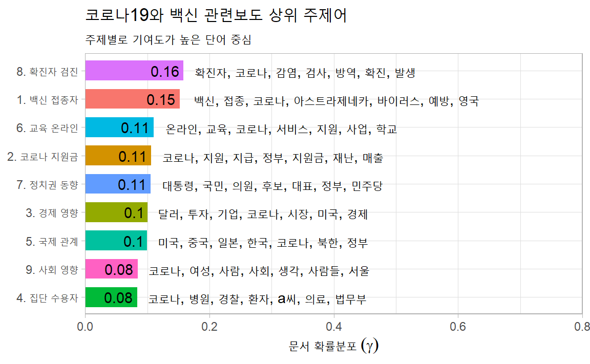

---
output: html_document
editor_options: 
  chunk_output_type: console
---


# 주제모형(공변인) {#anal4topic}

## 주제 명명과 공변인 주제모형

### 개관

주제모형은 기계학습의 비지도학습에 해당한다. 기계가 인간의 '지도'를 받지 않고 '스스로' 자료에서 일정한 규칙을 찾아 비슷한 유형끼리 군집하는 학습방식이다. 인간이 데이터셋을 미리 분류한 정보를 투입하지 않기 때문에, 기계가 분류한 군집에 대해 인간이 사후적으로 의미를 추론해야 한다. 이번 장에서는 기계가 도출한 각 주제의 주요 단어와 문서를 통해 주제의 의미를 추론하는 방법으로서의 주제 명명에 대해 학습한다. 

이와 함께, 메타데이터를 이용한 공변인(covariate) 주제모형 분석에 대해서도 학습한다. 메타데이터는 데이터에 대한 데이터다. 예를 들어, 말뭉치에 포함된 문서의 유형(예: 소설, 논설), 분류(예: 사회면, 정치면), 소속(예: 언론사), 시기(예: 연, 월, 주)에 대한 정보가 메타데이터다. 이 메타데이터를 변수로서 투입해 분석하면 말뭉치의 주제에 대해 보다 의미있는 분석이 가능하다. 

예를 들어, 기간대별로 말뭉치의 주제가 어떻게 변하는지, 혹은 문서의 분류에 따라 주제가 어떻게 다른지 등을 분석할 수 있다. 주제의 구조적인 측면은 다룬다고 해서 구조적 주제모형(structural topic models)이라고 한다. 

공변인을 투입한 주제모형 분석이므로 여기서는 동적 주제모형과 구조적 주제모형을 모두 공변인 주제모형(Covariates topic models)이라고 하겠다. 

[`stm`패키지](https://cran.r-project.org/web/packages/stm/index.html)와 [`keyATM`패키지](https://cran.r-project.org/web/packages/keyATM/index.html)는 말뭉치의 메타데이터를 공변인으로 투입해 말뭉치의 주제에 대한 회귀분석 기능을 제공한다. `keyATM`이 보다 최근의 패키지라 보다 다양한 기능이 있지만, 윈도에서 멀티바이트문자를 지원하지 않아 윈도에서는 한글문서를 분석할 수 없다는 단점이 있다. 


```r
pkg_v <- c("tidyverse", "tidytext", "stm", "lubridate")
purrr::map(pkg_v, require, ch = T)
```

<pre class="r-output"><code>## [[1]]
## [1] TRUE
## 
## [[2]]
## [1] TRUE
## 
## [[3]]
## [1] TRUE
## 
## [[4]]
## [1] TRUE
</code></pre>


## 자료 준비

### 수집

[빅카인즈](https://www.bigkinds.or.kr/)의 '뉴스분석' 메뉴에서 '뉴스검색·분석'을 선택한 다음, '상세검색'을 클릭한다. 상세검색은 다양한 기준으로 검색할 수 있다. 검색유형 기본값은 '뉴스', 검색어처리 기본값은 '형태소분석', 검색어범위 기본값은 '제목+본문'이다. 모두 기본값으로 검색한다.

- 기간: 2021-01-01 - 2021-03-31
- 검색어: '백신', '코로나19', '신종 코로나', '신종코로나', '우한 폐렴', '우한폐렴', '바이러스' (쉼표로 분리하면 각 검색어를 'OR' 연산자로 검색이 된다.)
- 언론사: 경향신문, 조선일보, 중앙일보, 한겨레
- 통합분류: 정치, 경제, 사회, 국제, 지역, IT_과학 
- 분석: 분석기사 (분석기사를 선택하면 중복(반복되는 유사도 높은 기사)과 예외(인사 부고 동정 포토)가 검색에서 제외된다.

모두 14,097건이다. 

다운로드한 엑셀파일을 작업디렉토리 아래 `data`폴더로 복사한다. `data`폴더에서 'News'로 시작해서 '.xlsx'로 끝나는 파일명만 표시해 보자. 


```r
list.files(path = 'data', pattern = '^News.*20210101.*\\.xlsx$')
```

<pre class="r-output"><code>## [1] "NewsResult_20210101-20210330.xlsx"
</code></pre>

데이터셋의 파일명이 'NewsResult_20210101-20210330.xlsx'이다. 


```r
readxl::read_excel("data/NewsResult_20210101-20210330.xlsx") %>% names()
```

<pre class="r-output"><code>##  [1] "뉴스 식별자"                  "일자"                        
##  [3] "언론사"                       "기고자"                      
##  [5] "제목"                         "통합 분류1"                  
##  [7] "통합 분류2"                   "통합 분류3"                  
##  [9] "사건/사고 분류1"              "사건/사고 분류2"             
## [11] "사건/사고 분류3"              "인물"                        
## [13] "위치"                         "기관"                        
## [15] "키워드"                       "특성추출(가중치순 상위 50개)"
## [17] "본문"                         "URL"                         
## [19] "분석제외 여부"
</code></pre>

분석에 필요한 열을 선택해 데이터프레임으로 저장한다. 분석 텍스트는 제목과 본문이다. 제목은 본문의 핵심 내용을 반영하므로, 제목과 본문을 모두 주제모형 분석에 투입한다. 시간별, 언론사별, 분류별로 분석할 계획이므로, 해당 열을 모두 선택한다. 키워드 열은 빅카인즈가 본문에서 추출한 키워드 중 단순 숫자, 이메일주소, 시간이 아닌 단어 등이다. 빅카인즈의 형태소분석결과를 이용할 계획이므로 키워드 열도 선택한다. 빅카인즈는 본문을 200자까지만 무료로 제공하지만, 빅카인즈에서 형태소분석을 통해 추출한 키워드는 기사 전문에서 추출한 결과다. 키워드를 이용하면 기사 전문을 이용하는 효과가 있다.   


```r
vac_df <- 
readxl::read_excel("data/NewsResult_20210101-20210330.xlsx") %>% 
  select(일자, 제목, 본문, 언론사, cat = `통합 분류1`, 키워드) 
vac_df %>% head(3)
```

<pre class="r-output"><code>## <span style='color: #555555;'># A tibble: 3 × 6</span>
##   일자     제목                                        본문  언론사 cat   키워드
##   <span style='color: #555555; font-style: italic;'>&lt;chr&gt;</span>    <span style='color: #555555; font-style: italic;'>&lt;chr&gt;</span>                                       <span style='color: #555555; font-style: italic;'>&lt;chr&gt;</span> <span style='color: #555555; font-style: italic;'>&lt;chr&gt;</span>  <span style='color: #555555; font-style: italic;'>&lt;chr&gt;</span> <span style='color: #555555; font-style: italic;'>&lt;chr&gt;</span> 
## <span style='color: #555555;'>1</span> 20210330 美 국채 금리 상승에 뉴욕 증시 소폭 하락 출… <span style='color: #555555;'>"</span>정…  조선…  경제… 국채,…
## <span style='color: #555555;'>2</span> 20210330 코로나 변이 바이러스 우려에 전문가들 “1년…  <span style='color: #555555;'>"</span>전…  경향…  IT_…  코로… 
## <span style='color: #555555;'>3</span> 20210330 “숲 통해 국민 심신 치유하는 사업 펼칠 것”   <span style='color: #555555;'>"</span>ㆍ…  경향…  지역… 치유,…
</code></pre>

### (선택) 표집

LDA 모형은 베이지언 모형이므로 사후확률의 근사치를 주어진 자료로부터 반복적으로 계산해 주제를 추론한다. 복잡한 계산을 반복적으로 수행하기 때문에 컴퓨터 사양이 낮은 경우 분석이 매우 느릴 수 있다. 데이터 크기와 컴퓨터 서능에 따라 수십분 혹은 수시간 이상 소요될 수 있다. 주제모형 분석 방법 학습 맥락에서 시간 절약을 위해 데이터셋의 일부만 추려 분석에 활용한다. 아래 코드는 1만4천개 행에서 3천개행 표집. 


```r
set.seed(37)
vac_sample_df <-   
  vac_df %>% 
  sample_n(size = 3000) 
vac_df %>% glimpse()
```

기사 본문과 키워드를 비교해보자. 


```r
vac_df %>% pull(키워드) %>% head(1)
```

<pre class="r-output"><code>## [1] "국채,금리,상승,출발,뉴욕,증시,소폭,하락,정체중,미국,국채,금리,상승세,미국,증시,소폭,약세,출발,마무리,트레이더들,미국,대통령,인프라,투자,계획,매도,국채,30일,현지시간,기준,미국,뉴욕,증시,지수,하락,거래,다우평균,0.24%,S&amp;P,0.35%,나스닥,0.81%,거래,0.81%,채권시장,이날,뉴욕,채권,시장,개장,전자상,거래,만기,국채,금리,하루,0.06%,포인트,여파,코로나,바이러스,1월,수준,기록,미국,정부,사회,인프라,투자,패키지,법안,공개,예정,법안,사회,인프라,투자,패키지,3조,달러,사회,인프라,투자,전망,인플레이션,가능,부각,국채,금리,상승,압력,작용,가능성,국채,금리,상승,이외,매니저,한국,해지펀드,Bill,Hwang,운용,펀드,이케고스,투자,주식,하락,여파,이케고스,지난주,마진콜,계약,가격,변화,부족,증거금,추가,납부,요구,블록딜,일반,주식,거래,양측,거래,상대방,대량,거래,시장,영향,가격,합의,정규장,거래,비아콤,CBS,디스커버리,주식,주식,낙차,발생,전문가들,증시,예상,예측,야후,파이낸스,30일,시황,보도,고용,동향,금요일,전망,이달,63만,일자리,창출,예상,수치,시작,코로나,펜데믹,수치"
</code></pre>


```r
vac_df %>% pull(제목) %>% head(1)
```

<pre class="r-output"><code>## [1] "美 국채 금리 상승에 뉴욕 증시 소폭 하락 출발"
</code></pre>

```r
vac_df %>% pull(본문) %>% head(1)
```

<pre class="r-output"><code>## [1] "정체중이었던 미국 국채금리가 다시 상승세를 보이면서 미국 증시가 소폭 약세를 보이며 출발했다. 1분기 마무리를 앞둔 트레이더들이 조 바이든 미국 대통령의 대규모 인프라 투자 계획 발표 전에 미 국채 매도를 늘리고 있다는 분석이 나온다. \n \n30일 오전 9시 40분(현지시간) 기준 미국 뉴욕 증시 3대 지수는 하락한채 거래 중이다. 다우평균은 전날보다 .."
</code></pre>


분석 목적에 맞게 열을 재구성한다. 언론사는 '여당지'와 '야당지'로 구분한다. 분류는 '사회면'와 '비사회면'로 나눈다. 


```r
vac2_df <- 
vac_df %>% 
  # 중복기사 제거
  distinct(제목, .keep_all = T) %>% 
  # 기사별 ID부여
  mutate(ID = factor(row_number())) %>% 
  # 월별로 구분한 열 추가(lubridate 패키지)
  mutate(week = week(ymd(일자))) %>%       
  # 기사 제목과 본문 결합
  unite(제목, 본문, col = "text", sep = " ") %>% 
  # 중복 공백 제거
  mutate(text = str_squish(text)) %>% 
  # 언론사 구분: 야당지, 여당지 %>% 
  mutate(press = case_when(
    언론사 == "조선일보" ~ "야당지",
    언론사 == "중앙일보" ~ "야당지",
    언론사 == "경향신문" ~ "여당지",
    TRUE ~ "여당지") ) %>% 
  # 기사 분류 구분 
  separate(cat, sep = ">", into = c("cat", "cat2")) %>% 
  # IT_과학, 경제, 사회 만 선택
  select(-cat2) %>% 
  # 분류 구분: 사회, 비사회
  mutate(catSoc = case_when(
    cat == "사회" ~ "사회면",
    cat == "지역" ~ "사회면",
    TRUE ~ "비사회면") )

vac2_df %>% glimpse()
```

<pre class="r-output"><code>## Rows: 14,090
## Columns: 9
## $ 일자   <span style='color: #555555; font-style: italic;'>&lt;chr&gt;</span> "20210330", "20210330", "20210330", "20210330", "20210330", "20…
## $ text   <span style='color: #555555; font-style: italic;'>&lt;chr&gt;</span> "美 국채 금리 상승에 뉴욕 증시 소폭 하락 출발 정체중이었던 미국…
## $ 언론사 <span style='color: #555555; font-style: italic;'>&lt;chr&gt;</span> "조선일보", "경향신문", "경향신문", "경향신문", "경향신문", "경…
## $ cat    <span style='color: #555555; font-style: italic;'>&lt;chr&gt;</span> "경제", "IT_과학", "지역", "IT_과학", "지역", "사회", "사회", "…
## $ 키워드 <span style='color: #555555; font-style: italic;'>&lt;chr&gt;</span> "국채,금리,상승,출발,뉴욕,증시,소폭,하락,정체중,미국,국채,금리,…
## $ ID     <span style='color: #555555; font-style: italic;'>&lt;fct&gt;</span> 1, 2, 3, 4, 5, 6, 7, 8, 9, 10, 11, 12, 13, 14, 15, 16, 17, 18, …
## $ week   <span style='color: #555555; font-style: italic;'>&lt;dbl&gt;</span> 13, 13, 13, 13, 13, 13, 13, 13, 13, 13, 13, 13, 13, 13, 13, 13,…
## $ press  <span style='color: #555555; font-style: italic;'>&lt;chr&gt;</span> "야당지", "여당지", "여당지", "여당지", "여당지", "여당지", "여…
## $ catSoc <span style='color: #555555; font-style: italic;'>&lt;chr&gt;</span> "비사회면", "비사회면", "사회면", "비사회면", "사회면", "사회면…
</code></pre>

새로 생성된 열의 기사 양을 계산해보자.


```r
vac2_df %>% count(cat, sort = T)
```

<pre class="r-output"><code>## <span style='color: #555555;'># A tibble: 8 × 2</span>
##   cat         n
##   <span style='color: #555555; font-style: italic;'>&lt;chr&gt;</span>   <span style='color: #555555; font-style: italic;'>&lt;int&gt;</span>
## <span style='color: #555555;'>1</span> 사회     <span style='text-decoration: underline;'>3</span>733
## <span style='color: #555555;'>2</span> 경제     <span style='text-decoration: underline;'>2</span>891
## <span style='color: #555555;'>3</span> 국제     <span style='text-decoration: underline;'>2</span>164
## <span style='color: #555555;'>4</span> 정치     <span style='text-decoration: underline;'>2</span>088
## <span style='color: #555555;'>5</span> 지역     <span style='text-decoration: underline;'>1</span>921
## <span style='color: #555555;'>6</span> IT_과학   915
## <span style='color: #555555;'># … with 2 more rows</span>
</code></pre>

문화와 스포츠를 검색단계서 선택하지 않았음에도 데이터셋에 포함된 이유는 하부 분류에 포함돼 있었기 때문이다. 


```r
vac2_df %>% count(catSoc, sort = T)
```

<pre class="r-output"><code>## <span style='color: #555555;'># A tibble: 2 × 2</span>
##   catSoc       n
##   <span style='color: #555555; font-style: italic;'>&lt;chr&gt;</span>    <span style='color: #555555; font-style: italic;'>&lt;int&gt;</span>
## <span style='color: #555555;'>1</span> 비사회면  <span style='text-decoration: underline;'>8</span>436
## <span style='color: #555555;'>2</span> 사회면    <span style='text-decoration: underline;'>5</span>654
</code></pre>

비사회면 8436건, 사회면 5653건으로 문서 수에서 큰 차이가 나지 않는다. 


```r
vac2_df %>% count(week)
```

<pre class="r-output"><code>## <span style='color: #555555;'># A tibble: 13 × 2</span>
##    week     n
##   <span style='color: #555555; font-style: italic;'>&lt;dbl&gt;</span> <span style='color: #555555; font-style: italic;'>&lt;int&gt;</span>
## <span style='color: #555555;'>1</span>     1  <span style='text-decoration: underline;'>1</span>491
## <span style='color: #555555;'>2</span>     2  <span style='text-decoration: underline;'>1</span>299
## <span style='color: #555555;'>3</span>     3  <span style='text-decoration: underline;'>1</span>229
## <span style='color: #555555;'>4</span>     4  <span style='text-decoration: underline;'>1</span>379
## <span style='color: #555555;'>5</span>     5  <span style='text-decoration: underline;'>1</span>219
## <span style='color: #555555;'>6</span>     6   927
## <span style='color: #555555;'># … with 7 more rows</span>
</code></pre>

```r
vac2_df %>% count(press, sort = T)
```

<pre class="r-output"><code>## <span style='color: #555555;'># A tibble: 2 × 2</span>
##   press      n
##   <span style='color: #555555; font-style: italic;'>&lt;chr&gt;</span>  <span style='color: #555555; font-style: italic;'>&lt;int&gt;</span>
## <span style='color: #555555;'>1</span> 야당지  <span style='text-decoration: underline;'>8</span>043
## <span style='color: #555555;'>2</span> 여당지  <span style='text-decoration: underline;'>6</span>047
</code></pre>

월 및 언론사 구분에서도 문서 수에서 큰 차이가 나지 않는다. 


### 정제

#### 토큰화

빅카인즈의 형태소분석이 된 키워드를 이용하므로 이미 토큰화가 된 상태이나, 본 분석에 앞서 단어의 빈도 등을 검토하기 위해 정돈텍스트 형식으로 변경하기 위해 토큰화를 진행한다. 'text'열이 아니라 '키워드'열의 ','를 기준으로 토큰화한다. 토큰화하기 전 문자, 숫자, 쉼표 이외의 요소를 제거한다. 전각문자는 문자가 아님에도 정규표현식으로 걸리지지 않으므로 추가로 제거한다.  

- 추가로 지워야 하는 주요 기호 :  
  - `ㆍㅣ‘’“” ○ ● ◎ ◇ ◆ □ ■ △ ▲ ▽ ▼ 〓 ◁ ◀ ▷ ▶ ♤ ♠ ♡ ♥ ♧ ♣ ⊙ ◈ ▣ `
  
이외에도 빈도 분석을 통해 정규표현식으로 걸러지지 않은 기호가 나오면 추가로 제거한다. 


```r
"!@#$... 전각ㆍㅣ문자 %^&*()" %>% str_remove("\\w+")
```

<pre class="r-output"><code>## [1] "!@#$...  %^&amp;*()"
</code></pre>


```r
fullchar_v <- "ㆍ|ㅣ|‘|’|“|”|○|●|◎|◇|◆|□|■|△|▲|▽|▼|〓|◁|◀|▷|▶|♤|♠|♡|♥|♧|♣|⊙|◈|▣"

vac_tk <- 
vac2_df %>% 
  mutate(키워드 = str_remove_all(키워드, "[^(\\w+|\\d+|,)]")) %>% 
  mutate(키워드 = str_remove_all(키워드, fullchar_v)) %>% 
  unnest_tokens(word, 키워드, token = "regex", pattern = ",") 

vac_tk %>% arrange(ID) %>% head(30)
```

<pre class="r-output"><code>## <span style='color: #555555;'># A tibble: 30 × 9</span>
##   일자     text                      언론사 cat   ID     week press catSoc word 
##   <span style='color: #555555; font-style: italic;'>&lt;chr&gt;</span>    <span style='color: #555555; font-style: italic;'>&lt;chr&gt;</span>                     <span style='color: #555555; font-style: italic;'>&lt;chr&gt;</span>  <span style='color: #555555; font-style: italic;'>&lt;chr&gt;</span> <span style='color: #555555; font-style: italic;'>&lt;fct&gt;</span> <span style='color: #555555; font-style: italic;'>&lt;dbl&gt;</span> <span style='color: #555555; font-style: italic;'>&lt;chr&gt;</span> <span style='color: #555555; font-style: italic;'>&lt;chr&gt;</span>  <span style='color: #555555; font-style: italic;'>&lt;chr&gt;</span>
## <span style='color: #555555;'>1</span> 20210330 美 국채 금리 상승에 뉴욕… 조선…  경제  1        13 야당… 비사…  국채 
## <span style='color: #555555;'>2</span> 20210330 美 국채 금리 상승에 뉴욕… 조선…  경제  1        13 야당… 비사…  금리 
## <span style='color: #555555;'>3</span> 20210330 美 국채 금리 상승에 뉴욕… 조선…  경제  1        13 야당… 비사…  상승 
## <span style='color: #555555;'>4</span> 20210330 美 국채 금리 상승에 뉴욕… 조선…  경제  1        13 야당… 비사…  출발 
## <span style='color: #555555;'>5</span> 20210330 美 국채 금리 상승에 뉴욕… 조선…  경제  1        13 야당… 비사…  뉴욕 
## <span style='color: #555555;'>6</span> 20210330 美 국채 금리 상승에 뉴욕… 조선…  경제  1        13 야당… 비사…  증시 
## <span style='color: #555555;'># … with 24 more rows</span>
</code></pre>

```r
vac_tk %>% arrange(ID) %>% tail(30)
```

<pre class="r-output"><code>## <span style='color: #555555;'># A tibble: 30 × 9</span>
##   일자     text                      언론사 cat   ID     week press catSoc word 
##   <span style='color: #555555; font-style: italic;'>&lt;chr&gt;</span>    <span style='color: #555555; font-style: italic;'>&lt;chr&gt;</span>                     <span style='color: #555555; font-style: italic;'>&lt;chr&gt;</span>  <span style='color: #555555; font-style: italic;'>&lt;chr&gt;</span> <span style='color: #555555; font-style: italic;'>&lt;fct&gt;</span> <span style='color: #555555; font-style: italic;'>&lt;dbl&gt;</span> <span style='color: #555555; font-style: italic;'>&lt;chr&gt;</span> <span style='color: #555555; font-style: italic;'>&lt;chr&gt;</span>  <span style='color: #555555; font-style: italic;'>&lt;chr&gt;</span>
## <span style='color: #555555;'>1</span> 20210101 <span style='color: #555555;'>"</span>\"당연한 게 당연하지 않… 경향…  사회  14090     1 여당… 사회면 온라…
## <span style='color: #555555;'>2</span> 20210101 <span style='color: #555555;'>"</span>\"당연한 게 당연하지 않… 경향…  사회  14090     1 여당… 사회면 자가 
## <span style='color: #555555;'>3</span> 20210101 <span style='color: #555555;'>"</span>\"당연한 게 당연하지 않… 경향…  사회  14090     1 여당… 사회면 진단 
## <span style='color: #555555;'>4</span> 20210101 <span style='color: #555555;'>"</span>\"당연한 게 당연하지 않… 경향…  사회  14090     1 여당… 사회면 제출 
## <span style='color: #555555;'>5</span> 20210101 <span style='color: #555555;'>"</span>\"당연한 게 당연하지 않… 경향…  사회  14090     1 여당… 사회면 선생…
## <span style='color: #555555;'>6</span> 20210101 <span style='color: #555555;'>"</span>\"당연한 게 당연하지 않… 경향…  사회  14090     1 여당… 사회면 부재…
## <span style='color: #555555;'># … with 24 more rows</span>
</code></pre>


#### 불용어 처리

빅카인즈의 형태소분석 결과를 이용하므로 별도의 불용어처리는 불필요하나, 의미없는 고빈도 단어를 선별할 필요가 있다. 단어의 총빈도를 계산해본다. '백신'과 '코로나19'의 빈도가 높다.  어느 한 단어가 압도적인 비중을 차지하는 것이 아니므로 제거하지 않고 그대로 둔다. '코로나'는 '코로나19'라는 질병의 이름으로 사용됐을수 있고, '코로나바이러스'라는 병인으로 사용됐을수도 있으므로, '코로나19'와 병합하지 말고 그대로 둔다.  


```r
count_df <- 
vac_tk %>% count(word, sort = T)

count_df %>% head(40)
```

<pre class="r-output"><code>## <span style='color: #555555;'># A tibble: 40 × 2</span>
##   word         n
##   <span style='color: #555555; font-style: italic;'>&lt;chr&gt;</span>    <span style='color: #555555; font-style: italic;'>&lt;int&gt;</span>
## <span style='color: #555555;'>1</span> 백신     <span style='text-decoration: underline;'>34</span>189
## <span style='color: #555555;'>2</span> 코로나19 <span style='text-decoration: underline;'>32</span>204
## <span style='color: #555555;'>3</span> 접종     <span style='text-decoration: underline;'>24</span>660
## <span style='color: #555555;'>4</span> 정부     <span style='text-decoration: underline;'>14</span>813
## <span style='color: #555555;'>5</span> 미국     <span style='text-decoration: underline;'>12</span>322
## <span style='color: #555555;'>6</span> 코로나   <span style='text-decoration: underline;'>12</span>120
## <span style='color: #555555;'># … with 34 more rows</span>
</code></pre>

```r
count_df %>% tail(40)
```

<pre class="r-output"><code>## <span style='color: #555555;'># A tibble: 40 × 2</span>
##   word               n
##   <span style='color: #555555; font-style: italic;'>&lt;chr&gt;</span>          <span style='color: #555555; font-style: italic;'>&lt;int&gt;</span>
## <span style='color: #555555;'>1</span> 히팅               1
## <span style='color: #555555;'>2</span> 힉스               1
## <span style='color: #555555;'>3</span> 힌덴버그리서치     1
## <span style='color: #555555;'>4</span> 힌두경전           1
## <span style='color: #555555;'>5</span> 힌두교식           1
## <span style='color: #555555;'>6</span> 힌두트바           1
## <span style='color: #555555;'># … with 34 more rows</span>
</code></pre>


### `stm`말뭉치

`stm()`함수에서 처리하는 데이터는 각 기사의 토큰이 하나의 열에 함께 있어야 한다. 정돈텍스트형식은 한개의 열에 하나의 토큰만 있으므로 `str_flatten()`함수로 하나의 열에 결합한다. 


```r
combined_df <-
  vac_tk %>%
  group_by(ID) %>%
  summarise(text2 = str_flatten(word, " ")) %>%
  ungroup() %>% 
  inner_join(vac2_df, by = "ID")

combined_df %>% glimpse()
```

<pre class="r-output"><code>## Rows: 14,090
## Columns: 10
## $ ID     <span style='color: #555555; font-style: italic;'>&lt;fct&gt;</span> 1, 2, 3, 4, 5, 6, 7, 8, 9, 10, 11, 12, 13, 14, 15, 16, 17, 18, …
## $ text2  <span style='color: #555555; font-style: italic;'>&lt;chr&gt;</span> "국채 금리 상승 출발 뉴욕 증시 소폭 하락 정체중 미국 국채 금리 …
## $ 일자   <span style='color: #555555; font-style: italic;'>&lt;chr&gt;</span> "20210330", "20210330", "20210330", "20210330", "20210330", "20…
## $ text   <span style='color: #555555; font-style: italic;'>&lt;chr&gt;</span> "美 국채 금리 상승에 뉴욕 증시 소폭 하락 출발 정체중이었던 미국…
## $ 언론사 <span style='color: #555555; font-style: italic;'>&lt;chr&gt;</span> "조선일보", "경향신문", "경향신문", "경향신문", "경향신문", "경…
## $ cat    <span style='color: #555555; font-style: italic;'>&lt;chr&gt;</span> "경제", "IT_과학", "지역", "IT_과학", "지역", "사회", "사회", "…
## $ 키워드 <span style='color: #555555; font-style: italic;'>&lt;chr&gt;</span> "국채,금리,상승,출발,뉴욕,증시,소폭,하락,정체중,미국,국채,금리,…
## $ week   <span style='color: #555555; font-style: italic;'>&lt;dbl&gt;</span> 13, 13, 13, 13, 13, 13, 13, 13, 13, 13, 13, 13, 13, 13, 13, 13,…
## $ press  <span style='color: #555555; font-style: italic;'>&lt;chr&gt;</span> "야당지", "여당지", "여당지", "여당지", "여당지", "여당지", "여…
## $ catSoc <span style='color: #555555; font-style: italic;'>&lt;chr&gt;</span> "비사회면", "비사회면", "사회면", "비사회면", "사회면", "사회면…
</code></pre>


`textProcessor()`함수는 영문처리를 기본값으로 하고 있다. 영문은 두 글자 단어가 거의 없기 때문에 기본값이 세글자 이상만 분석에 투입하도록 기본값이 설정돼 있다. 국문은 두 글자 단어도 의미있는 단어가 많기 때문에, 단어의 길이를 두 글자 이상으로 설정한다. 


```r
processed <-
  combined_df %>% textProcessor(
    documents = combined_df$text2,
    metadata = .,
    wordLengths = c(2, Inf)
  )
```

<pre class="r-output"><code>## Building corpus... 
## Converting to Lower Case... 
## Removing punctuation... 
## Removing stopwords... 
## Removing numbers... 
## Stemming... 
## Creating Output...
</code></pre>

```r
summary(processed)
```

<pre class="r-output"><code>## A text corpus with 14090 documents, and an 121938 word dictionary. Use str() to inspect object or see documentation
</code></pre>

prepDocuments()함수로 주제모형에 사용할 데이터의 인덱스(wordcounts)를 만든다. 이후 stm말뭉치와 기사 본문을 연결해 확인해야 하므로, 단어와 문서를 제거하지 않는다.  


```r
out <-
  prepDocuments(processed$documents,
                processed$vocab,
                processed$meta,
                lower.thresh = 0)
summary(out)
```

<pre class="r-output"><code>##                Length Class      Mode     
## documents       14090 -none-     list     
## vocab          121938 -none-     character
## meta               10 data.frame list     
## words.removed       0 -none-     character
## docs.removed        0 -none-     NULL     
## tokens.removed      1 -none-     numeric  
## wordcounts     121938 -none-     numeric
</code></pre>

산출결과를 개별 객체로 저장한다. 이 객체들은 이후 모형구축에 사용된다.


```r
docs <- out$documents
vocab <- out$vocab
meta <- out$meta
```


## 분석

주제모형 구축에 앞서 먼저 도출한 주제의 수를 정한다. 

### 주제(topic)의 수 설정

보통 10개부터 100개까지 10개 단위로 주제의 수를 구분해 연구자들이 정성적으로 최종 주제의 수 판단한다.

학습 상황이므로 계산시간을 줄이기 위해 주제의 수를 3개, 9개, 100개의 결과를 비교해보자.  

주제모형 분석은 사후 확률의 근사치를 주어진 자료로부터 반복적으로 최적화하는 계산을 수행하기 때문에 자료가 크면 계산시간이 오래 걸린다. 컴퓨터 성능에 따라 수십분 이상 소요될 수 있다. 


```r
topicN <- c(3, 9, 100)

storage <- searchK(docs, vocab, K = topicN)
storage
plot(storage)
```


### 모형 구성

`stm`패키지가 추출한 주제에 대하여 메타데이터를 변수로 투입하는 방식은 2가지다. 'topical prevalence'와 'topical content'를 이용하는 방식이다. 'topical prevalence' 공변인은 `prevalence = `인자를 통해 투입하고, 'topical content'는 `cotent = `인자를 통해 투입한다. 모형에 따라 `prevalence`와 `content` 중 하나만 투입하기도 하고 둘다 투입하기도 한다. 

- Topical prevalence: 공변인에 따른 문서별 주제 분포의 비율

- Topical content: 공변인에 따른 단어별 주제 분포

연속변수를 투입할 때는 `s()`함수를 이용해 구간의 수를 지정한다. `s()`함수는 공변인을 연속변수로 투입할때 spline으로 추정하도록 한다. 즉, 구간을 지정해 각 구간별로 따로 회귀식을 구하면서 각 구간을 연속적인 형태로 만들어준다. 구간의 수는 `df = `인자를 통해 투입한다. 기본값은 10이다. 

주제모형분석을 위해서는 주제어 선정과 분포계산을 반복적으로 수행한다. 이 과정을 화면에 출력되지 않게 `verbose = ` 인자를 `FALSE`로 설정할 수 있다.  

- 주의: 메타데이터 인자(`prevalence =~ ` 와 `content =~ `)에 투입할 때 `=`가 아니라 `=~` !!! 

아래 모형에서는 언론사의 정치성향과 시간을 공변인으로 투입했다. 


```r
t1 <- Sys.time()
meta_fit <-
  stm(
    documents = docs,
    vocab = vocab,
    data = meta,
    K = 9,         
    prevalence =~ press + s(week, 6), # 투입하는 공변인
    max.em.its = 75,                # 최대 반복계산 회수 
    verbose = F,                    # 반복계산결과 화면출력 여부
    init.type = "Spectral",
    seed = 37 
  )
t2 <- Sys.time()
t2-t1

meta_fit %>% 
  write_rds("data/meta_fit.rds")
```


```r
meta_fit <-  
  read_rds("data/meta_fit.rds")

summary(meta_fit)
```

<pre class="r-output"><code>## A topic model with 9 topics, 14090 documents and a 121938 word dictionary.
</code></pre><pre class="r-output"><code>## Topic 1 Top Words:
##  	 Highest Prob: 백신, 접종, 코로나, 아스트라제네카, 바이러스, 예방, 영국 
##  	 FREX: 접종, 아스트라제네카, 임상, az, 면역, 화이자, 혈전 
##  	 Lift: aah, abv, acip, acut, adapt, adcov, ade 
##  	 Score: 접종, 백신, 아스트라제네카, 접종자, az, 임상, 혈전 
## Topic 2 Top Words:
##  	 Highest Prob: 코로나, 지원, 지급, 정부, 지원금, 재난, 매출 
##  	 FREX: 추경안, 가액, 예비비, 지원대상, 부가세, 본예산, 하이트진로 
##  	 Lift: bgf, blt, carrier, cj오쇼핑, covideigokr, db손해보험, e영업제한 
##  	 Score: 지원금, 매출, 지급, 소상공인, 소득, 대출, 자영업자 
## Topic 3 Top Words:
##  	 Highest Prob: 달러, 투자, 기업, 코로나, 시장, 미국, 경제 
##  	 FREX: 주식, 반도체, 주가, 증시, 투자자, 코스피, 공매도 
##  	 Lift: a기업, bev, carbon, cbi, ceo스코어, cpng, c쇼크 
##  	 Score: 금리, 증시, 달러, 주식, 반도체, 코스피, 공매도 
## Topic 4 Top Words:
##  	 Highest Prob: 코로나, 병원, 경찰, 환자, a씨, 의료, 법무부 
##  	 FREX: 교도소, 서울동부구치소, 의료법, 재판부, 재소자, 서울구치소, 정인이 
##  	 Lift: 교도소, 서울구치소, 총회장, abus, admit, aids감염인연합회, aids인권활동가네트워크 
##  	 Score: 수용자, 구치소, 경찰, 병원, 법무부, 동부구치소, 혐의 
## Topic 5 Top Words:
##  	 Highest Prob: 미국, 중국, 일본, 한국, 코로나, 북한, 정부 
##  	 FREX: 올림픽, 도쿄, 미얀마, 스가, 쿼드, 군부, 도쿄올림픽 
##  	 Lift: 관영, 도쿄, aaaj, aaip, aapi, aapp, aaron 
##  	 Score: 북한, 중국, 바이든, 외교, 트럼프, 이란, 미국 
## Topic 6 Top Words:
##  	 Highest Prob: 온라인, 교육, 코로나, 서비스, 지원, 사업, 학교 
##  	 FREX: 클럽하우스, 학년도, 학급, 메타버스, vr, 특강, 명예의 
##  	 Lift: 학급, aadhaar, aapex, abet, abf, abf제도, abl생명보험 
##  	 Score: 브랜드, 수업, 학생, 등교, 학년, 고객, 학교 
## Topic 7 Top Words:
##  	 Highest Prob: 대통령, 국민, 의원, 후보, 대표, 정부, 민주당 
##  	 FREX: 선거, 지지율, 출마, 탄핵, 사면, 보궐, 경선 
##  	 Lift: sica, 고전역학, 공정사단, 기록관, 기초의원, 김해신공항, 난타전 
##  	 Score: 대통령, 민주당, 후보, 선거, 대선, 출마, 의원 
## Topic 8 Top Words:
##  	 Highest Prob: 확진자, 코로나, 감염, 검사, 방역, 확진, 발생 
##  	 FREX: 진단검사, 비수도권, 입국자, 열방, btj, 선교회, 다중이용시설 
##  	 Lift: abrimosomorimo, accept, agejspnurl, antibodi, anvisa, a관세법, a관세법인 
##  	 Score: 확진자, 확진, 판정, 검사, 감염, 방대본, 집단감염 
## Topic 9 Top Words:
##  	 Highest Prob: 코로나, 여성, 사람, 사회, 생각, 사람들, 서울 
##  	 FREX: 출생아, 층간소음, 천사, 빙어, 칫솔, 장미, 빨대 
##  	 Lift: a무리, bj파이, brt, cesd, cmip, connectus, contact 
##  	 Score: 플라스틱, 쓰레기, 결혼, 축제, 일자리, 가구, 여성
</code></pre>


## 주제 이름짓기

### 주제별 단어와 원문 결합

주제 단어가 추출된 원문을 살펴보면 해당 주제를 보다 명확하게 파악할 수 있다. 모형 구성에 투입한 데이터와 문서(이 경우 개별 기사) 본문이 포함된 데이터를 결합해야 한다. `stm`패키지는 `findThoughts()`함수를 통해 각 모형별로 전형적인 문서를 확인할 수 있도록 한다. 


```r
findThoughts(
  model = meta_fit,     # 구성한 주제모형
  texts = vac2_df$text,  # 문서 본문 문자 벡터
  topics = c(1, 2),     # 찾고자 하는 주제의 값. 기본값은 모든 주제
  n = 3                 # 찾고자 하는 문서의 수
)
```

<pre class="r-output"><code>## 
##  Topic 1: 
##  	 770만명 맞을 아스트라, 유럽선 중단 EU(유럽연합) 4대 회원국인 독일 프랑스 이탈리아 스페인이 15일(현지 시각) 아스트라제네카(AZ) 코로나 백신의 접종을 일시 중단하겠다고 선언했다. 접종 후 혈전(血栓 핏덩이)이 생기는 부작용이 발생했다는 보고가 잇따르자 추가 조사 결과가 나올 때까지 접종을 멈추겠다는 것이다. 이날 옌스 슈판 독일 보건부 장관은 “부작용이 백신 접종의 효과를 ..
##  	아스트라 백신 1차 검증서 "예방 효과 62% 고령층 접종 가능" 아스트라제네카 백신이 국내 접종을 앞두고 허가 심사 첫 관문을 통과했다. 식품의약품안전처 외부 자문단이 아스트라제네카 백신에 대해 조건부 허가할 수 있다는 결론을 내렸다. 해외에서 논란이 일고 있는 65세 이상 고령자 접종에 대해서도 자문단 다수가 “투여할 수 있다”고 의견을 냈다. 식약처 허가를 통과하면 아스트라제네카 백신은 이달 말께 공급돼 요양병원..
##  	65세 이상, 아스트라 백신 접종 연기 아스트라제네카 코로나 백신의 최우선 접종 대상에서 ‘65세 이상’ 고령층이 제외됐다. 코로나19 예방접종 대응 추진단(단장 정은경 질병관리청장)은 당초 2월 접종 예정이었던 요양병원 요양시설의 65세 이상 고령자 접종을 2분기(4~6월) 이후로 미룬다고 15일 밝혔다. 최근 유럽에서 ‘효과 검증이 부족하다’는 이유로 65세 이상에 대한 아스트라제네.. 
##  Topic 2: 
##  	 매출 근로자 수 기준 재검토 실질 피해 따져 ‘사각’ 없앤다 기재부, 선별 방식 연구용역 발주 업종 간 형평성도 보완 ‘직격탄’ 업종 더 주고, 특고 프리랜서 제한 기준 개선할 듯 4차 재난지원금 ‘선별지원’을 주장해온 정부는 ‘선별 속 선별’을 강조하고 있다. 지급 대상을 더 정교하게 구분해서 피해에 걸맞은 지원액을 최대한 많이 주자는 것이다. 앞선 지급과정에서 문제로 드러난 매출 근로자 수 기준, 업종 구분..
##  	분배 악화일로 근로 사업소득 사상 첫 3분기째 동반 감소 코로나19 3차 유행이 시작된 지난해 4분기 상 하위 계층 간 소득 격차가 벌어지며 두 분기 연속 분배 상황이 악화했다. 코로나19로 인한 경기 부진과 고용 충격이 저소득층에 집중되면서 소득 불균형을 키웠다. 코로나19 사태 장기화로 일해서 버는 돈인 근로소득과 사업소득이 사상 처음으로 세 분기 연속 동반 감소했다. 18일 통계청이 발표한 ‘2020년..
##  	소상공인 자영업자 코로나 피해지원금 최대 500만원 검토 정부가 4차 재난지원금에 포함할 소상공인 자영업자 피해지원금을 매출 감소에 따라 차등 지원하는 방안을 추진 중이다. 1인당 지원금은 최대 500만원까지 지급하는 방안을 검토 중이다. 21일 더불어민주당과 정부 설명을 종합하면, 기획재정부는 다음달 초 국회에 제출할 예정인 추가경정예산(추경)안에 이런 내용을 담은 소상공인 피해지원대책을 논의 중이다. ..
</code></pre>

구성한 stm모형과 구성전 데이터프레임을 결합하면 보다 다양한 방식으로 문서의 원문을 탐색할 수 있다. 

결합하는 두 데이터프레임의 기준이 되는 열에 포함된 자료의 유형을 통일시킨다. 여기서는 정수(integer)로 통일시켰다. 


```r
td_gamma <- meta_fit %>% tidy(matrix = "gamma")
td_gamma$document <- as.integer(td_gamma$document)
combined_df$ID <- as.integer(combined_df$ID) 
```

각 주제는 독립된 열로 분리한다. 


```r
text_gamma <- 
combined_df %>% 
  select(ID, text2, text, 키워드) %>% 
  left_join(td_gamma, by = c("ID" = "document")) %>% 
  pivot_wider(
    names_from = topic,
    values_from = gamma,
    names_prefix = "tGamma",
    values_fill = 0
    ) 

text_gamma %>% glimpse()  
```

<pre class="r-output"><code>## Rows: 14,090
## Columns: 13
## $ ID      <span style='color: #555555; font-style: italic;'>&lt;int&gt;</span> 1, 2, 3, 4, 5, 6, 7, 8, 9, 10, 11, 12, 13, 14, 15, 16, 17, 18,…
## $ text2   <span style='color: #555555; font-style: italic;'>&lt;chr&gt;</span> "국채 금리 상승 출발 뉴욕 증시 소폭 하락 정체중 미국 국채 금리…
## $ text    <span style='color: #555555; font-style: italic;'>&lt;chr&gt;</span> "美 국채 금리 상승에 뉴욕 증시 소폭 하락 출발 정체중이었던 미…
## $ 키워드  <span style='color: #555555; font-style: italic;'>&lt;chr&gt;</span> "국채,금리,상승,출발,뉴욕,증시,소폭,하락,정체중,미국,국채,금리…
## $ tGamma1 <span style='color: #555555; font-style: italic;'>&lt;dbl&gt;</span> 0.006021, 0.944370, 0.058890, 0.362034, 0.000923, 0.001406, 0.…
## $ tGamma2 <span style='color: #555555; font-style: italic;'>&lt;dbl&gt;</span> 0.011376, 0.001862, 0.009169, 0.063926, 0.002910, 0.740996, 0.…
## $ tGamma3 <span style='color: #555555; font-style: italic;'>&lt;dbl&gt;</span> 9.36e-01, 3.91e-03, 1.83e-02, 7.79e-03, 6.16e-04, 1.50e-02, 8.…
## $ tGamma4 <span style='color: #555555; font-style: italic;'>&lt;dbl&gt;</span> 0.000581, 0.004401, 0.003925, 0.004451, 0.002581, 0.119365, 0.…
## $ tGamma5 <span style='color: #555555; font-style: italic;'>&lt;dbl&gt;</span> 0.007778, 0.009563, 0.012495, 0.001949, 0.001280, 0.058604, 0.…
## $ tGamma6 <span style='color: #555555; font-style: italic;'>&lt;dbl&gt;</span> 0.003105, 0.002289, 0.369640, 0.516974, 0.003732, 0.004798, 0.…
## $ tGamma7 <span style='color: #555555; font-style: italic;'>&lt;dbl&gt;</span> 0.033440, 0.011748, 0.210739, 0.025828, 0.001314, 0.008581, 0.…
## $ tGamma8 <span style='color: #555555; font-style: italic;'>&lt;dbl&gt;</span> 0.000197, 0.007103, 0.003683, 0.012100, 0.005785, 0.008719, 0.…
## $ tGamma9 <span style='color: #555555; font-style: italic;'>&lt;dbl&gt;</span> 0.001481, 0.014757, 0.313156, 0.004952, 0.980859, 0.042495, 0.…
</code></pre>


각 주제별로 확률분포가 높은 문서를 확인해 보자. 각 문서에서 감마가 높은 순서로 정열하면, 해당 주제에 속할 확률이 높은 문서 순서대로 볼수 있다.  `pull()`함수를 이용하면 해당 열의 모든 내용을 볼수 있다. 


```r
text_gamma %>% 
  arrange(-tGamma7) %>% 
  pull(text) %>% head(9)
```

<pre class="r-output"><code>## [1] "이낙연의 사면론 묘수일까 자충수일까 당대표 임기 두달 앞두고 전격 제기 하필이면 왜, 지금일까 이적수. 바둑용어다. 바둑에서 이적수는 둘이다. 이적수(利敵手)와 이적수(耳赤手). 한글발음은 같지만, 뜻은 정반대다. 이적수(利敵手)는 상대방에게 유리한 결과를 두는 수다. 자충수가 대표적이다. 이적수(耳赤手)는 상대방의 귀가 빨갛게 변하는 수다. 형세가 불리할 때 역전의 발판이 되.."                                         
## [2] "2021 서울시장 선거, 단일화 전쟁이 시작됐다 오는 4월7일 서울시장과 부산시장을 다시 뽑는다. 내년 3월 대선을 앞둔 전초전이어서 여야 모두 물러설 수 없는 승부다. 대한민국 ‘민심의 풍향계’인 수도 서울에선 더더욱 그렇다. 여당은 수성을, 야당은 수복을 노리고 있다. 선거 한 달을 앞두고 주요 정당의 서울시장 후보가 모습을 드러내고 있지만 아직 대진표는 확정되지 않았다. 후보 단일화 과정이 남.."                        
## [3] "금태섭 \"1대1 경선하자\" 안철수 \"국민의힘 논의 먼저\" 금태섭 전 더불어민주당 의원이 31일 서울시장 보궐선거 출마선언을 하면서 안철수 국민의당 대표를 향해 “제3지대 경선을 하자”고 제안했다. 이날 조정훈 시대전환 대표도 보선 출사표를 던지면서 범야권 단일화 시계가 본격적으로 움직이기 시작했다. 이날 오전 서울 마포구의 한 공연장에서 출마선언을 한 금 전 의원은 “서울 시민의 삶을 바꾸고 변화의 .."              
## [4] "사면론 이틀만에 막히자...이낙연 \"오랜 충정에서 말한 것뿐\" 이낙연 더불어민주당 대표가 꺼낸 이명박 박근혜 전 대통령에 대한 사면(赦免) 구상이 당원과 지지층의 반발에 부딪히면서 제동이 걸렸다. 이 대표가 새해 첫날 언론 인터뷰에서 ‘사면론’을 꺼낸 지 이틀 만이다. 이 대표는 3일 오후 국회 의원회관 사무실에서 긴급 최고위원 간담회를 소집해 의견 수렴에 나섰다. 당 최고위원회는 회의 직후 입장문(최인호 .."          
## [5] "서울시장 선거 여권 재역전 가능할까 오세훈 강세 지속 선거전 1주일 유권자 선택 중요 “오해하면 안 되는 것이 LH 사태라는 돌발변수 때문에 뒤집힌 것이 아니라는 점이다.” 민주당 측 당 전략전문가의 말이다. “교육부 서기관 나향욱의 개돼지 발언을 보라. 그게 박근혜가 시켜 한 발언인가. 박근혜나 당시 새누리당과 아무 관련 없이 터져나온 것이다. 그렇지 않아도 불만이 쌓여.."                                              
## [6] "文 교감 속 작품? 반전 노린 3위 이낙연의 '사면' 승부수 이낙연 더불어민주당 대표가 “이명박 박근혜 전 대통령 사면 건의” 뜻을 1일 언론 인터뷰에서 밝히면서 정국을 흔들었다. 평소 신중한 성격의 이 대표가 대통령 고유 권한인 사면 문제를 먼저 꺼낸 걸 두고 “사면에 대한 대통령의 정치적 부담을 줄이고, 한 편으론 대선 후보 지지율 3위로 주저앉은 자신을 위한 반전 계기를 만들려 했다”는 분석이 나온다. 이날.."          
## [7] "\"대선 포기\" 안철수가 치고나간 서울시장 선거 여야 딜레마 4 7 재보선의 하이라이트로 꼽히는 서울시장 보궐선거전은 지난달 20일 출렁댔다. 주요 예상 후보들이 출마 선언을 미루는 가운데 안철수 국민의당 대표가 “대권 포기, 야권 단일화”를 외치며 치고 나갔다. 여야는 과거 중도층 지지를 받았던 안 대표의 등장에 촉각을 곤두세웠다. ━ 경선에 주목하는 與 민주당에선 우상호 의원이 처음 출마를.."                         
## [8] "금 “새정치만 10년째, 성과 뭔가?” 안 “정치개혁 초심 여전히 굳다” “10년 전 ‘새정치’라는 기치를 들고 나오셨다. 그런데 10년 동안 어떤 성과가 있었나?”(금태섭 후보) “금 후보나 저나 정치를 같은 시기에 시작했다. 정치를 개혁하겠단 초심, 의지는 여전히 굳고 똑같다.”(안철수 후보) 4월 서울시장 재보궐 선거에 출마한 안철수 국민의당 예비후보와 무소속 금태섭 예비후보가 18일 ‘문재인 정부의 4년 평가와.."        
## [9] "범야권 ‘단일화 시계’ 빨라지나 금태섭, 안철수에 “1:1 경선하자” 금태섭 전 더불어민주당 의원이 31일 서울시장 보궐선거 출마선언을 하면서 안철수 국민의당 대표를 향해 “제3지대 경선을 하자”고 제안했다. 금 전 의원은 이날 오전 서울 마포구 공연장에서 출마선언을 하면서 “서울시민의 삶을 바꾸고 변화의 새판을 열어야 하는 선거지만 정치권은 오래된 싸움만 하고 있다”며 “엄중한 시기를 오래되고 낡은 정치에 맡길 .."
</code></pre>

```r
text_gamma %>% 
  arrange(-tGamma7) %>% 
  pull(키워드) %>% .[6]
```

<pre class="r-output"><code>## [1] "교감,작품,반전,이낙연,사면,승부수,대표,이낙연,더불어민주당,이명박,박근혜,대통령,건의,인터뷰,언론,정국,평소,신중,성격,대표,권한,대통령,고유,사면,사면,대통령,정치,부담,대선,후보,지지율,자신,반전,계기,이날,민주당,사면,주장,모습,추락,승부수,관계자,민주당,핵심,중앙일보,메시지,대표,모습,통합,원래,이낙연,본모습,국가,좌고우면,설명,취임,문파,文派,강성,지지,비판,대표,목소리,신호,의미,이날,여론조사,각종,신년,여론,조사,대표,이재명,윤석열,지지,대선,주자,3위,대표,혼자,주장,여권,대통령,대표,사이,임기,마지막,화두,국민,통합,의기투합,4,모종,그림,발언,기획,대표,26일,차례,대통령,차례,독대,대표,당내,의견,청와대,국민,소통,수석,윤영찬,의원,참여,의원,중앙일보,통화,조언,대표,의견,교환,생각,임기,총대,멨나,대표,임기,마지막,대통령,구속,전직,대통령,정치,부담,총대,가능성,거론,친문,분류,의원,대통령,고민,대표,이슈,당직,의원,대표,신중,성격,대통령,영역,사람,혼자,독단,대통령,권한,이야기,임기,대표,지지,반발,각오,결단,추론,당내,부정,여론,김종민,최고,위원,통화,결정,국민,수용,대통령,사면권,국민,위임,권한,여야,국정농단,정치,상황,고민,극복,개선,방안,모색,논의,우상호,의원,페이스북,사람,반성,사과,박근혜,심판,사법,반대,공개적,가시화,내부,반발,가시,대표,명분,신년사,언급,사회,갈등,완화,국민,통합,비판,분출,의원,친문,재선,통합,이명박,박근혜,대통령,사면,국민,논의,당대표,대통령,압박,비판,상의,초선,최고,위원,본인,결단,전략통,의원,사면,수도,재선,당내,반발,확산,양상,게시판,민주당,권리당원,대통령,도전,생각,사퇴,촛불민심,뒤통수,비난,도배,대표,건의,해피엔딩,대통령,수용,여부,대통령,통합,이미지,대선후보,유력,대선,후보,청와대,반대,좌초,대표,오점,대표,모두발언,신년인,사회,발언,김대중,외환위기,노무현,안보,위기,문재인,코로나19,현직,대통령,위기,극복,거론,전진,통합,동시,통합,강조,주변,대표,윤석열,탄핵,배제,친문세력들,문자,폭탄,와중,반응,삼척동자,친문,초선,대표,비난,승부수,의미"
</code></pre>


각 주제별로 대표 단어를 선택해 원문을 살펴보자. 


```r
text_gamma %>% 
  arrange(-tGamma2) %>% 
  filter(str_detect(text, "지원금")) %>% 
  mutate(text = str_replace_all(text, "지원금", "**지원금**")) %>% 
  pull(text) %>% 
  head(5)
```

<pre class="r-output"><code>## [1] "매출 근로자 수 기준 재검토 실질 피해 따져 ‘사각’ 없앤다 기재부, 선별 방식 연구용역 발주 업종 간 형평성도 보완 ‘직격탄’ 업종 더 주고, 특고 프리랜서 제한 기준 개선할 듯 4차 재난**지원금** ‘선별지원’을 주장해온 정부는 ‘선별 속 선별’을 강조하고 있다. 지급 대상을 더 정교하게 구분해서 피해에 걸맞은 지원액을 최대한 많이 주자는 것이다. 앞선 지급과정에서 문제로 드러난 매출 근로자 수 기준, 업종 구분.."       
## [2] "소상공인 자영업자 코로나 피해**지원금** 최대 500만원 검토 정부가 4차 재난**지원금**에 포함할 소상공인 자영업자 피해**지원금**을 매출 감소에 따라 차등 지원하는 방안을 추진 중이다. 1인당 **지원금**은 최대 500만원까지 지급하는 방안을 검토 중이다. 21일 더불어민주당과 정부 설명을 종합하면, 기획재정부는 다음달 초 국회에 제출할 예정인 추가경정예산(추경)안에 이런 내용을 담은 소상공인 피해지원대책을 논의 중이다. .."
## [3] "피해지원? 경기부양? “재난**지원금** 목표따라 규모 정해야” 지난해 전국민에게 지급한 14조3천억원 규모의 긴급재난**지원금**이 일으킨 소비 효과를 두고 학계가 뜨겁게 논쟁하고 있다. 소비 진작 효과가 투입 금액의 24%였다는 연구에서 최대 78%에 이른다는 분석까지 나온다. 연구 결과들은 공통으로 전체적인 소비 진작 효과뿐만 아니라 지원방식, 지급대상 등을 더욱 정교하게 설계해 **지원금** 지급 효율성을 높여야 한다고 강.."
## [4] "코로나 고용 한파에 소득 불평등 커졌다 ㆍ임시 일용직 많은 저소득층 타격 ㆍ하위 20% 근로소득 급감 적자살림 ㆍ4분기 ‘5분위 배율’ 4.72로 더 악화 ㆍ정부 지원 효과로 양극화 폭 줄여 코로나19에 따른 경제충격으로 지난해 4분기에 소득양극화가 심화된 것으로 나타났다. 정부가 2차 긴급재난**지원금**으로 취약계층을 집중 지원했지만 물리적(사회적) 거리 두기에 따른 일자리 쇼크 해소.."                                        
## [5] "29일 소상공인, 30일 특고 프리랜서 4차 재난**지원금** 지급 29일부터 소상공인 특수형태근로종사자 등 코로나19 피해계층을 대상으로 한 4차 재난**지원금** 지급이 시작된다. 28일 기획재정부 등에 따르면 정부는 6조7천억원 규모의 소상공인 버팀목자금 플러스와 1조원 규모의 고용 취약계층 피해**지원금**을 29일부터 순차 지급한다. 소상공인 버팀목자금 플러스는 집합금지 제한업종 및 국세청 자료에서 매출 감소가 확인되는.."
</code></pre>


### 주제 이름 목록

각 주제별로 주요 주제어와 해당 문서의 본문을 비교해 주제별로 주요 문서를 살펴보고 주제에 대한 이름을 짓는다. 각 주제별 주요 단어는  `labelTopics()`함수를 통해 주요단어를 찾을 수 있다. 주제별 이름은 목록을 만들어 데이터프레임에 저장한다. 


```r
labelTopics(meta_fit)
```

<pre class="r-output"><code>## Topic 1 Top Words:
##  	 Highest Prob: 백신, 접종, 코로나, 아스트라제네카, 바이러스, 예방, 영국 
##  	 FREX: 접종, 아스트라제네카, 임상, az, 면역, 화이자, 혈전 
##  	 Lift: aah, abv, acip, acut, adapt, adcov, ade 
##  	 Score: 접종, 백신, 아스트라제네카, 접종자, az, 임상, 혈전 
## Topic 2 Top Words:
##  	 Highest Prob: 코로나, 지원, 지급, 정부, 지원금, 재난, 매출 
##  	 FREX: 추경안, 가액, 예비비, 지원대상, 부가세, 본예산, 하이트진로 
##  	 Lift: bgf, blt, carrier, cj오쇼핑, covideigokr, db손해보험, e영업제한 
##  	 Score: 지원금, 매출, 지급, 소상공인, 소득, 대출, 자영업자 
## Topic 3 Top Words:
##  	 Highest Prob: 달러, 투자, 기업, 코로나, 시장, 미국, 경제 
##  	 FREX: 주식, 반도체, 주가, 증시, 투자자, 코스피, 공매도 
##  	 Lift: a기업, bev, carbon, cbi, ceo스코어, cpng, c쇼크 
##  	 Score: 금리, 증시, 달러, 주식, 반도체, 코스피, 공매도 
## Topic 4 Top Words:
##  	 Highest Prob: 코로나, 병원, 경찰, 환자, a씨, 의료, 법무부 
##  	 FREX: 교도소, 서울동부구치소, 의료법, 재판부, 재소자, 서울구치소, 정인이 
##  	 Lift: 교도소, 서울구치소, 총회장, abus, admit, aids감염인연합회, aids인권활동가네트워크 
##  	 Score: 수용자, 구치소, 경찰, 병원, 법무부, 동부구치소, 혐의 
## Topic 5 Top Words:
##  	 Highest Prob: 미국, 중국, 일본, 한국, 코로나, 북한, 정부 
##  	 FREX: 올림픽, 도쿄, 미얀마, 스가, 쿼드, 군부, 도쿄올림픽 
##  	 Lift: 관영, 도쿄, aaaj, aaip, aapi, aapp, aaron 
##  	 Score: 북한, 중국, 바이든, 외교, 트럼프, 이란, 미국 
## Topic 6 Top Words:
##  	 Highest Prob: 온라인, 교육, 코로나, 서비스, 지원, 사업, 학교 
##  	 FREX: 클럽하우스, 학년도, 학급, 메타버스, vr, 특강, 명예의 
##  	 Lift: 학급, aadhaar, aapex, abet, abf, abf제도, abl생명보험 
##  	 Score: 브랜드, 수업, 학생, 등교, 학년, 고객, 학교 
## Topic 7 Top Words:
##  	 Highest Prob: 대통령, 국민, 의원, 후보, 대표, 정부, 민주당 
##  	 FREX: 선거, 지지율, 출마, 탄핵, 사면, 보궐, 경선 
##  	 Lift: sica, 고전역학, 공정사단, 기록관, 기초의원, 김해신공항, 난타전 
##  	 Score: 대통령, 민주당, 후보, 선거, 대선, 출마, 의원 
## Topic 8 Top Words:
##  	 Highest Prob: 확진자, 코로나, 감염, 검사, 방역, 확진, 발생 
##  	 FREX: 진단검사, 비수도권, 입국자, 열방, btj, 선교회, 다중이용시설 
##  	 Lift: abrimosomorimo, accept, agejspnurl, antibodi, anvisa, a관세법, a관세법인 
##  	 Score: 확진자, 확진, 판정, 검사, 감염, 방대본, 집단감염 
## Topic 9 Top Words:
##  	 Highest Prob: 코로나, 여성, 사람, 사회, 생각, 사람들, 서울 
##  	 FREX: 출생아, 층간소음, 천사, 빙어, 칫솔, 장미, 빨대 
##  	 Lift: a무리, bj파이, brt, cesd, cmip, connectus, contact 
##  	 Score: 플라스틱, 쓰레기, 결혼, 축제, 일자리, 가구, 여성
</code></pre>


주제별 이름 목록을 데이터프레임에 저장한다. 


```r
topic_name <- tibble(topic = 1:9,
                     name = c("1. 백신 접종자",
                              "2. 코로나 지원금",
                              "3. 경제 영향",
                              "4. 집단 수용자",
                              "5. 국제 관계",
                              "6. 교육 온라인",
                              "7. 정치권 동향",
                              "8. 확진자 검진",
                              "9. 사회 영향") )
```

주제별 상위 7개 단어목록을 데이터프레임에 저장한 다음, 이름 목록과 결합한다. 


```r
td_beta <- meta_fit %>% tidy(matrix = 'beta') 

term_topic_name <- 
td_beta %>% 
  group_by(topic) %>% 
  slice_max(beta, n = 7) %>% 
  left_join(topic_name, by = "topic")

term_topic_name
```

<pre class="r-output"><code>## <span style='color: #555555;'># A tibble: 63 × 4</span>
## <span style='color: #555555;'># Groups:   topic [9]</span>
##   topic term              beta name          
##   <span style='color: #555555; font-style: italic;'>&lt;int&gt;</span> <span style='color: #555555; font-style: italic;'>&lt;chr&gt;</span>            <span style='color: #555555; font-style: italic;'>&lt;dbl&gt;</span> <span style='color: #555555; font-style: italic;'>&lt;chr&gt;</span>         
## <span style='color: #555555;'>1</span>     1 백신           0.084<span style='text-decoration: underline;'>2</span>  1. 백신 접종자
## <span style='color: #555555;'>2</span>     1 접종           0.061<span style='text-decoration: underline;'>2</span>  1. 백신 접종자
## <span style='color: #555555;'>3</span>     1 코로나         0.024<span style='text-decoration: underline;'>9</span>  1. 백신 접종자
## <span style='color: #555555;'>4</span>     1 아스트라제네카 0.011<span style='text-decoration: underline;'>5</span>  1. 백신 접종자
## <span style='color: #555555;'>5</span>     1 바이러스       0.009<span style='text-decoration: underline;'>24</span> 1. 백신 접종자
## <span style='color: #555555;'>6</span>     1 예방           0.007<span style='text-decoration: underline;'>45</span> 1. 백신 접종자
## <span style='color: #555555;'># … with 57 more rows</span>
</code></pre>


### 주제별 단어 분포도

단어별로 부여된 베타 값을 이용해 주제별 단어 분포도를 각 주제의 이름과 함께 시각화한다. 


```r
term_topic_name %>% 
  
  ggplot(aes(x = beta, 
             y = reorder_within(term, beta, name),  # 각 주제별로 재정렬
             fill = name)) +
  geom_col(show.legend = F) +
  facet_wrap(~name, scales = "free") +
  scale_y_reordered() +                             # 재정렬한 y축의 값 설정
  labs(x = expression("단어 확률분포: "~beta), y = NULL,
       title = "주제별 단어 확률 분포",
       subtitle = "주제별로 다른 단어들로 군집") +
  theme(plot.title = element_text(size = 20))
```


### 주제별 문서 분포도

문서별로 부여된 감마 값을 이용한 주제별로 문서의 분포도를 각 주제의 이름과 함께 시각화한다. 


```r
td_gamma <- meta_fit %>% tidy(matrix = 'gamma') 

doc_topic_name <- 
td_gamma %>% 
  group_by(topic) %>% 
  left_join(topic_name, by = "topic")

doc_topic_name
```

<pre class="r-output"><code>## <span style='color: #555555;'># A tibble: 126,810 × 4</span>
## <span style='color: #555555;'># Groups:   topic [9]</span>
##   document topic    gamma name          
##      <span style='color: #555555; font-style: italic;'>&lt;int&gt;</span> <span style='color: #555555; font-style: italic;'>&lt;int&gt;</span>    <span style='color: #555555; font-style: italic;'>&lt;dbl&gt;</span> <span style='color: #555555; font-style: italic;'>&lt;chr&gt;</span>         
## <span style='color: #555555;'>1</span>        1     1 0.006<span style='text-decoration: underline;'>02</span>  1. 백신 접종자
## <span style='color: #555555;'>2</span>        2     1 0.944    1. 백신 접종자
## <span style='color: #555555;'>3</span>        3     1 0.058<span style='text-decoration: underline;'>9</span>   1. 백신 접종자
## <span style='color: #555555;'>4</span>        4     1 0.362    1. 백신 접종자
## <span style='color: #555555;'>5</span>        5     1 0.000<span style='text-decoration: underline;'>923</span> 1. 백신 접종자
## <span style='color: #555555;'>6</span>        6     1 0.001<span style='text-decoration: underline;'>41</span>  1. 백신 접종자
## <span style='color: #555555;'># … with 126,804 more rows</span>
</code></pre>

```r
doc_topic_name %>% 
  ggplot(aes(x = gamma, fill = name)) +
  geom_histogram(bins = 50, show.legend = F) +
  facet_wrap(~name) + 
  labs(title = "주제별 문서 확률 분포",
       y = "문서(기사)의 수", x = expression("문서 확률분포"~(gamma))) +
  theme(plot.title = element_text(size = 20))
```


### 주제별 단어-문서 분포


```r
# 주제별 상위 7개 단어 추출
top_terms <- 
td_beta %>% 
  group_by(topic) %>% 
  slice_max(beta, n = 7) %>% 
  select(topic, term) %>% 
  summarise(terms = str_flatten(term, collapse = ", ")) 

# 주제별 감마 평균 계산  
gamma_terms <- 
td_gamma %>% 
  group_by(topic) %>% 
  summarise(gamma = mean(gamma)) %>% 
  left_join(top_terms, by = 'topic') %>%  # 주제별 단어 데이터프레임과 결합
  left_join(topic_name, by = 'topic')     # 주제 이름 데이터프레임과 결합

gamma_terms
```

<pre class="r-output"><code>## <span style='color: #555555;'># A tibble: 9 × 4</span>
##   topic  gamma terms                                                    name    
##   <span style='color: #555555; font-style: italic;'>&lt;int&gt;</span>  <span style='color: #555555; font-style: italic;'>&lt;dbl&gt;</span> <span style='color: #555555; font-style: italic;'>&lt;chr&gt;</span>                                                    <span style='color: #555555; font-style: italic;'>&lt;chr&gt;</span>   
## <span style='color: #555555;'>1</span>     1 0.152  백신, 접종, 코로나, 아스트라제네카, 바이러스, 예방, 영국 1. 백신…
## <span style='color: #555555;'>2</span>     2 0.106  코로나, 지원, 지급, 정부, 지원금, 재난, 매출             2. 코로…
## <span style='color: #555555;'>3</span>     3 0.100  달러, 투자, 기업, 코로나, 시장, 미국, 경제               3. 경제…
## <span style='color: #555555;'>4</span>     4 0.083<span style='text-decoration: underline;'>8</span> 코로나, 병원, 경찰, 환자, a씨, 의료, 법무부              4. 집단…
## <span style='color: #555555;'>5</span>     5 0.099<span style='text-decoration: underline;'>6</span> 미국, 중국, 일본, 한국, 코로나, 북한, 정부               5. 국제…
## <span style='color: #555555;'>6</span>     6 0.111  온라인, 교육, 코로나, 서비스, 지원, 사업, 학교           6. 교육…
## <span style='color: #555555;'># … with 3 more rows</span>
</code></pre>

결합한 데이터프레임을 막대도표로 시각화.


```r
gamma_terms %>% 
  
  ggplot(aes(x = gamma, y = reorder(name, gamma), fill = name)) +
  geom_col(show.legend = F) +
  geom_text(aes(label = round(gamma, 2)), # 소수점 2자리 
            hjust = 1.15) +                # 라벨을 막대도표 안쪽으로 이동
  geom_text(aes(label = terms), 
            hjust = -0.05) +              # 단어를 막대도표 바깥으로 이동
  scale_x_continuous(expand = c(0, 0),    # x축 막대 위치를 Y축쪽으로 조정
                     limit = c(0, .8)) +   # x축 범위 설정
  labs(x = expression("문서 확률분포"~(gamma)), y = NULL,
       title = "코로나19와 백신 관련보도 상위 주제어",
       subtitle = "주제별로 기여도가 높은 단어 중심") +
  theme(plot.title = element_text(size = 20))
```




## 공변인 분석

`stm`패키지는  메타데이터와 주제 사이의 관계 탐색을 위해 `estimateEffect()`함수를 제공한다. 각 주제를 종속변수(산출요소)로 설정하고, 메타데이터를 독립변수(투입요소)로 설정해 회귀분석으로 수행한다. 분석결과는 회귀계수(estimate), 표준오차, t값으로 요약해 제시한다. 

여기서 사용한 자료에서 메타데이터로 투입한 독립변수는 press(언론사의 정치성향)와 시간(week)이다. 즉, 언론사 정치성향과 시간은 독립변수로서 종속변수인 추촐한 주제를 예측하는  변인이 된다. 

회귀계수는 독립변수가 종속변수를 설명하는 정도다. 예를 들어, press(언론사 정치성향)가 각 주제를 예측하는 정도가 회귀계수이므로, 이 회귀계수가 야당지에 비해 여당지에서 해당 주제에 대해 평균적으로 더 많이 언급한 정도를 나타낸다. 회귀계수가 음수면 야당지에서 언급이 더 많은 주제이고, 양수면 여당지에서 언급이 더 많은 주제다. t값과 p값은 그 효과(회귀계수)가 0과 유의하게 다른지를 나타낸다. 

분석 결과는  `plot.estimateEffect()`함수로 시각화한다. 주제 분포의 불확실성은 `uncertainty = `인자를 통해 다양한 방법으로 계산하는데, 기본값은 모든 경우를 고려하는 'Global'이다. 만일 계산속도를 높이고 싶으면 추가적인 불확실성 계산을 생략하는 'None'으로 투입한다. 

언론사의 정치성향(press)과 보도시점을 주 단위를 6개로 구분해 독립변수로 투입하고, 추출한 9개 주제를 종속변수로 투입해 분석해보자. 


```r
out$meta$rating <- as.factor(out$meta$press)
prep <- estimateEffect(formula = 1:9 ~ press + s(week, 6), 
                       stmobj = meta_fit,
                       metadata = out$meta,
                       uncertainty = "Global")

summary(prep, topics= 1:9)
```

<pre class="r-output"><code>## 
## Call:
## estimateEffect(formula = 1:9 ~ press + s(week, 6), stmobj = meta_fit, 
##     metadata = out$meta, uncertainty = "Global")
## 
## 
## Topic 1:
## 
## Coefficients:
##             Estimate Std. Error t value Pr(&gt;|t|)    
## (Intercept)  0.13292    0.00836   15.90  &lt; 2e-16 ***
## press여당지 -0.06927    0.00518  -13.36  &lt; 2e-16 ***
## s(week, 6)1 -0.00787    0.01797   -0.44   0.6615    
## s(week, 6)2  0.01004    0.01744    0.58   0.5648    
## s(week, 6)3  0.02105    0.01823    1.15   0.2483    
## s(week, 6)4  0.13472    0.01943    6.93  4.2e-12 ***
## s(week, 6)5  0.08363    0.02002    4.18  3.0e-05 ***
## s(week, 6)6  0.04645    0.01492    3.11   0.0019 ** 
## ---
## Signif. codes:  0 '***' 0.001 '**' 0.01 '*' 0.05 '.' 0.1 ' ' 1
## 
## 
## Topic 2:
## 
## Coefficients:
##              Estimate Std. Error t value Pr(&gt;|t|)    
## (Intercept)  0.075411   0.006971   10.82   &lt;2e-16 ***
## press여당지  0.033215   0.004549    7.30    3e-13 ***
## s(week, 6)1  0.026761   0.015302    1.75   0.0803 .  
## s(week, 6)2  0.041134   0.014805    2.78   0.0055 ** 
## s(week, 6)3  0.027896   0.015051    1.85   0.0638 .  
## s(week, 6)4  0.000922   0.016436    0.06   0.9553    
## s(week, 6)5 -0.008214   0.017042   -0.48   0.6298    
## s(week, 6)6  0.016163   0.011890    1.36   0.1741    
## ---
## Signif. codes:  0 '***' 0.001 '**' 0.01 '*' 0.05 '.' 0.1 ' ' 1
## 
## 
## Topic 3:
## 
## Coefficients:
##             Estimate Std. Error t value Pr(&gt;|t|)    
## (Intercept)  0.12245    0.00709   17.27   &lt;2e-16 ***
## press여당지 -0.01048    0.00471   -2.22    0.026 *  
## s(week, 6)1 -0.01928    0.01529   -1.26    0.207    
## s(week, 6)2 -0.01191    0.01551   -0.77    0.442    
## s(week, 6)3 -0.03370    0.01586   -2.13    0.034 *  
## s(week, 6)4 -0.02218    0.01644   -1.35    0.177    
## s(week, 6)5  0.00103    0.01695    0.06    0.951    
## s(week, 6)6 -0.00978    0.01217   -0.80    0.422    
## ---
## Signif. codes:  0 '***' 0.001 '**' 0.01 '*' 0.05 '.' 0.1 ' ' 1
## 
## 
## Topic 4:
## 
## Coefficients:
##             Estimate Std. Error t value Pr(&gt;|t|)    
## (Intercept)  0.11652    0.00659   17.67  &lt; 2e-16 ***
## press여당지  0.00411    0.00388    1.06    0.289    
## s(week, 6)1  0.02654    0.01381    1.92    0.055 .  
## s(week, 6)2 -0.07887    0.01353   -5.83  5.7e-09 ***
## s(week, 6)3 -0.01425    0.01263   -1.13    0.259    
## s(week, 6)4 -0.03679    0.01461   -2.52    0.012 *  
## s(week, 6)5 -0.05692    0.01367   -4.16  3.2e-05 ***
## s(week, 6)6 -0.04658    0.01139   -4.09  4.3e-05 ***
## ---
## Signif. codes:  0 '***' 0.001 '**' 0.01 '*' 0.05 '.' 0.1 ' ' 1
## 
## 
## Topic 5:
## 
## Coefficients:
##             Estimate Std. Error t value Pr(&gt;|t|)    
## (Intercept)  0.09544    0.00674   14.16  &lt; 2e-16 ***
## press여당지 -0.01034    0.00449   -2.30    0.021 *  
## s(week, 6)1 -0.00683    0.01457   -0.47    0.639    
## s(week, 6)2  0.03850    0.01517    2.54    0.011 *  
## s(week, 6)3 -0.00535    0.01422   -0.38    0.707    
## s(week, 6)4 -0.03021    0.01592   -1.90    0.058 .  
## s(week, 6)5  0.07686    0.01555    4.94  7.8e-07 ***
## s(week, 6)6 -0.01430    0.01203   -1.19    0.235    
## ---
## Signif. codes:  0 '***' 0.001 '**' 0.01 '*' 0.05 '.' 0.1 ' ' 1
## 
## 
## Topic 6:
## 
## Coefficients:
##              Estimate Std. Error t value Pr(&gt;|t|)    
## (Intercept)  0.087814   0.007130   12.32  &lt; 2e-16 ***
## press여당지 -0.011102   0.004793   -2.32   0.0206 *  
## s(week, 6)1  0.000218   0.015118    0.01   0.9885    
## s(week, 6)2  0.042055   0.015102    2.78   0.0054 ** 
## s(week, 6)3  0.005794   0.015508    0.37   0.7087    
## s(week, 6)4  0.051091   0.016810    3.04   0.0024 ** 
## s(week, 6)5  0.020497   0.018240    1.12   0.2611    
## s(week, 6)6  0.069777   0.012326    5.66  1.5e-08 ***
## ---
## Signif. codes:  0 '***' 0.001 '**' 0.01 '*' 0.05 '.' 0.1 ' ' 1
## 
## 
## Topic 7:
## 
## Coefficients:
##             Estimate Std. Error t value Pr(&gt;|t|)    
## (Intercept)  0.12688    0.00791   16.04  &lt; 2e-16 ***
## press여당지  0.00781    0.00439    1.78    0.075 .  
## s(week, 6)1 -0.01200    0.01661   -0.72    0.470    
## s(week, 6)2  0.02591    0.01587    1.63    0.102    
## s(week, 6)3 -0.06810    0.01597   -4.27  2.0e-05 ***
## s(week, 6)4  0.01741    0.01689    1.03    0.303    
## s(week, 6)5 -0.10097    0.01746   -5.78  7.4e-09 ***
## s(week, 6)6 -0.02197    0.01282   -1.71    0.087 .  
## ---
## Signif. codes:  0 '***' 0.001 '**' 0.01 '*' 0.05 '.' 0.1 ' ' 1
## 
## 
## Topic 8:
## 
## Coefficients:
##             Estimate Std. Error t value Pr(&gt;|t|)    
## (Intercept)  0.17429    0.00849   20.53  &lt; 2e-16 ***
## press여당지  0.02968    0.00521    5.69  1.3e-08 ***
## s(week, 6)1 -0.01232    0.01928   -0.64  0.52275    
## s(week, 6)2 -0.05192    0.01936   -2.68  0.00734 ** 
## s(week, 6)3  0.03165    0.01875    1.69  0.09145 .  
## s(week, 6)4 -0.09281    0.02112   -4.39  1.1e-05 ***
## s(week, 6)5 -0.05503    0.01992   -2.76  0.00574 ** 
## s(week, 6)6 -0.05245    0.01520   -3.45  0.00056 ***
## ---
## Signif. codes:  0 '***' 0.001 '**' 0.01 '*' 0.05 '.' 0.1 ' ' 1
## 
## 
## Topic 9:
## 
## Coefficients:
##             Estimate Std. Error t value Pr(&gt;|t|)    
## (Intercept)  0.06851    0.00589   11.63  &lt; 2e-16 ***
## press여당지  0.02653    0.00375    7.07  1.6e-12 ***
## s(week, 6)1  0.00463    0.01325    0.35   0.7269    
## s(week, 6)2 -0.01549    0.01295   -1.20   0.2317    
## s(week, 6)3  0.03523    0.01274    2.76   0.0057 ** 
## s(week, 6)4 -0.02312    0.01444   -1.60   0.1094    
## s(week, 6)5  0.03956    0.01470    2.69   0.0071 ** 
## s(week, 6)6  0.01209    0.01101    1.10   0.2721    
## ---
## Signif. codes:  0 '***' 0.001 '**' 0.01 '*' 0.05 '.' 0.1 ' ' 1
</code></pre>

주제4와 주제7을 제외하고 모두 언론사의 정치성향에 따라 기사의 주제가 다른 경향을 보이고 있다. 주제3과 주제5를 제외하고 모두 3월에 기사의 주제가 바뀌었다. 
언론사의 정치성향을 '여당지'와 '야당지'로 구분했는데, 분석결과에 '여당지'만 나오는 이유는 야당지를 기준으로 여당지의 분포를 계산했기 때문이다. 즉, 계수가 음수면 야당지를 기준으로 여당지에 해당 주제를 구성하는 단어의 빈도가 상대적으로 적게 나타났다는 의미이다. 반대로 계수가 양수면 여당지에 해당 주제를 구성하는 단어의 빈도가 더 크다는 의미다. 


### 문서 내용 확인

주제1은 '백신접종'에 관련된 내용이다. 언론사 별로 각 주제에 대해 전형적인 기사가 무엇인지 확인해보자. 원문과 언론사 정보가 포함된 데이터프레임과 감마 계수 데이터프레임을 결합해 전형적인 기사를 찾을 수 있다.


```r
combined_df %>% names()
```

<pre class="r-output"><code>##  [1] "ID"     "text2"  "일자"   "text"   "언론사" "cat"    "키워드" "week"  
##  [9] "press"  "catSoc"
</code></pre>

```r
combined_df %>% 
  left_join(td_gamma, by = c("ID" = "document")) %>% 
  pivot_wider(
    names_from = topic,
    values_from = gamma,
    names_prefix = "tGamma",
    values_fill = 0
    ) %>% 

  arrange(-tGamma1) %>% 
  filter(str_detect(text, "백신")) %>% 
  mutate(text = str_replace_all(text, "백신", "**백신**")) %>% 
  head(30)
```

<pre class="r-output"><code>## <span style='color: #555555;'># A tibble: 30 × 19</span>
##      ID text2 일자  text  언론사 cat   키워드  week press catSoc tGamma1 tGamma2
##   <span style='color: #555555; font-style: italic;'>&lt;int&gt;</span> <span style='color: #555555; font-style: italic;'>&lt;chr&gt;</span> <span style='color: #555555; font-style: italic;'>&lt;chr&gt;</span> <span style='color: #555555; font-style: italic;'>&lt;chr&gt;</span> <span style='color: #555555; font-style: italic;'>&lt;chr&gt;</span>  <span style='color: #555555; font-style: italic;'>&lt;chr&gt;</span> <span style='color: #555555; font-style: italic;'>&lt;chr&gt;</span>  <span style='color: #555555; font-style: italic;'>&lt;dbl&gt;</span> <span style='color: #555555; font-style: italic;'>&lt;chr&gt;</span> <span style='color: #555555; font-style: italic;'>&lt;chr&gt;</span>    <span style='color: #555555; font-style: italic;'>&lt;dbl&gt;</span>   <span style='color: #555555; font-style: italic;'>&lt;dbl&gt;</span>
## <span style='color: #555555;'>1</span>  <span style='text-decoration: underline;'>1</span>847 770…  2021… <span style='color: #555555;'>"</span>770… 조선…  국제  770만…    11 야당… 비사…    0.997 6.29<span style='color: #555555;'>e</span><span style='color: #BB0000;'>-5</span>
## <span style='color: #555555;'>2</span>  <span style='text-decoration: underline;'>8</span>183 62 …  2021… <span style='color: #555555;'>"</span>아…  중앙…  사회  62%,…      5 야당… 사회면   0.997 9.82<span style='color: #555555;'>e</span><span style='color: #BB0000;'>-5</span>
## <span style='color: #555555;'>3</span>  <span style='text-decoration: underline;'>6</span>092 65세… 2021… <span style='color: #555555;'>"</span>65…  조선…  사회  65세,…     7 야당… 사회면   0.997 9.09<span style='color: #555555;'>e</span><span style='color: #BB0000;'>-5</span>
## <span style='color: #555555;'>4</span>  <span style='text-decoration: underline;'>3</span>822 유럽… 2021… <span style='color: #555555;'>"</span>유…  중앙…  사회  유럽,…     9 야당… 사회면   0.996 9.26<span style='color: #555555;'>e</span><span style='color: #BB0000;'>-5</span>
## <span style='color: #555555;'>5</span>  <span style='text-decoration: underline;'>7</span>362 az …  2021… <span style='color: #555555;'>"</span>AZ … 중앙…  사회  AZ,고…     6 야당… 사회면   0.996 1.14<span style='color: #555555;'>e</span><span style='color: #BB0000;'>-4</span>
## <span style='color: #555555;'>6</span>  <span style='text-decoration: underline;'>1</span>852 백신… 2021… <span style='color: #555555;'>"</span>**…  조선…  국제  백신,…    11 야당… 비사…    0.996 9.27<span style='color: #555555;'>e</span><span style='color: #BB0000;'>-5</span>
## <span style='color: #555555;'># … with 24 more rows, and 7 more variables: tGamma3 &lt;dbl&gt;, tGamma4 &lt;dbl&gt;,</span>
## <span style='color: #555555;'>#   tGamma5 &lt;dbl&gt;, tGamma6 &lt;dbl&gt;, tGamma7 &lt;dbl&gt;, tGamma8 &lt;dbl&gt;, tGamma9 &lt;dbl&gt;</span>
</code></pre>

'백신 접종'을 주제로 보도한 기사에서 주제1의 감마 계수 상위 10대 기사 중 9건이 야당지 보도다. 기사의 제목과 본문을 살펴보자. 4번째가 여당지 기사이고, 나머지는 모두 야당지 기사다. 


```r
combined_df %>% names()
```

<pre class="r-output"><code>##  [1] "ID"     "text2"  "일자"   "text"   "언론사" "cat"    "키워드" "week"  
##  [9] "press"  "catSoc"
</code></pre>

```r
combined_df %>% 
  left_join(td_gamma, by = c("ID" = "document")) %>% 
  pivot_wider(
    names_from = topic,
    values_from = gamma,
    names_prefix = "tGamma",
    values_fill = 0
    ) %>% 

  arrange(-tGamma1) %>% 
  filter(str_detect(text, "백신")) %>% 
  mutate(text = str_replace_all(text, "백신", "**백신**")) %>% 
  pull(text) %>% .[1:10]
```

<pre class="r-output"><code>##  [1] "770만명 맞을 아스트라, 유럽선 중단 EU(유럽연합) 4대 회원국인 독일 프랑스 이탈리아 스페인이 15일(현지 시각) 아스트라제네카(AZ) 코로나 **백신**의 접종을 일시 중단하겠다고 선언했다. 접종 후 혈전(血栓 핏덩이)이 생기는 부작용이 발생했다는 보고가 잇따르자 추가 조사 결과가 나올 때까지 접종을 멈추겠다는 것이다. 이날 옌스 슈판 독일 보건부 장관은 “부작용이 **백신** 접종의 효과를 .."                                                
##  [2] "아스트라 **백신** 1차 검증서 \"예방 효과 62% 고령층 접종 가능\" 아스트라제네카 **백신**이 국내 접종을 앞두고 허가 심사 첫 관문을 통과했다. 식품의약품안전처 외부 자문단이 아스트라제네카 **백신**에 대해 조건부 허가할 수 있다는 결론을 내렸다. 해외에서 논란이 일고 있는 65세 이상 고령자 접종에 대해서도 자문단 다수가 “투여할 수 있다”고 의견을 냈다. 식약처 허가를 통과하면 아스트라제네카 **백신**은 이달 말께 공급돼 요양병원.."
##  [3] "65세 이상, 아스트라 **백신** 접종 연기 아스트라제네카 코로나 **백신**의 최우선 접종 대상에서 ‘65세 이상’ 고령층이 제외됐다. 코로나19 예방접종 대응 추진단(단장 정은경 질병관리청장)은 당초 2월 접종 예정이었던 요양병원 요양시설의 65세 이상 고령자 접종을 2분기(4~6월) 이후로 미룬다고 15일 밝혔다. 최근 유럽에서 ‘효과 검증이 부족하다’는 이유로 65세 이상에 대한 아스트라제네.."                                                 
##  [4] "유럽도 AZ 고령층 접종한다는데 국내선 결론나도 2분기에나 아스트라제네카(AZ) **백신**의 고령층 접종을 제한했던 유럽 국가 일부가 접종을 다시 허용하는 쪽으로 입장을 바꾸는 분위기다. 국내에서도 고령층 접종을 재검토해야 한다는 목소리가 나오고 있다. 2일 영국 BBC 등 외신에 따르면 프랑스 정부는 1일(현지시간) 아스트라제네카 **백신**의 접종 권고 연령을 기존 65세 미만에서 74세까지로 확대했다. 올리비에.."                             
##  [5] "AZ 고령층 접종 신중하게...질병청 예방접종위로 공 넘겨 아스트라제네카사(社)의 **백신** 허가를 위한 식품의약품안전처의 중앙약사심의위원회 회의에서 ‘18세 이상에게 접종할 수 있다’는 조건부 허가 권고가 나왔다. 현재 진행 중인 3상 임상결과를 제출하는 조건이다. 다만 중앙약심은 핵심 쟁점인 ‘65세 이상 고령자’에 대해서는 애매한 판단을 내렸다. 그간 나온 임상시험 자료가 충분하지 않다는 이유에서다. 허용은 하.."                    
##  [6] "**백신**이 혈전 원인? 아스트라에 대한 3가지 의문 유럽 국가들이 줄줄이 아스트라제네카(AZ) **백신** 접종을 잠정 중단하면서 국내서도 불안감이 커지고 있다. 전문가들은 대부분 “현재까지 AZ **백신**과 혈전(핏덩이) 등과의 인과성은 확인된 바 없다”며 “고령층과 기저 질환자도 코로나 감염 위험을 감안하면 접종을 하는 게 더 이득”이란 입장이다. 하지만 정부가 국민 불안에 지금처럼 소극적 수동적으로 대처하면 백.."                      
##  [7] "아스트라 효과 62% 자문단 다수 “고령자 배제 이유 없다” 식품의약품안전처의 전문가 자문기구가 아스트라제네카의 코로나19 **백신**을 고령층에게 접종해도 된다는 판단을 내렸다. 해당 **백신**은 유럽에서 고령층 접종 효과를 둘러싼 논란이 불거지면서 일부 국가는 고령층을 제외하고 접종하도록 권고했다. 자문기구는 현재 진행 중인 임상시험 결과를 제출하는 것을 전제로 아스트라제네카 **백신**에 대해 ‘조건부 허가’를 권고했다. .."       
##  [8] "화이자 **백신**, 국내 두 번째 허가 \"16세 이상 접종 가능\" 화이자 **백신**이 아스트라제네카에 이어 국내에서 두 번째 코로나19 **백신**으로 정식 허가됐다. 허가 접종 연령이 만 16세 이상으로 결론 난 데 따라 원칙적으로는 미성년자인 고등학생도 **백신**을 접종할 수 있게 됐다. 식품의약품안전처는 5일 최종점검위원회를 열어 한국화이자제약의 코로나19 **백신**인 ‘코미나티주’를 허가했다고 밝혔다. 식약처는 “앞서 실시된 .."          
##  [9] "AZ **백신**, 고령층 중증 위험 84% 낮춰...이상반응 0.4%는? 26일 아스트라제네카(AZ) **백신** 접종이 시작된 가운데 접종 후 나타날 수 있는 '이상 반응'에 관심이 높다. 우리나라보다 먼저 AZ **백신**을 맞은 영국에서는 접종 인구 가운데 약 0.4%가 이상 반응을 신고한 것으로 나타났다. 질별관리청 중앙방역대책본부(방대본)는 지난 24일 열린 코로나19 예방접종 특집브리핑에서 “\"각 국가에서 보고되는 코.."                                   
## [10] "대상자 54만명 줄고, 접종시기 밀리고 스텝 꼬인 **백신**플랜 방역 당국이 15일 발표한 ‘1분기(2~3월) **백신** 접종 계획’은 요양병원에 입원한 65세 환자 등의 접종을 2월 말에서 4월 이후로 미루는 내용이 골자다. 각국이 아스트라제네카 **백신**의 ‘고령자 예방 효과’에 대한 근거 부족을 이유로 잇따라 ‘고령자 접종 제한’ 권고를 내렸던 게 고려됐다. 또 국내 1분기 도입 물량 100만명분 중 94만명분이 이 **백신**.."
</code></pre>


### 공변인 분석 시각화 

공변인이 주제를 어떻게 예측하는지에 대해 도표로 시각화할 수 있다. 간단한 방법은 `stm`패키지에서 제공하는 `plot.estimate()`함수를 이용하는 방식이다. `ggplot2`패키지를 이용하면 보다 다양한 방식으로 독립변수와 종속변수의 관계를 시각화할 수 있다.   

#### 정치성향에 따른 주제분포  


```r
plot.estimateEffect(
  prep,
  covariate = "press",
  topics = c(1, 2, 4),
  model = meta_fit,
  method = "difference",
  cov.value1 = "여당지",
  cov.value2 = "야당지",
  xlab = "문서당 주제 분포 비율(야당지 대 여당지)",
  main = "언론사 정치성향에 따른 문서별 주제 분포",
  xlim = c(-.1, .1),
  labeltype = "custom",
  custom.labels = c("주제1", "주제2", "주제4")
)
```


`ggplot2`패키지를 이용하면 모다 다양한 방식으로 시각화할 수 있다. 앞서 명명한 주제의 이름이 막대도표에 표시되도록 먼저 데이터프레임을 결합한다. 


```r
# 주제 이름
topic_name
```

<pre class="r-output"><code>## <span style='color: #555555;'># A tibble: 9 × 2</span>
##   topic name            
##   <span style='color: #555555; font-style: italic;'>&lt;int&gt;</span> <span style='color: #555555; font-style: italic;'>&lt;chr&gt;</span>           
## <span style='color: #555555;'>1</span>     1 1. 백신 접종자  
## <span style='color: #555555;'>2</span>     2 2. 코로나 지원금
## <span style='color: #555555;'>3</span>     3 3. 경제 영향    
## <span style='color: #555555;'>4</span>     4 4. 집단 수용자  
## <span style='color: #555555;'>5</span>     5 5. 국제 관계    
## <span style='color: #555555;'>6</span>     6 6. 교육 온라인  
## <span style='color: #555555;'># … with 3 more rows</span>
</code></pre>

```r
# 공변인 계수
coef_df <- 
prep %>% tidy() %>% 
  filter(term == "press여당지")
coef_df
```

<pre class="r-output"><code>## <span style='color: #555555;'># A tibble: 9 × 6</span>
##   topic term        estimate std.error statistic  p.value
##   <span style='color: #555555; font-style: italic;'>&lt;int&gt;</span> <span style='color: #555555; font-style: italic;'>&lt;chr&gt;</span>          <span style='color: #555555; font-style: italic;'>&lt;dbl&gt;</span>     <span style='color: #555555; font-style: italic;'>&lt;dbl&gt;</span>     <span style='color: #555555; font-style: italic;'>&lt;dbl&gt;</span>    <span style='color: #555555; font-style: italic;'>&lt;dbl&gt;</span>
## <span style='color: #555555;'>1</span>     1 press여당지 -<span style='color: #BB0000;'>0.069</span><span style='color: #BB0000; text-decoration: underline;'>3</span>    0.005<span style='text-decoration: underline;'>21</span>    -<span style='color: #BB0000;'>13.3</span>  4.30<span style='color: #555555;'>e</span><span style='color: #BB0000;'>-40</span>
## <span style='color: #555555;'>2</span>     2 press여당지  0.033<span style='text-decoration: underline;'>2</span>    0.004<span style='text-decoration: underline;'>54</span>      7.31 2.90<span style='color: #555555;'>e</span><span style='color: #BB0000;'>-13</span>
## <span style='color: #555555;'>3</span>     3 press여당지 -<span style='color: #BB0000;'>0.010</span><span style='color: #BB0000; text-decoration: underline;'>5</span>    0.004<span style='text-decoration: underline;'>67</span>     -<span style='color: #BB0000;'>2.25</span> 2.47<span style='color: #555555;'>e</span><span style='color: #BB0000;'>- 2</span>
## <span style='color: #555555;'>4</span>     4 press여당지  0.004<span style='text-decoration: underline;'>13</span>   0.003<span style='text-decoration: underline;'>93</span>      1.05 2.93<span style='color: #555555;'>e</span><span style='color: #BB0000;'>- 1</span>
## <span style='color: #555555;'>5</span>     5 press여당지 -<span style='color: #BB0000;'>0.010</span><span style='color: #BB0000; text-decoration: underline;'>3</span>    0.004<span style='text-decoration: underline;'>48</span>     -<span style='color: #BB0000;'>2.31</span> 2.08<span style='color: #555555;'>e</span><span style='color: #BB0000;'>- 2</span>
## <span style='color: #555555;'>6</span>     6 press여당지 -<span style='color: #BB0000;'>0.011</span><span style='color: #BB0000; text-decoration: underline;'>1</span>    0.004<span style='text-decoration: underline;'>81</span>     -<span style='color: #BB0000;'>2.31</span> 2.10<span style='color: #555555;'>e</span><span style='color: #BB0000;'>- 2</span>
## <span style='color: #555555;'># … with 3 more rows</span>
</code></pre>

```r
# 주제별 상위 10개 단어 추출
top_terms <- 
meta_fit %>% tidy(matrix = "beta")  %>% 
  group_by(topic) %>% 
  slice_max(beta, n = 7) %>% 
  select(topic, term) %>% 
  summarise(terms = str_flatten(term, " "))

top_terms
```

<pre class="r-output"><code>## <span style='color: #555555;'># A tibble: 9 × 2</span>
##   topic terms                                             
##   <span style='color: #555555; font-style: italic;'>&lt;int&gt;</span> <span style='color: #555555; font-style: italic;'>&lt;chr&gt;</span>                                             
## <span style='color: #555555;'>1</span>     1 백신 접종 코로나 아스트라제네카 바이러스 예방 영국
## <span style='color: #555555;'>2</span>     2 코로나 지원 지급 정부 지원금 재난 매출            
## <span style='color: #555555;'>3</span>     3 달러 투자 기업 코로나 시장 미국 경제              
## <span style='color: #555555;'>4</span>     4 코로나 병원 경찰 환자 a씨 의료 법무부             
## <span style='color: #555555;'>5</span>     5 미국 중국 일본 한국 코로나 북한 정부              
## <span style='color: #555555;'>6</span>     6 온라인 교육 코로나 서비스 지원 사업 학교          
## <span style='color: #555555;'># … with 3 more rows</span>
</code></pre>

```r
# 데이터프레임 결합
term_coef_name <- 
top_terms %>% 
  left_join(topic_name, by = "topic") %>% 
  left_join(coef_df, by = "topic") 
  
term_coef_name %>% glimpse()
```

<pre class="r-output"><code>## Rows: 9
## Columns: 8
## $ topic     <span style='color: #555555; font-style: italic;'>&lt;int&gt;</span> 1, 2, 3, 4, 5, 6, 7, 8, 9
## $ terms     <span style='color: #555555; font-style: italic;'>&lt;chr&gt;</span> "백신 접종 코로나 아스트라제네카 바이러스 예방 영국", "코로…
## $ name      <span style='color: #555555; font-style: italic;'>&lt;chr&gt;</span> "1. 백신 접종자", "2. 코로나 지원금", "3. 경제 영향", "4. 집…
## $ term      <span style='color: #555555; font-style: italic;'>&lt;chr&gt;</span> "press여당지", "press여당지", "press여당지", "press여당지", …
## $ estimate  <span style='color: #555555; font-style: italic;'>&lt;dbl&gt;</span> -0.06931, 0.03317, -0.01049, 0.00413, -0.01035, -0.01110, 0.…
## $ std.error <span style='color: #555555; font-style: italic;'>&lt;dbl&gt;</span> 0.00521, 0.00454, 0.00467, 0.00393, 0.00448, 0.00481, 0.0044…
## $ statistic <span style='color: #555555; font-style: italic;'>&lt;dbl&gt;</span> -13.30, 7.31, -2.25, 1.05, -2.31, -2.31, 1.78, 5.70, 7.17
## $ p.value   <span style='color: #555555; font-style: italic;'>&lt;dbl&gt;</span> 4.30e-40, 2.90e-13, 2.47e-02, 2.93e-01, 2.08e-02, 2.10e-02, …
</code></pre>

데이터셋이 마련됐으면 막대도표에 시각화한다. 


```r
term_coef_name %>% 
  
  ggplot(aes(x = estimate,
             y = reorder(name, estimate),
             fill = name)) +
  geom_col(show.legend = F) +
  geom_errorbar(aes(xmin = estimate - std.error,
                    xmax = estimate + std.error), 
                width = .9, size = .4, color = "grey10",
                show.legend = F) +
  scale_x_continuous(expand = c(0, 0),
                     limits = c(-.75, .15),
                     breaks = 0) +
  geom_text(aes(x =-.4, label = terms), show.legend = F) +
  geom_text(aes(label = round(estimate, 3)),
            hjust = -.2) +
  
  labs(x = "문서당 주제 분포 비율(야당지 대 여당지)",
       y = NULL,
       title = "언론사 정치성향에 따른 문서별 주제 분포") +
  theme(plot.title = element_text(size = 20))
```


#### 시간대별 주제 변화


```r
plot.estimateEffect(
  prep,
  covariate = "week",    
  topics = c(1, 8),
  model = meta_fit,
  method = "continuous", # 시간대 연속적으로 표시
  xlab = "기간 (1월 ~ 3월)",
  main = "시간대별 주제 분포"
)
```


`ggplot2`패키지로 시각화하기 위해 먼저 데이터프레임을 결합한다. 


```r
# 주제 이름
topic_name
```

<pre class="r-output"><code>## <span style='color: #555555;'># A tibble: 9 × 2</span>
##   topic name            
##   <span style='color: #555555; font-style: italic;'>&lt;int&gt;</span> <span style='color: #555555; font-style: italic;'>&lt;chr&gt;</span>           
## <span style='color: #555555;'>1</span>     1 1. 백신 접종자  
## <span style='color: #555555;'>2</span>     2 2. 코로나 지원금
## <span style='color: #555555;'>3</span>     3 3. 경제 영향    
## <span style='color: #555555;'>4</span>     4 4. 집단 수용자  
## <span style='color: #555555;'>5</span>     5 5. 국제 관계    
## <span style='color: #555555;'>6</span>     6 6. 교육 온라인  
## <span style='color: #555555;'># … with 3 more rows</span>
</code></pre>

```r
# 공변인 계수
coef_time <- 
prep %>% tidy() %>% 
  filter(str_detect(term, "^s"))
coef_time
```

<pre class="r-output"><code>## <span style='color: #555555;'># A tibble: 54 × 6</span>
##   topic term        estimate std.error statistic  p.value
##   <span style='color: #555555; font-style: italic;'>&lt;int&gt;</span> <span style='color: #555555; font-style: italic;'>&lt;chr&gt;</span>          <span style='color: #555555; font-style: italic;'>&lt;dbl&gt;</span>     <span style='color: #555555; font-style: italic;'>&lt;dbl&gt;</span>     <span style='color: #555555; font-style: italic;'>&lt;dbl&gt;</span>    <span style='color: #555555; font-style: italic;'>&lt;dbl&gt;</span>
## <span style='color: #555555;'>1</span>     1 s(week, 6)1 -<span style='color: #BB0000;'>0.008</span><span style='color: #BB0000; text-decoration: underline;'>08</span>    0.018<span style='text-decoration: underline;'>0</span>    -<span style='color: #BB0000;'>0.449</span> 6.54<span style='color: #555555;'>e</span><span style='color: #BB0000;'>- 1</span>
## <span style='color: #555555;'>2</span>     1 s(week, 6)2  0.009<span style='text-decoration: underline;'>92</span>    0.017<span style='text-decoration: underline;'>4</span>     0.571 5.68<span style='color: #555555;'>e</span><span style='color: #BB0000;'>- 1</span>
## <span style='color: #555555;'>3</span>     1 s(week, 6)3  0.020<span style='text-decoration: underline;'>6</span>     0.018<span style='text-decoration: underline;'>1</span>     1.14  2.54<span style='color: #555555;'>e</span><span style='color: #BB0000;'>- 1</span>
## <span style='color: #555555;'>4</span>     1 s(week, 6)4  0.135      0.019<span style='text-decoration: underline;'>4</span>     6.96  3.54<span style='color: #555555;'>e</span><span style='color: #BB0000;'>-12</span>
## <span style='color: #555555;'>5</span>     1 s(week, 6)5  0.083<span style='text-decoration: underline;'>0</span>     0.020<span style='text-decoration: underline;'>1</span>     4.12  3.74<span style='color: #555555;'>e</span><span style='color: #BB0000;'>- 5</span>
## <span style='color: #555555;'>6</span>     1 s(week, 6)6  0.046<span style='text-decoration: underline;'>2</span>     0.014<span style='text-decoration: underline;'>7</span>     3.16  1.60<span style='color: #555555;'>e</span><span style='color: #BB0000;'>- 3</span>
## <span style='color: #555555;'># … with 48 more rows</span>
</code></pre>

```r
# 데이터프레임 결합
term_coef_time <- 
coef_time %>% 
  left_join(topic_name, by = "topic") 
  
term_coef_time %>% glimpse()
```

<pre class="r-output"><code>## Rows: 54
## Columns: 7
## $ topic     <span style='color: #555555; font-style: italic;'>&lt;int&gt;</span> 1, 1, 1, 1, 1, 1, 2, 2, 2, 2, 2, 2, 3, 3, 3, 3, 3, 3, 4, 4, …
## $ term      <span style='color: #555555; font-style: italic;'>&lt;chr&gt;</span> "s(week, 6)1", "s(week, 6)2", "s(week, 6)3", "s(week, 6)4", …
## $ estimate  <span style='color: #555555; font-style: italic;'>&lt;dbl&gt;</span> -0.00808, 0.00992, 0.02061, 0.13494, 0.08304, 0.04624, 0.026…
## $ std.error <span style='color: #555555; font-style: italic;'>&lt;dbl&gt;</span> 0.0180, 0.0174, 0.0181, 0.0194, 0.0201, 0.0147, 0.0151, 0.01…
## $ statistic <span style='color: #555555; font-style: italic;'>&lt;dbl&gt;</span> -0.4485, 0.5706, 1.1401, 6.9606, 4.1245, 3.1562, 1.7625, 2.7…
## $ p.value   <span style='color: #555555; font-style: italic;'>&lt;dbl&gt;</span> 6.54e-01, 5.68e-01, 2.54e-01, 3.54e-12, 3.74e-05, 1.60e-03, …
## $ name      <span style='color: #555555; font-style: italic;'>&lt;chr&gt;</span> "1. 백신 접종자", "1. 백신 접종자", "1. 백신 접종자", "1. 백…
</code></pre>


```r
term_coef_time %>% 
  mutate(term = str_extract(term, "\\d$")) %>% 
  mutate(term = as.integer(term)) %>% 
  mutate(term = term * 2 - 1) %>% 
  mutate(term = as.factor(term)) %>% 
           
  filter(str_detect(name, "^1|^2|^8")) %>% 
  
  ggplot(aes(x = term,
             y = estimate,
             color = name)) +
  geom_line(aes(group = name), size = 1.2) +
  geom_point(aes(shape = name), size = 3,) +
  geom_errorbar(aes(ymin = estimate - std.error, 
                    ymax = estimate + std.error), 
                width = .4, size = 1,
                position = position_dodge(.01)) +
  labs(x = "기간(1월 ~ 3월)",
       y = "문서당 주제 분포 비율",
       title = "시간대별 주제 분포") +
  theme(plot.title = element_text(size = 20))
```


### 주제 사이 상관성

주제사이의 상관성을 표시할 수 있다. 


```r
library(reshape2)

get_lower_tri <- function(x){
  x[upper.tri(x)] <- NA
  return(x)
}

topicCorr(meta_fit) %>% .$cor %>% 
  get_lower_tri() %>% 
  melt(na.rm = T) %>% 
  
  ggplot(aes(x = factor(Var1), 
             y = factor(Var2), 
             fill = value)) +
  geom_tile(color = "white") + 
  scale_fill_gradient2(low = "blue", high = "red", mid = "white",
                       midpoint = 0,
                       limit = c(-1, 1), space = "Lab") +
  geom_text(aes(Var1, Var2, label = round(value, 3)), color = "black", size = 3) +
  theme_minimal()
```


### 과제

1. 관심있는 검색어를 이용해 빅카인즈에서 기사를 검색해 수집한 기사의 주제모형을 구축한다. 
2. 주요 주제어에 대하여 시각화한다. 
3. 공변인(메타데이터)를 설정해, 공변인과 주제와의 관계를 탐색한다. 공변인은 시간, 언론사, 기사분류 등 선택. 


